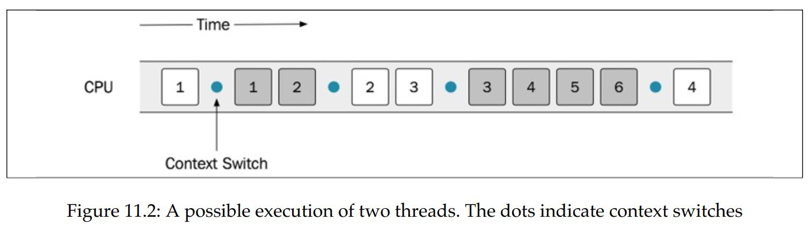
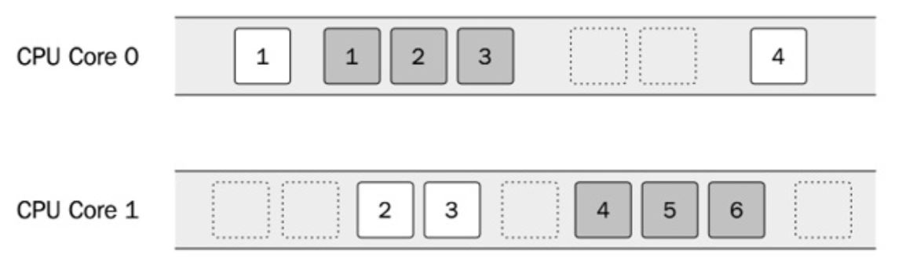
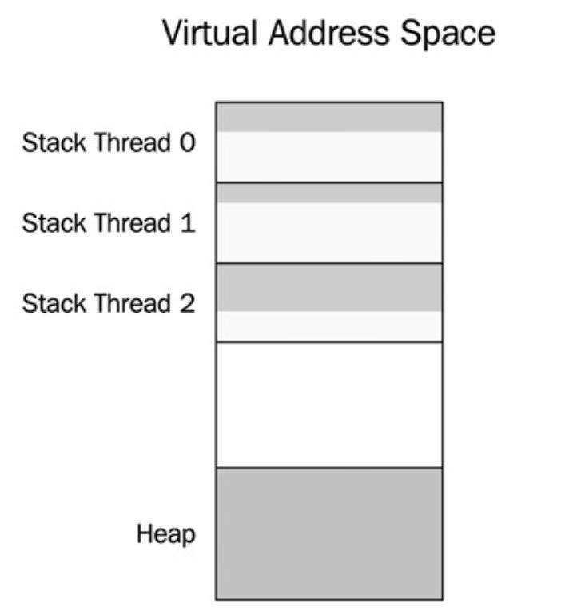
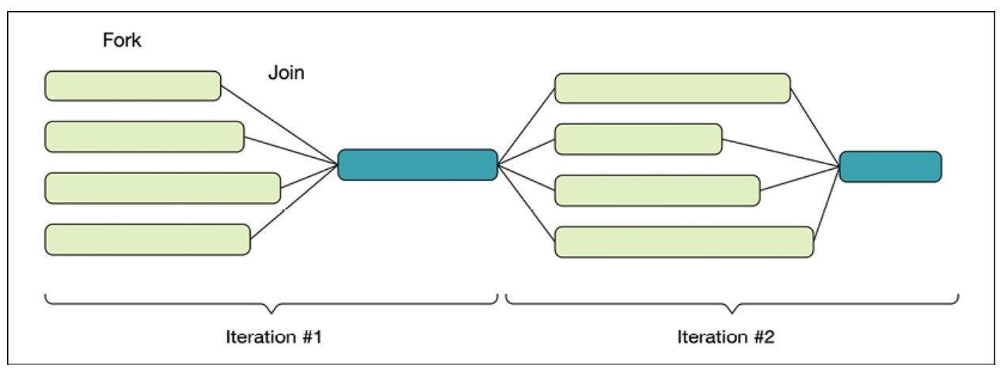

# [Ch. 11: Concurrency](CHP/README.md)

> [C++ High Performance](https://www.amazon.com/High-Performance-Master-optimizing-functioning/dp/1839216549)


## Concurrency and parallelism

> from GPT
> - Concurrency allows for the interleaved execution of multiple tasks, which gives the illusion of simultaneous progress.
> - However, in reality, the execution is not (necessarily) happening at the exact same time. Instead, the tasks are divided into smaller units, and the execution jumps back and forth between these units.
> - This interleaving gives the impression that the tasks are progressing simultaneously, even though they are being executed in a sequential or overlapping manner.
- To clarify, in the context of concurrency, the term "simultaneously" is used to describe the "perceived" progress on multiple tasks, but it's important to understand that the execution is not truly simultaneous.
- It is a way of managing and organizing tasks to optimize efficiency and responsiveness.

- Concurrency and parallelism are two terms that are sometimes used interchangeably.
- A program is said to run concurrently if it has multiple individual control flows running during overlapping time periods.
  - (A concurrent program can execute multiple tasks at the same time)
  - In C++, each individual control flow is represented by a thread.
  - The threads may or may not execute at the exact same time, though.
- If they do, they are said to execute in **parallel**.
  - For a concurrent program to run in parallel, it needs to be executed on a machine that has support for parallel execution of instructions; that is, a machine with multiple CPU cores.

- At first glance, it might seem obvious that we always want concurrent programs to run in parallel if possible, for efficiency reasons. However, that is not necessarily always true.
  - A lot of synchronization primitives are required only to support the parallel execution of threads.
  - Concurrent tasks that are not run in parallel do not require the same locking mechanisms and can be a lot easier to reason about.


### Time slicing

- How are concurrent threads executed on machines with only a single CPU core? The answer is time slicing.
- It is the same mechanism that is used by the operating system to support the concurrent execution of processes.
  - The operating system will schedule each thread to have some limited time on the CPU and then perform a context switch.
  - The context switch will store the current state of the running thread and load the state of the thread that should be executed.




- This is done often enough so that it appears as if the threads are running at the same time.
- A context switch is time-consuming, though, and most likely will generate a lot of cache misses each time a new thread gets to execute on a CPU core. Therefore, **we don't want context switches to happen too often.**
- As programmers, we must make sure that the program can run as expected, regardless of how the operating system scheduler is scheduling the tasks.
  - If a sequence, for some reason, is invalid, there are ways to control the order in which the instructions get executed by using locks.



- If a machine has multiple CPU cores, it is possible to execute the two threads in parallel. However, there is no guarantee (it's even unlikely) that the **two threads will execute on one core each throughout the lifetime of the program.**
- The entire system shares time on the CPU, so the scheduler will let other processes execute as well.
- This is one of the reasons why the threads are not scheduled on dedicated cores.


### Shared memory

- Threads created in the same process share the same virtual memory.
  - This means that a thread can access any data that is addressable within the process.
- Virtual memory only protects us from accessing memory allocated in different processes to our own
  - The operating system, which protects memory between processes using virtual memory, does nothing to protect us from accidentally accessing memory inside a process that was not intended to be shared among different threads.
- Sharing memory between multiple threads can be a very efficient way to handle communication between threads. However, sharing memory in a safe way between threads is one of the major challenges when writing concurrent programs in C++.
- We should always strive to minimize the number of shared resources between threads.
- Fortunately, not all memory is shared by default.
- Each thread has its own stack for storing local variables and other data necessary for handling function calls.
  - Unless a thread passes references or pointers to local variables to other threads, no other thread will be able to access the stack from that thread.
  - This is one more reason to use the stack as much as possible (if you are not already convinced that the stack is a good place for your data after reading Chapter 7, Memory Management).
- There is also **thread local storage**, sometimes abbreviated to TLS, which can be used to store variables that are *global in the context of a thread but which are not shared between threads.*
  - A thread local variable can be thought of as a global variable where each thread has its own copy.
- **Everything else is shared by default**; that is, dynamic memory allocated on the heap, global variables, and static local variables.
- Whenever you have shared data that is mutated by some thread, you need to ensure that no other thread is accessing that data at the same time or you will have a data race.
-  Virtual address space of a process containing 3 threads.
   - Each thread has its own stack memory, but there is only one heap for all threads




### Data races

- A data race happens when **two threads are accessing the same memory at the same time** and **at least one of the threads is mutating the data.**
- **If your program has a data race, it means that your program has undefined behavior.**
- The compiler and optimizer will assume that there are no data races in your code and optimize it under that assumption.
- This may result in crashes or other completely surprising behavior. In other words, **you can under no circumstances allow data races in your program.**
- The compiler usually doesn't warn you about data races since they are hard to detect at compile time.
- Anything could happen when your program has a data race. One such example is **tearing**, which is the common term for
**torn reads** and **torn writes**.
  - This happens when a thread writes parts of a value to memory while another thread reads the value at the same time and therefore ends up with a corrupt value.


### Mutex

- A mutex, short for **mutual exclusion lock**, is a synchronization primitive for avoiding data races.
- A thread that needs to enter a critical section first needs to lock the mutex (locking is sometimes also called **acquiring a mutex lock**).
- This means that no other thread can lock the same mutex until the first thread that holds the lock has unlocked the mutex. In that way, the mutex guarantees that only one thread at a time is inside a critical section.


- **The net result is that the two threads can update the mutable shared variable in a safe and correct way. However, it also means that the two threads can no longer be run in parallel.**

- The state where the second thread is blocked by the first thread is called **contention**.
  - This is something we strive to minimize, because it hurts the scalability of a concurrent program. Adding more CPU cores will not improve performance if the degree of contention is high.


### Deadlock

- When using mutex locks to protect shared resources, there is a risk of getting stuck in a state called deadlock.
- A deadlock can happen when two threads are waiting for each other to release their locks. Neither of the threads can proceed and they are stuck in a deadlock state.
- One condition that needs to be fulfilled for a deadlock to occur is that **one thread that already holds a lock tries to acquire an additional lock.**
- When a system grows and gets larger, it becomes more and more difficult to track all locks that might be used by all threads running in a system.
- This is one reason for always trying to minimize the use of shared resources, and this demonstrates the need for exclusive locking.

## Concurrent programming in C++

- Before concurrency was part of the language, it was implemented with native concurrency support from the operating system, POSIX Threads (pthreads), or some other library
- Concurrency support was first introduced in C++11 and has since been extended into C++14, C++17, and C++20.
- Sometimes, however, you have to reach for platform-specific functionality when dealing with concurrency on your platform. For example, **there is no support in the C++ standard library for setting thread priorities, configuring CPU affinity (CPU pinning), or setting the stack size of new threads.**

### `std::thread`

- When a `std::thread` object is destructed, it must have been joined or detached or it will cause the program to call `std::terminate()`, which by default will call `std::abort()` if we haven't installed a custom `std::terminate_handler`


- Starting from the bottom, the figure shows the CPU and its **hardware threads.**
  - **Those are the execution units on the CPU.**
  - In this example, the CPU provides four hardware threads. Usually that means it has four cores, but it could be some other configuration;
  - for example, some cores can execute two hardware threads. This is usually called **hyperthreading**.
  - The **total number of hardware threads** can be printed at runtime with this:
    - The preceding code might also output 0 if the number of hardware threads cannot be determined on the running platform.

```cpp
std::cout << std::thread::hardware_concurrency() << '\n';
```

- The layer above the hardware threads contains the **operating system threads.**
  - These are the actual **software threads**.
  - The operating system **scheduler determines when and for how long an operating system thread is executed by a hardware thread.**
  - In Figure 11.9, there are currently three out of six software threads executing.

- The topmost layer in the figure contains the `std::thread` objects.
  - A std::thread object is nothing more than an ordinary C++ object that **may or may not be associated with an underlying operating system thread**.
  - Two instances of `std::thread` cannot be associated with the same underlying thread. 
  - In the figure, you can see that the program currently has three instances of `std::thread`: two are associated with threads and one is not.
  - It's possible to use the `std::thread::joinable` property to find out what state a `std::thread` object is in
- A `std::thread` is not joinable if it has been:
  - Default constructed; that is, if it has nothing to execute Moved from (its associated running thread has been transferred to another `std::thread` object) 
  - Detached by a call to `detach()`
  - Already joined by a call to `join()`
  - Otherwise, the `std::thread` object is in the joinable state.
  - Remember, when a `std::thread` object is destructed, it must no longer be in the joinable state or the program will terminate.

### `std::jthread` (Since C++20)

- Instead of terminating the app when it is being destructed in a nonjoinable state, the destructor of `std::jthread` will send a stop request and join the thread on destruction.
- `std::jthread` has support for stopping a thread using a stop token.

```cpp
void print(std::stop_token stoken) {
  while (!stoken.stop_requested()) {
    std::cout << std::this_thread::get_id() << '\n';
    std::this_thread::sleep_for(std::chrono::seconds{1});
  }
  std::cout << "Stop requested\n";
}


int main() {
  auto joinable_thread = std::jthread(print);
  std::cout << "main: goes to sleep\n";
  std::this_thread::sleep_for(std::chrono::seconds{3});
  std::cout << "main: request jthread to stop\n";
  joinable_thread.request_stop();
}
```

- It should be the first choice when reaching for a thread class in C++.


### `std::mutex`

- `std::mutex` object itself is a mutable shared variable, but it will not generate data races.
- The synchronization primitives from the C++ thread library, such as `std::mutex` , are designed for this particular purpose. In that respect, they are very special and use hardware instructions, or whatever is necessary on our platform, to guarantee that they don't generate data races themselves.


### Avoiding deadlocks


- As long as a thread never acquires more than one lock at a time, there is no risk of deadlocks. Sometimes, though, it is necessary to acquire another lock while already holding onto a previously acquired lock.
- The risk of deadlocks in these situations can be avoided by grabbing both locks at the exact same time.
- C++ has a way to do this by using the `std::lock()` function, which **takes an arbitrary number of locks and blocks until all locks have been acquired**.

```cpp
struct Account {
  Account() {}
  int balance_{0};
  std::mutex m_{};
};
void transfer_money(Account& from, Account& to, int amount) {
  auto lock1 = std::unique_lock<std::mutex>{from.m_, std::defer_lo ck};
  auto lock2 = std::unique_lock<std::mutex>{to.m_, std::defer_lock};
  // Lock both unique_locks at the same time
  std::lock(lock1, lock2);
  from.balance_ -= amount;
  to.balance_ += amount;
}
```


## `std::condition_variable`

- A condition variable makes it possible **for threads to wait until some specific condition has been met.**
- Threads can also use a condition variable to **signal to other threads that the condition has changed.**

```cpp
auto cv = std::condition_variable{};
auto q = std::queue<int>{};
auto mtx = std::mutex{};      // Protects the shared queue
constexpr int sentinel = -1;  // Value to signal that we are done

void print_ints() {
  auto i = 0;
  while (i != sentinel) {
    {
      auto lock = std::unique_lock<std::mutex>{mtx};
      while (q.empty()) {
        //When the consumer calls cv.wait(lock) , the thread goes to sleep and
        // leaves the CPU for other threads to execute. Apart from putting the
        // thread to sleep, `wait()` also unlocks the mutex while sleeping and
        // then acquires the mutex before it returns
        cv.wait(lock);
        // The lock is released while waiting here
      }
      i = q.front();
      q.pop();
    }
    if (i != sentinel) { std::cout << "Got: " << i << '\n'; }
  }
}

auto generate_ints() {
  // The producer thread generates a sequence of integers and pushes
  // them to a global std::queue<int> once every second. Whenever an
  // element is added to the queue, the producer signals that the condition
  // has changed using notify_one() .
  for (auto i : {1, 2, 3, sentinel}) {
    std::this_thread::sleep_for(std::chrono::seconds(1));
    {
      auto lock = std::scoped_lock{mtx};
      q.push(i);
    }
    //Note also that it is not required to hold the lock while notifying the
    // condition variable.
    cv.notify_one();
  }
}

int main() {
  auto producer = std::jthread{generate_ints};
  auto consumer = std::jthread{print_ints};
}
```

- It is important to understand why we need to pass the variable lock when calling `wait()`.
  - **Apart from putting the thread to sleep, `wait()` also unlocks the mutex while sleeping and then acquires the mutex before it returns.**
  - If `wait()` didn't release the mutex, the producer would not be able to add elements to the queue.
- Why is the consumer waiting on the condition variable with a while-loop around it and not an if statement?
  - This is a common pattern, and sometimes we need to do that since there might be other consumers that were also woken up and emptied the queue before us.
  - In our program, we only have one consumer thread, though, so that cannot happen.
- However, it is possible for the consumer to be awoken from its `wait` even though the producer thread did not signal. This phenomenon is called **spurious wakeup**.
- As an alternative to using a while -loop, we can use an overloaded version of `wait()` that accepts a predicate. This version of `wait()` check if the predicate is satisfied and will do the looping for us.


```cpp
// ...
auto lock = std::unique_lock<std::mutex>{mtx};
cv.wait(lock, [] { return !q.empty(); });
// ...
```

- As spurious wakeups can happen: always check the condition in a while loop or use the overloaded version of `wait()` that accepts a predicate

## `std::futures` and `std::promises`

- In the standard library `<future>` header
- "promise" the data will be handled and sent back in the "future"
- we can find some class templates that help us with writing concurrent code without global variables and locks, and, in addition, **can communicate exceptions between threads for handling errors**

- For below, check how we managed to pass data back and forth with proper error handling, without using any shared global data and with no explicit locking.
  - The `promise takes care of that for us, and we can focus on implementing the essential logic of the program instead
- Note: since the future is an ordinary object, we can, for example, pass it around to other objects that need the computed value. If it is not computed at that point in time, the call to `get()` will block until it is finished.

```cpp
auto divide(int a, int b, std::promise<int>& p) {
  if (b == 0) {
    auto e = std::runtime_error{"Divide by zero exception"};
    p.set_exception(std::make_exception_ptr(e));
  }
  else {
    const auto result = a / b;
    p.set_value(result);
  }
}

int main() {
  auto p = std::promise<int>{};
  std::thread(divide, 45, 5, std::ref(p)).detach();
  auto f = p.get_future();
  try {
    // future is the receiving side of the value
    const auto& result = f.get();  // Blocks until ready
    std::cout << "Result: " << result << '\n';
  }
  catch(const std::exception& e) {
    std::cout << "Caught exception: " << e.what() << '\n';
  }
}
```

## Tasks

- In many cases, we don't have any need for managing threads; instead, what we really need is to be able to execute a task asynchronously and have that task execute on its own concurrently with the rest of the program, and then eventually get the result or error communicated to the parts of the program that need it. The task should be carried out in isolation to minimize contention and the risk of data races

- Task classes automatically set up the `future`s and `promises` for us. You will see how we can get rid of the manual administration of threads and leave that to the library.

```cpp
int divide(int a, int b) {  // No need to pass a promise ref here!
  if (b == 0) {
    throw std::runtime_error{"Divide by zero exception"};
  }
  return a / b;
}

int main() {
  auto task = std::packaged_task<decltype(divide)>{divide};
  auto f = task.get_future();
  std::thread{std::move(task), 45, 5}.detach();
  // The code below is unchanged from the previous example
  try {
    const auto& result = f.get();  // Blocks until ready
    std::cout << "Result: " << result << '\n';
  }
  catch(const std::exception& e) {
    std::cout << "Caught exception: " << e.what() << '\n';
  }
  return 0;
}
```

- `std::packaged_task` is itself a callable object that can be moved to the `std::thread` object we are creating.
- `std::packaged_task` now does most of the work for us: we don't have to create the `promise` ourselves. But, more importantly, we can write our `divide()` function just like a normal function, without the need for explicitly returning values or exceptions through the `promise`; the `std::packaged_task` will do that for us.

- Take this further, we would also like to get rid of the manual thread management:

```cpp
int divide(int a, int b) {
  if (b == 0) {
    throw std::runtime_error{"Divide by zero exception"};
  }
  return a / b;
}

int main() {
  auto future = std::async(divide, 45, 5);
  try {
    const auto& result = future.get();
    std::cout << "Result: " << result << '\n';
  }
  catch(const std::exception& e) {
    std::cout << "Caught exception: " << e.what() << '\n';
  }
}
```

## `std::latches`

- In some cases, we want a set of asynchronous tasks to arrive at a common synchronization point, and then have the tasks continue running.
  - These situations typically occur when some sort of initialization is needed before multiple worker threads start their actual work.

- A `std::latch` is a synchronization primitive that can be used for synchronizing multiple threads. It creates a synchronization point where all threads must arrive at.
- You can think of a latch as a decrementing counter. Typically, all threads decrement the counter once and then wait for the latch to reach zero before moving on.


```cpp
// A latch is constructed by passing an initial value of the internal counter
auto lat = std::latch{8}; // Construct a latch initialized with 8

// Threads can then decrement the counter using count_down() :
lat.count_down(); // Decrement but don't wait

// A thread can wait on the latch to reach zero:
lat.wait(); // Block until zero

// It's also possible to check (without blocking) to see whether the counter
// has reached zero:
if (lat.try_wait()) {
  //...
}

// decrements the latch and then waits for the latch to reach zero:
lat.arrive_and_wait(); // Decrement and block while not zero
```
### Example

Scenario: "prefaulting":

- When a thread is created, a contiguous block of memory is allocated for the stack. Typically, this memory does not yet reside in physical memory when it is first allocated in the virtual address space. Instead, when the stack is being used, **page faults** will be generated in order to **map the virtual memory to physical memory.**
- The operating system handles the mapping for us, and it is an efficient way to lazily map memory when needed. Usually, this is just what we want: we pay for the cost of mapping memory as late as possible and only if needed.
- However, in circumstances where low latency is important, for example in real-time code, it might be necessary to completely avoid page faults.
- The stack memory is unlikely to be paged out by the operating system, so **it is usually enough to run some code that will generate page faults and thereby map the virtual stack memory to physical memory.**
- There is no portable way to set or get the stack size of a C++ thread, so here we will just assume that the stack is at least 500 KB
- The `volatile` keyword has nothing to do with concurrency; it's only added here to prevent the compiler from optimizing away this code. By declaring the mem array `volatile` , the compiler is **not allowed to ignore the writes to the array**


```cpp
void prefault_stack() {
  // We don't know the size of the stack
  constexpr auto stack_size = 500u * 1024u;
  // Make volatile to avoid optimization
  volatile unsigned char mem[stack_size];
  std::fill(std::begin(mem), std::end(mem), 0);
}

auto do_work() { /* ... */}

int main() {
  constexpr auto n_threads = 2;
  auto initialized = std::latch{n_threads};
  auto threads = std::vector<std::thread>{};
  for (auto i = 0; i < n_threads; ++i) {
    threads.emplace_back([&] {
      prefault_stack();
      initialized.arrive_and_wait();
      do_work();
    });
  }
  initialized.wait();
  std::cout << "Initialized, starting to work\n";
  for (auto&& t : threads) {
    t.join();
  }
}
```

- Once the latch has reached zero, it can no longer be reused. There is no function for resetting the latch. If we have a scenario that requires multiple synchronization points, we can instead use a `std::barrier`


## `std::barrier`

Barriers are similar to latches but with two major additions: a barrier can
be reused, and it can run a completion function whenever all threads have
reached the barrier.

```cpp

// A barrier is constructed by passing an initial value of the internal counter
and a completion function:
auto bar = std::barrier{ 8,
  [] {// Completion function
        std::cout "All threads arrived at barrier\n";}
};

// Threads can arrive and wait in the same way we use a latch:
bar.arrive_and_wait();


```

- Whenever all threads have arrived (that is, when the internal counter of the barrier reaches zero) two things happens:
  - The completion function provided to the constructor is called by the barrier. 
  - The **internal counter is reset to its initial value** **after** the **completion function has returned.**
- Barriers are useful in parallel programming algorithms that are based on the **fork-join model.**
  - Typically, an iterative algorithm contains a part that can be run in parallel and another part that needs to run sequentially.
  - Multiple tasks are forked and run in parallel.
  - Then, when all tasks have finished and joined, some single-threaded code is executed to determine whether the algorithm should continue or finish.



- Code example seems wrong in the book....

```cpp
auto random_int(int min, int max) {
  // Generating the seed and creating the engine is typically slow and something
  // we want to avoid doing at every call.

  // A common way to do this is to declare the random engine with static
  // duration so that it lives during the entire lifetime of the program.

  // However, the classes in <random> are not thread-safe so we need to protect
  // the static engine somehow. Instead of synchronizing access with a mutex,
  // which would make the random number generator run sequentially, we can use
  // thread-local storage
  static thread_local auto engine =
      std::default_random_engine{std::random_device{}()};
  auto dist = std::uniform_int_distribution<>{min, max};
  return dist(engine);
}

int main() {
  constexpr auto n = 5;  // Number of dice
  auto done = false;
  auto dice = std::array<int, n>{};
  auto threads = std::vector<std::thread>{};
  auto n_turns = 0;
  auto check_result = [&] {  // Completion function
    ++n_turns;
    auto is_six = [](auto i) { return i == 6; };
    done = std::all_of(dice.begin(), dice.end(), is_six);
  };
  auto bar = std::barrier{n, check_result};
  for (int i = 0; i < n; ++i) {
    threads.emplace_back([&, i] {
      // !!!!!!!??????? SEEMS WRONG????????????????????????????????
      while (!done) {
        dice[i] = random_int(1, 6);  // Roll dice
        bar.arrive_and_wait();       // Join
      }
    });
  }
  for (auto&& t : threads) { t.join(); }
  std::cout << n_turns << '\n';
}
```

## `std::counting_semaphore`

```cpp

class Server {
 public:
  void handle(const Request& req) {
    sem_.acquire();
    // Restricted section begins here.
    // Handle at most 4 requests concurrently.
    do_handle(req);
    sem_.release();
  }

 private:
  void do_handle(const Request& req) { /* ... */
  }
  // The semaphore is initialized with a value of 4 , which means that at most
  // four concurrent requests can be handled at the same time.
  std::counting_semaphore<4> sem_{4};
};
```


- The word semaphore means something that can be used for signaling, such as a flag or a light.

- Instead of mutually exclusive access to a section in the code, multiple threads can have access to the same section but with **restrictions concerning the number of threads currently in that section.**
- The member function `acquire()` decrements the semaphore if the semaphore is greater than zero. Otherwise `acquire()` blocks until the semaphore allows it to decrement and enter the restricted section.
- `release()` increments the counter without blocking. If the semaphore was zero before it was incremented by `release()` , waiting threads will be signaled.
- In addition to the `acquire()` function, it's also possible to try to decrement the counter without blocking using the `try_acquire()` function. It returns `true` if it managed to decrement the counter, or `false` otherwise.
- The functions `try_acquire_for()` and `try_acquire_until()` can be used in a similar way.
  - But instead of immediately returning false when the counter is already zero, they automatically try to decrement the counter within a specified time before returning to the caller.
- The std::counting_semaphore is a template with one template parameter accepting the maximum value of the semaphore. It is considered a programming error to increment (release) a semaphore above its maximum value.
- A `std::counting_semaphore` with a maximum size of 1 is called a binary semaphore.
  - The <semaphore> header includes an alias-declaration for binary semaphores
  - A binary semaphore is guaranteed to be implemented more efficiently than a counting semaphore with a higher maximum value.

```cpp
std::binary_semaphore = std::counting_semaphore<1>;
```

- Another important property of semaphores is that the thread that releases a semaphore may not be the thread that acquired it.
  - This is in contrast with `std::mutex`, which requires that the thread that acquired the mutex is also the thread that must release it.
  - However, with semaphores it's common to have one type of task to do the waiting (acquire) and another type of task to do the signaling (release).


### Example: A bounded buffer using semaphores

- (Not circular but a fixed size queue)
- The `do_push` function is a helper method to add items to the buffer.
  - It first acquires an empty slot using `n_empty_slots_.acquire()`, which might block if there are no available empty slots.
  - The item is then added to the buffer at the current write position, and the write position is updated accordingly.
  - If an exception occurs during the process, the empty slot is released with `n_empty_slots_.release()` before re-throwing the exception.
  - Finally, `n_full_slots_`.release() is called to indicate that there is one more full slot in the buffer.


- The `pop` function is responsible for retrieving an item from the buffer.
  - It first acquires a full slot using `n_full_slots_.acquire()`, potentially blocking if there are no full slots available.
  - The item is then moved from the buffer at the current read position, and the read position is updated accordingly.
  - If an exception occurs, the full slot is released with `n_full_slots_.release()` before re-throwing the exception.
  - Finally, `n_empty_slots_.release()` is called to indicate that there is one more empty slot in the buffer. The function returns the retrieved item.

```cpp
template <class T, int N>
class BoundedBuffer {
  std::array<T, N> buf_;
  std::size_t read_pos_{};
  std::size_t write_pos_{};
  std::mutex m_;
  std::counting_semaphore<N> n_empty_slots_{N};
  std::counting_semaphore<N> n_full_slots_{0};
  void do_push(auto&& item) {
    // Take one of the empty slots (might block), consumer in pop might wake it
    n_empty_slots_.acquire();                 // <------------------------------
    try {
      auto lock = std::unique_lock{m_};
      buf_[write_pos_] = std::forward<decltype(item)>(item);
      write_pos_ = (write_pos_ + 1) % N;
    } catch (...) {
      n_empty_slots_.release();               // <------------------------------
      throw;
    }
    // Increment and signal consumer in pop() that there is one more full slot
    n_full_slots_.release();                  // <------------------------------
  }

 public:
  void push(const T& item) { do_push(item); }
  void push(T&& item) { do_push(std::move(item)); }
  auto pop() {
    // Take one of the full slots (might block)
    n_full_slots_.acquire();                  // <------------------------------
    auto item = std::optional<T>{};
    try {
      auto lock = std::unique_lock{m_};
      item = std::move(buf_[read_pos_]);
      read_pos_ = (read_pos_ + 1) % N;
    } catch (...) {
      n_full_slots_.release();                // <------------------------------
      throw;
    }
    // Increment and signal do_push that there is one more empty slot
    n_empty_slots_.release();                 // <------------------------------
    return std::move(*item);
  }
};
```