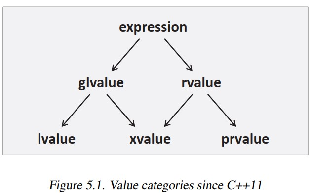
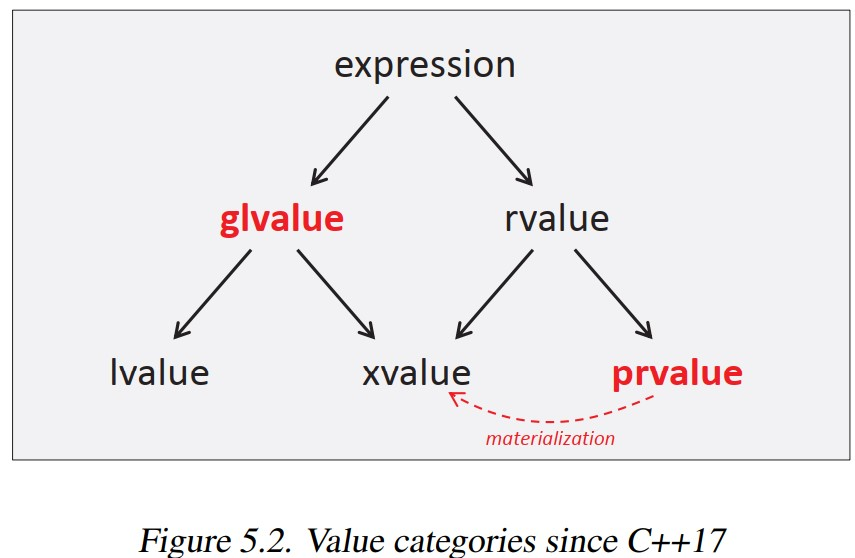

# [C++17 - The complete guide, Ch 5: Mandatory Copy Elision or Passing  Unmaterialized Objects](http://www.cppstd17.com/index.html)

> GPT: Copy elision and return value optimization (RVO) are related concepts but not exactly the same.
> - Copy elision refers to a compiler optimization technique where the creation of unnecessary temporary objects during certain value computations is avoided. In other words, it allows the compiler to omit the copy or move operations that would typically be required to construct or assign objects in certain scenarios. Copy elision can occur in various situations, including function return values, object initialization, and exception handling.
> - Return value optimization (RVO), on the other hand, specifically focuses on optimizing the construction of objects returned from functions. It is a specific form of copy elision that eliminates the need for copying or moving the return value of a function by directly constructing the object in its final destination. RVO is an optimization technique aimed at improving the performance of function return operations by avoiding unnecessary object copies or moves.
> - So, while copy elision is a broader concept encompassing various optimizations, RVO is a specific type of copy elision that optimizes function return values. In practice, RVO is one of the most common and well-known forms of copy elision, as it can significantly reduce the overhead associated with returning objects from functions.
> - It's worth noting that C++17 introduced a mandatory form of copy elision known as "mandatory copy elision." This allows the omission of certain copy or move operations even when they have observable side effects, under specific circumstances defined by the standard. This further enhances the potential for optimizations like RVO in compliant C++17 (and later) compilers.

---

- Since the first standard, C++ has permitted the omission (elision) of certain copy operations even if this might impact the behavior of a program (e.g., skipping a print statement in the copy constructor).
- One such case is when a temporary object is used to initialize a new object. This happens especially when **a temporary is passed to or returned from a function by value.**

```cpp
class MyClass {
  ...
};

void foo(MyClass param){// param is initialized by passed argument
  ...
}

MyClass bar() {
  return MyClass{};  // returns temporary
}

int main() {
  foo(MyClass{});     // pass temporary to initialize param
  MyClass x = bar();  // use returned temporary to initialize x
  foo(bar());         // use returned temporary to initialize param
}
```

- However, **because these optimizations were not mandatory, it had to be possible to copy the objects by implicitly or explicitly providing a copy or move constructor.**
- **That is, although the copy/move constructor was usually not called, it had to exist.** Code like this did not compile when no copy/move constructor was defined.
- Thus, with the following definition of the `class MyClass`, the code above did not compile:


```cpp
class MyClass {
 public:
  ...
  // no copy/move constructor defined:
  MyClass(const MyClass&) = delete;
  MyClass(MyClass&&) = delete;
  ...
};
```

- It was enough not to have the copy constructor, because the move constructor is only implicitly available when no copy constructor (or assignment operator or destructor) is user-declared.
- **The copy elision to initialize objects from temporaries is mandatory since C++17.**
- In fact, what we will see later is that we simply pass a value for initialization as an argument or return value that is then used to materialize a new object.
  - This means that even with a definition of `class MyClass` not enabling copying at all, the example above compiles.
  - However, note that **all other optional copy elisions are still optional and require a callable copy or move constructor**. For example:

```cpp
MyClass foo() {
  MyClass obj;
  return obj;  // still requires copy/move support
}
```

- Here, `foo()` contains a variable `obj` that has a name (which is an **lvalue** when used). Therefore, the named **return value optimization (NRVO)** is used, which **still requires copy/move support.**
- This would be the case even if `obj` were a parameter:

```cpp
MyClass bar(MyClass obj)  // copy elision for passed temporaries
{
  ...
  return obj;  // still requires copy/move support
}
```

- While passing a temporary (which is a **prvalue** when used) to the function is no longer a copy/move, returning the parameter requires copy/move support **because the returned object has a name**.
- As part of this change, a couple of modifications and clarifications were made in the terminology of value categories.

## 5.2 Benefit of Mandatory Copy Elision for Temporaries

- One benefit of this feature is, of course, that better performance is now guaranteed when returning a value that is expensive to copy (although all major compilers did the copy elision anyway).
- Although move semantics helps to reduce copying costs significantly, not performing copies can still be a significant improvement (e.g., if the objects have many fundamental data types as members). This might reduce the need to use out-parameters rather than simply returning a value (provided the return value is created with the return statement).
- Another benefit is the ability to now define a factory function that always works because it can now also return an object even when neither copying nor moving is allowed.
- For example, consider the following generic factory


```cpp
#include <utility>
template <typename T, typename... Args>
T create(Args&&... args) {
  ...
  return T{std::forward<Args>(args)...};
}
```

- This function can now even be used for a type such as `std::atomic<>`, where neither the copy nor the
move constructor is defined:

```cpp
#include <atomic>
#include <memory>

#include "factory.hpp"
int main() {
  int i = create<int>(42);
  std::unique_ptr<int> up = create<std::unique_ptr<int>>(new int{42});
  std::atomic<int> ai = create<std::atomic<int>>(42);
}
```

- As another effect, for classes with explicitly deleted move constructors, you can now return temporaries by value and initialize objects with them:


```cpp
class CopyOnly {
 public:
  CopyOnly() {}
  CopyOnly(int) {}
  CopyOnly(const CopyOnly&) = default;
  CopyOnly(CopyOnly&&) = delete;  // explicitly deleted
};
CopyOnly ret() {
  return CopyOnly{};  // OK since C++17
}
CopyOnly x = 42;  // OK since C++17
```

- The initialization of `x` was invalid before C++17 because the copy initialization (initialization using the `=`) needed the conversion of 42 to a temporary and that temporary in principle needed the move constructor, although it was never called. (The fact that the copy constructor serves as a fallback for a move constructor applies only if the move constructor is not user-declared.)


## 5.3 Clarified Value Categories

- As a side effect of the proposed change to require copy elision for temporaries when initializing new objects, some adjustments were made to value categories.

### 5.3.1 Value Categories

- Each expression in a C++ program has a value category. In particular, **the category describes what can be done with an expression.**

- Historically (taken from C), we had only lvalue and rvalue, based on an assignment: `x = 42;` where `x` used as an expression was an lvalue because it could stand on the left side of an assignment, and `42` used as an expression was an rvalue, because it could only stand on the right side.
- However, things already became more complicated with ANSI-C because an `x` declared as const int could not stand on the left side of an assignment but was still a (non-modifyable) lvalue.
- Then, C++11 introduced movable objects, which **from a semantic perspective**, were objects for the right side of an assignment only **but could be modified because an assignment operator could steal their value.** For this reason, the category **xvalue** was introduced and the former category **rvalue** was renamed to **prvalue**



-  We have the primary categories lvalue,** prvalue (“pure rvalue”)**, and **xvalue (“eXpiring value”)**.
-  The composite categories are: **glvalue (“generalized lvalue,”** which is the union of lvalue and xvalue) and rvalue (the union of xvalue and prvalue)

Examples of lvalues are:

- An expression that is just the name of a variable, function, or data member (except a plain value member of an rvalue)
- An expression that is just a string literal (e.g., "hello")
- The return value of a function if it is declared to return an lvalue reference (return type Type&)
- Any reference to a function, even when marked with std::move()
- The result of the built-in unary * operator (i.e., **what dereferencing a raw pointer yields**)

Examples of prvalues are:

- Expressions that consist of a built-in literal that is not a string literal (e.g., 42, true, or nullptr)
- The **return type of a function if it is declared to return by value** (return type `Type`)
- The result of the built-in unary & operator (i.e., what taking the address of an expression yields)
- A lambda expression

Examples of xvalues are:

-  The result of marking an object with `std::move()`
- A cast to an rvalue reference of an object type (not a function type)
- The returned value of a function if it is declared to return an rvalue reference (return type `Type&&`)
- A non-static value member of an rvalue

Roughly speaking:

- All names used as expressions are lvalues.
- All string literals used as expression are lvalues.
- All other literals (4.2, true, or nullptr) are prvalues.
- All temporaries without a name (especially objects returned by value) are prvalues.
- All objects marked with `std::move()` and their value members are xvalues

```cpp
class X {};
X v;
const X c;
void f(const X&);  // accepts an expression of any value category
void f(X&&);       // accepts prvalues and xvalues only, but is a better match
f(v);              // passes a modifiable lvalue to the first f()
f(c);              // passes a non-modifiable lvalue to the first f()
f(X());            // passes a prvalue to the second f()
f(std::move(v));   // passes an xvalue to the second f()

```

- It is worth emphasizing that strictly speaking, glvalues, prvalues, and xvalues are **terms for expressions** and not for values (which means that these terms are misnomers).
- For example, **a variable itself is not an lvalue; only an expression denoting the variable is an lvalue**:
  - `int x = 3; // here, x is a variable, not an lvalue`
  - `int y = x; // here, x is an lvalue`

- In the first statement, 3 is a prvalue which initializes the variable (not the lvalue) x.
- In the second statement, x is an lvalue (its evaluation designates an object containing the value 3).
- The lvalue x is converted to a prvalue, which is what initializes the variable y

### 5.3.2 Value Categories Since C++17

C++17 clarified the semantic meaning of value categories as:



The key approach for explaining value categories now is that in general, we have two kinds of expressions:

- glvalues: expressions for locations of objects or functions
- prvalues: expressions for initializations

- An xvalue is then considered a special location, representing an object whose resources can be reused (usually because the object is near the end of its lifetime).

- C++17 then introduces a new term, called **materialization (of a temporary)**, for the moment a prvalue becomes a temporary object.
- Thus, a temporary materialization conversion is a prvalue-to-xvalue conversion.
- Any time a prvalue validly appears where a glvalue (lvalue or xvalue) is expected, a temporary object is created and initialized with the prvalue (remember that prvalues are primarily “initializing values”), and the prvalue is replaced by an xvalue designating the temporary.
- So in the example above, strictly speaking, we have:

```cpp
void f(const X& p); // accepts an expression of any value category, but expects a glvalue
f(X()); // passes a prvalue materialized as xvalue
```

- Because `f()` in this example has a reference parameter, it expects a glvalue argument.
- However, the expression X() is a prvalue. The “temporary materialization” rule therefore kicks in, and the expression `X()` is “converted” into an xvalue designating a temporary object initialized with the default constructor.
- Note that materialization does not mean that we create a new/different object. The lvalue reference `p` still binds to both an xvalue and a prvalue, although the latter now always involves a conversion to an xvalue.
- With this modification (that **prvalues are no longer objects but are instead expressions that can be used to initialize objects)**, the required copy elision makes perfect sense because the **prvalues no longer need to be movable in order to initialize a variable using assignment syntax**.
- We simply pass an initial value around that, sooner or later, is materialized to initialize an object.


## 5.4 Unmaterialized Return Value Passing

Unmaterialized return value passing applies to all forms of returning a temporary object (prvalue) by value:


- When we return a literal that is not a string literal:

```cpp
int f1() { // return int by value
  return 42;
}
```

- When we return a temporary object by its type or auto:

```cpp
auto f2() { // return deduced type by value
  ...
  return MyType{ ... };
}
```

- When we return a temporary object by `decltype(auto)`

```cpp
decltype(auto) f3() { // return temporary from return statement by value
  ...
  return MyType{ ... };
}
```

- Remember that a declaration with `decltype(auto)` operates by value if the expression used for initialization (here the return statement) is an expression that creates a temporary (a prvalue).
- Because we return a prvalue in all these cases by value, we do not require any copy/move support at all.