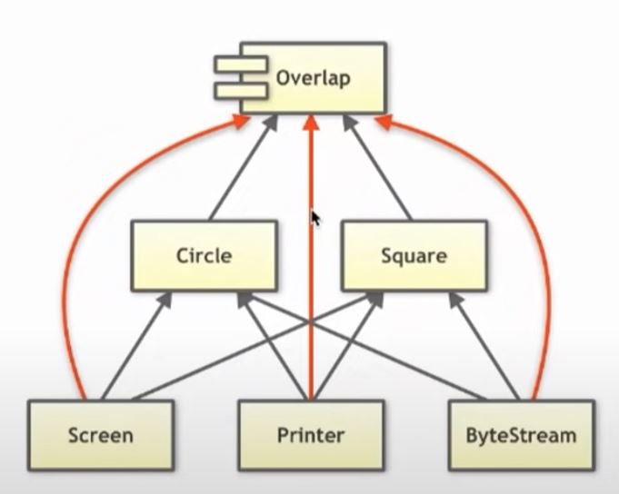
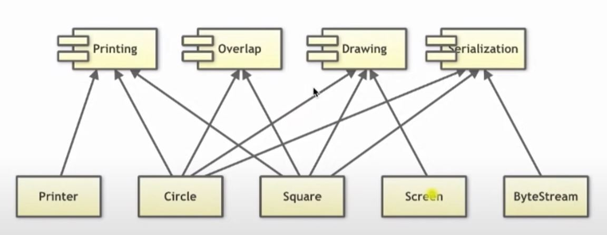
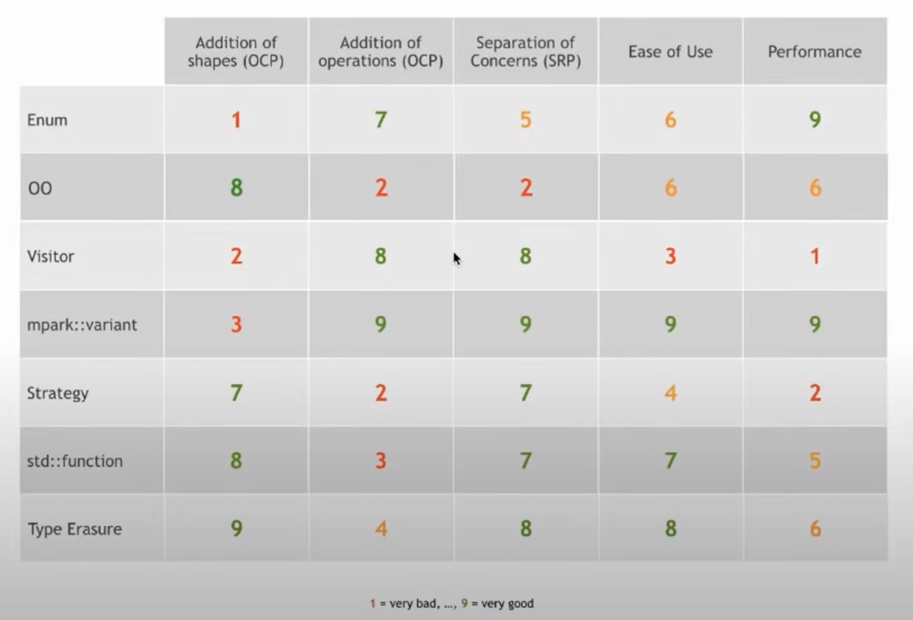
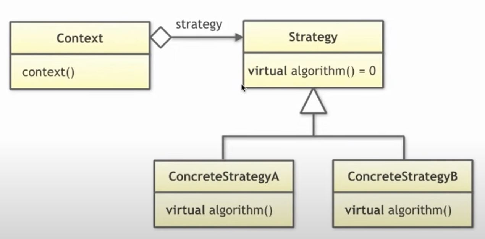
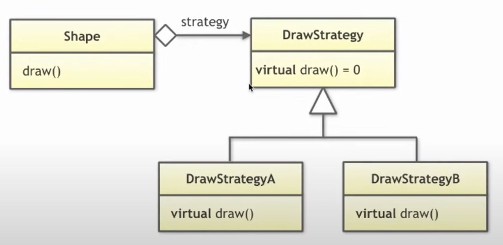
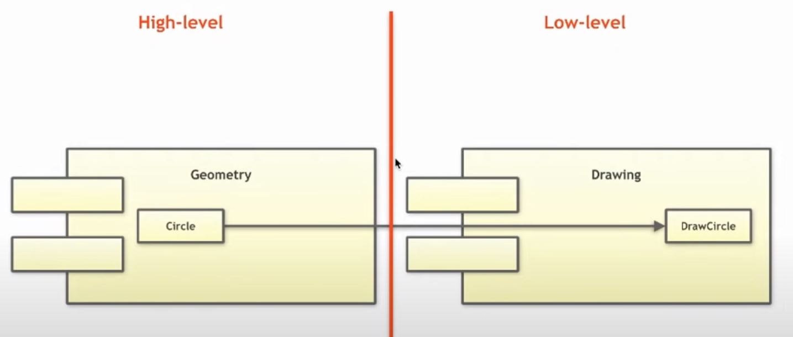
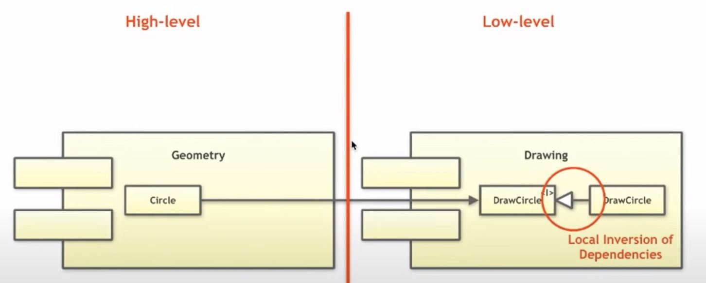
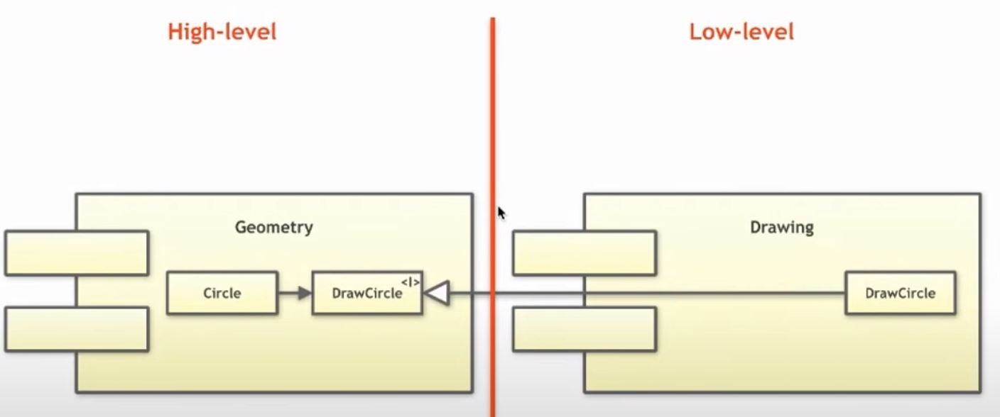
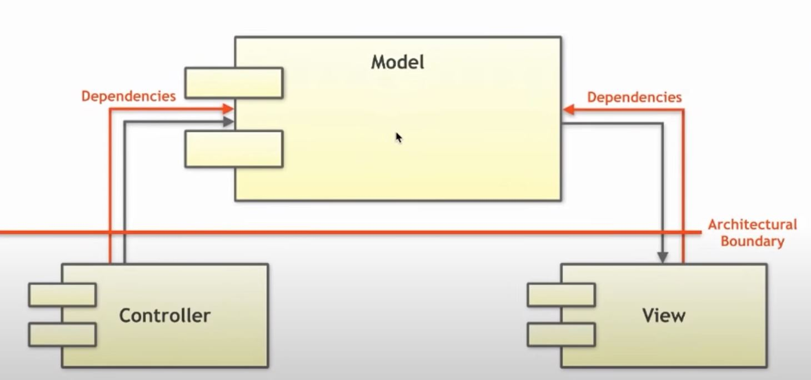
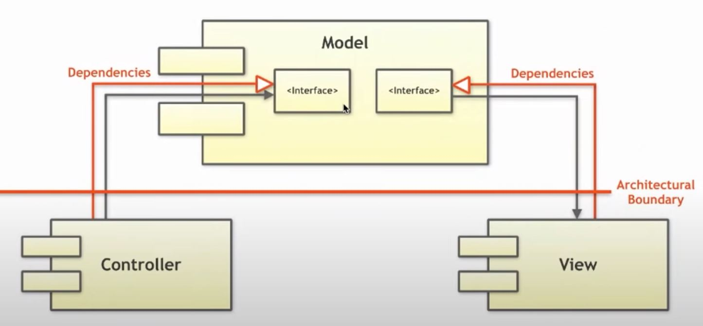

# Breaking Dependencies: The SOLID Principles - Klaus Iglberger

> **"Soft"ware: easy to change and extend**, as opposed to "hard"ware

Why some software is hard to change/extend? Ultimately likely due to **dependency**

> **"Coupling is the enemy of change, because it links together things that must change in parallel**" ...[*1]

The goal of talk:

- SOLID principles can be a **general set of guidelines** that is **not limited to OO programming**
- Use SOLID principles to reduce coupling and facilitate changes.

## The single-responsibility principle (SRP)

:brain: The question is, what is "responsibility" in SRP, what is "one thing" in "everything should just do one thing"?

> **"Orthogonality": ... design component that are self-contained: independent and with a single, well-defined purpose (...cohesion). When components are isolated from one another, you know that you can change one without having to worry about the rest.** ...[*1]

What this tells us, SRP is all about **making change easier**.

> "Cohesion is a measure of the **strength of association of the elements inside a module**"
> - A highly cohesive module is **a collection of statements and data items that should be treated as a whole because they are so closely related.** Any attempt to divide them up would only result in increased coupling and decreased readability. ... [*2]

> A class should have only on reason to change. ...[*3]

<details><summary markdown="span">Example</summary>

```cpp
class Circle {
public:
    // ...
    void draw(Screen& s, /*...*/);
    void draw(Printer& s, /*...*/);
    void serialize(ByteStream& bs, /*...*/);
};
```

If you defined this way, a `Circle` need to change if ....
- `Screen` changes ...
- `Printer` changes ...
- `ByteStream` changes ...
- implementation details of `draw()` change ...
- implementation details of `serialize()` change ...

Imagine you have another `Square` class that needs to implement this plus another class `Overlap` that depends on `Circle` and `Square` ... the overall dependency structure would have looked like:



A SRP design should look like this instead:



**Another counter example**:

- `std::string::replace`, `std::string::find` ... those functions has nothing to do with std::string itself where it stores an array of chars. And today, they can be done by `std::replace`, `std::find` in `algorithm` instead

</details>

> ### :man_teacher: Guideline: Prefer cohesive software entities. Everything that does not strictly belong together, should be separated.

---

## The open-closed principle (OCP)

> Software artifacts (classes, modules, functions ...etc) should be open for extension, but closed for modification. ...[*4]

<details><summary markdown="span">Example</summary>

```cpp
enum class ShapeType {
    circle,
    square,
};

class Shape {
public:
    explicit Shape(ShapeType t) : type_{t} {}
    ShapeType getType() const noexcept { return type_; }
    //...
private:
    ShapeType type_;
};

class Circle : public Shape {
public:
    explicit Circle(double radius) : Shape{ ShapeType::circle}, radius_{radius} {}
    //...
};

void translate(Circle& c, const Vector3D& vec3d);
void rotate(Circle& c, const Quaternion& vec3d);
void draw(const Circle& c);

class Square : public Shape {
public:
    explicit Square(double width) : Shape{ShapeType::square}, width{width} {}
    //...
};

void translate(Square& c, const Vector3D& vec3d);
void rotate(Square& c, const Quaternion& vec3d);
void draw(const Square& c);

void draw(const std::vector<std::unique_ptr<Shape>>& shapes) {
    for (const auto& s : shapes) {
        switch (s->getType()) {
            case ShapeType::circle:
                draw(*static_cast<const Circle*>(s.get()));
                break;
            case ShapeType::square:
                draw(*static_cast<const Square*>(s.get()));
                break;
            //...
        }
    }
}
```

:weary: The problem of above is that if we want to add another shape, because Circle and Square depends on SquareShape, they might need to recompile. Also the `draw(const std::vector<std::unique_ptr<Shape>>& shapes)` needs to add a case. Or we can say, every place that is depending on type might need a change.

> This kind of type-based programming .... one of the things we know about it is that it yields programs that are essentially unmaintainable" ...[*5]

</details>

<details><summary markdown="span">Example - modified</summary>

```cpp
class Shape {
public:
    explicit Shape(ShapeType t) : type_{t} {}

    virtual void translate(const Vector3D& vec3d) = 0;
    virtual void rotate(const Quaternion& vec3d) = 0;
    virtual void draw() const = 0;
    //...
};

class Circle : public Shape {
public:
    explicit Circle(double radius) : radius_{radius} {}
    void translate(const Vector3D& vec3d) override;
    void rotate(const Quaternion& vec3d) override;
    void draw() const override;
    //...
};

class Square : public Shape {
public:
    explicit Square(double width) : width{width} {}
    void translate(const Vector3D& vec3d) override;
    void rotate(const Quaternion& vec3d) override;
    void draw() const override;
    //...
};

void draw(const std::vector<std::unique_ptr<Shape>>& shapes) {
    for (const auto& s : shapes) {
        s->draw();
    }
}
```

- Why not use `virtual`? This makes it easy to add new type!
- :brain: But doing this, we actually broke the SRP ... Circle and Square are now coupled with the implementation details of `translate`, `rotate`, `draw` ...
- [talks for further reads: Embrace No Paradigm Programming!](https://youtu.be/fwXaRH5ffJM)



- [talks for further reads: Dynamic polymorphism with code injection and metaclasses](https://youtu.be/8c6BAQcYF_E)
  - might be a way to bring SRP and OCP together in C++!
  - "Meta information with static compilation would result in very efficient generic code.  ", from YT comment
</details>


<details><summary markdown="span">Great example for demonstration: std::copy</summary>

```cpp
template<class InputIt, class OutputIt>
OutputIt copy(InputIt first, InputIt last, OutputIt d_first)
{
    for (; first != last; (void)++first, (void)++d_first) {
        *d_first = *first;
    }
    return d_first;
}
```

- The `copy()` function works for all copyable types.
- It works for all types that adhere to the required concepts.
- It does not have to be modified for new types.

</details>

> ### :man_teacher: Guideline: Prefer software design that allows the addition of types or operations without the need to modify existing code.

---

## The Liskov Substitution Principle (LSP)

> What is wanted here is something like the following substitution property:
> - If for each object $o_1$ of type S, there is an object $o_2$ of type T s.t. for all programs P defined in terms of T, the behavior of (such program) P is unchanged when $o_1$ is substituted for $o_2$, then S is a subtype of T. ...[*6]

Translate: **"Subtypes must be substitutable for their base types."**

- or called: **"Behavior subtyping"**, a.k.a "IS-A" relationship: "I have expectations on subtype, and these expectations should be fulfilled either by some other ? types, or some derived class that implements the base class."


**Behavior sub-typing**

- Contravariance of **method arguments** in a subtype
- Covariance of** return types** in a subtype
- **Preconditions** cannot be strengthened in a subtype
- **Postconditions** cannot be weakened in a subtype
- **Invariants** of the super type must be preserved in a subtype

<details><summary markdown="span">Question: Square is a Rectangle, or Rectangle is a Square</summary>

```cpp

// Option A: Rectangle is a Square
class Square {
public:
    virtual void setWidth(double);
    //...
private:
    double width_ = 0;
};

class Rectangle : public Square {
public:
    virtual void setHeight(double);
    //...
private:
    double height_ = 0;
};

// Option B: Square is a Rectangle
class Rectangle {
public:
    virtual void setWidth(double);
    virtual void setHeight(double);
    //...
private:
    double width_ = 0;
};

class Square : public class Rectangle {
    //...
};
```

- In option B, the assumption in supertype (Rectangle) is broke. Rectangle assume setWidth and setHeight can be used separately, but in subtype (Square), they are tight together. So the subtype Square isn't behaved the same as we expected for a supertype Rectangle.
- However, we can argue option A suffers the same issue. The Square's assumption of `setWidth` is broke by Rectangle's `setWidth` and `setHeight`
- Also, if you have a function that takes a `Square&` then it wouldn't make sense if you didn't actually get a square, but rather some non-square rectangle.
- So this is actually a trick question ... you better not to let Square and Rectangle to have a relationship...

Side note: `std::copy` is still a greate example of LSP, the `InputIt` and `OutputIt` template params have certain expectations. If you passes something that isn't have `!=`, `++`, `*`, then it just doesn't work. The concept of template parameters impose the constraints.


</details>

> The take away from the example is that, what is naive in mathematics might not hold in code - in code, it depends on **the expectation on the base type, ot depends on the interface**. If you inherit from some base type, and there is certain expectations, make sure you understand the requirement/contracts on those base type.

> ### :man_teacher: Guideline: Make sure that inheritance is about behavior, not about data.

> ### :man_teacher: Guideline: Make sure that the contract of base type is adhered to.

> ### :man_teacher: Guideline: Make sure to adhere the required concept.

## The interface segregation principle (ISP)

> Client should not be forced to depend on methods that they do not use ...[*3]

> Many client specific interfaces are better than one general-purpose interface ... Wikipedia


<details><summary markdown="span">Example</summary>

Strategy pattern where we inject the `Strategy` dependency into the `Context` class (normally through constructor of `Context` or some setter). This allows us to extract implementation details out of `Context`

Strategy pattern             |  Example
:-------------------------:|:-------------------------:
  |  


```cpp
class DrawStrategy {
public:
    //...
    virtual void draw(const Circle& c) const = 0;
    virtual void draw(const Square& c) const = 0;
    //...
};

class Shape {
public:
    Shape(std::unique_ptr<DrawStrategy> ds) : drawing_{std::move(ds)} {}
    virtual void draw() const = 0;
    //...
protected:
    std::unique_ptr<DrawStrategy> drawing_;
};

class Circle : public Shape {
public:
    Circle(double radius, std::unique_ptr<DrawStrategy> ds)
     : Shape(std::move(ds)), radius_{radius} {}
    void draw() const override { drawing->draw(*this); }
    //...
};

class Square : public Shape {
public:
    Square(double width, std::unique_ptr<DrawStrategy> ds)
     : Shape(std::move(ds)), width_{width} {}
    void draw() const override { drawing->draw(*this); }
    //...
};

```

Although it's good that we can put all things similar together in the Strategy, but this actually breaks ISP.

- What if we need to add `void draw(const Rectangle& r)` - then `Circle`, and `Square` would have to see the change of the `DrawStrategy`. And we will need to recompile again ...etc. E.g. we are introducing unwanted coupling.

To use Strategy patten without breaking ISP, the idea way is actually through breaking such coupling with:

```cpp
class DrawCircleStrategy {
public:
    virtual void draw(const Circle& c) const = 0;
    //...
};

class DrawSquareStrategy {
public:
    virtual void draw(const Square& c) const = 0;
    //...
};

class Shape {
public:
    virtual void draw() const = 0;
    //...
};

class Circle : public Shape {
public:
    Circle(double radius, std::unique_ptr<DrawCircleStrategy> dcs)
     : drawCircle_(std::move(dcs)), radius_{radius} {}
    void draw() const override { drawCircle_->draw(*this); }
    //...
private:
    std::unique_ptr<DrawCircleStrategy> drawCircle_;
};

class Square : public Shape {
public:
    Square(double width, std::unique_ptr<DrawSquareStrategy> dss)
     : drawSquare_(std::move(dss)), width_{width} {}
    void draw() const override { drawSquare_->draw(*this); }
    //...
private:
    std::unique_ptr<DrawCircleStrategy> drawSquare_;
};

```

ISP is not just for class hierarchy, another example, `std::copy` again.

- The input concept/template is actually like base class that imposes certain requirements. If the set of requirements is kept as minimum, it also follows the idea of ISP.
- `std::copy`'s `InputIt` and `OutputIt` defines the minimum requirement, input has to be able to `!=`, `++`, and `*`. This is why `std::copy` works with vector, or even a file ...etc.

</details>

> ### :man_teacher: Guideline: Make sure interfaces don't include unnecessary dependencies

---

## The dependency inversion principle (DIP)

> The most flexible systems are those in which **source code dependencies refer only to abstractions, not to concretions** ...[*7]

> Two rules from ...[*3]
> 1. High-level modules should not depend on low-level modules. Both should depend on abstractions.
> 2. Abstractions should not depend on details. Details should depend on abstractions.


<details><summary markdown="span">Example</summary>



Geometry is high-level because it's more close to the center of architecture. Drawing is more outside of the center, and is more likely to change.

- The drawback of this architecture is that Circle (high-level) depends on DrawCircle (low-level / implementation details). Whenever the DrawCircle change, Circle will be aware and has to change as well.

How to solve it? Introduce abstractions.



- above, Circle now only depends on the abstraction. So DrawCircle can change as it wishes and not affect Circle.
- However, architecture wise, we still have high-level depends on something low-level. To make architecture correct, we should do:



- The difference is that Circle does not depends on the IDrawCircle interface anymore, it owns it. Circle itself defines what it needs to draw itself.
- The implementation of Drawing now depends on the interface, not the other way around. The low level details now depends on high level interface/contract/requirement.


Another example: the Mode-view-controller (MVC) (pattern that is used for designing layout of the page, particularly popular for web applications.



- Controller: gives some kind of input, which forwards to the model.
- Model: contains business logic, things that should change as rarely as possible.
- View: The output of model passes to the view, screen, terminal, or anything.



- Model itself defines the interface about how to deal with controller and how to deal with view.
- This allows third party to add new things to controller and view, without changing the core business logic.


Another example: `std::copy` yet again. `std::copy` owns the concept that its `InputIt` and `OutputIt` has to support `!=`, `++`, `*` operations. As long as the concrete type supports the operation, they can do the `std::copy`

- So what you depends on the contract with the `std::copy` call, you have to find a type that supports the operations. But you can define that, for your type, what actually behavior you want for those operations.
- That's why you depends on std library, and std library don't depend on you.

</details>

> ### :man_teacher: Guideline: Prefer to depend on abstractions (i.e. abstract classes or concepts) instead of concrete types.

---

## Use SOLID principles to reduce coupling and facilitate changes.

- Separate concerns via the **S**RP to isolate changes.
- Design by **O**CP to simplify additions/extensions.
- Adhere to the **L**SP when using abstractions.
- Minimize the dependencies of interfaces via the **I**SP.
- Introduce abstractions to steer dependencies (**D**IP).

---

## Related notes

[Your book reading notes](../../../cpp/designPattern/design_principles/solid/README.md)

---

## Reference
- [*1]: D. Thomas, A. Hunt, The Pragmatic Programmer
- [*2]: T. DeMarco, Structured Analysis and System Specification
- [*3]: R. Martin, Agile Software Development
- [*4]: B. Meyer, Object-Oriented Software Construction
- [*5]: S. Meyers, More effective C++
- [*6]: B. Liskov, Data Abstraction and Hierarchy
- [*7]: R. Martin, Clean Architecture