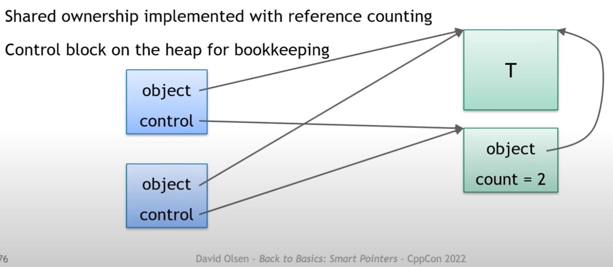

# Back to Basics: C++ Smart Pointers - David Olsen

## Raw pointers' role

Raw pointer are too powerful for their own good, it can't really communicate the programmer's intent

**Single object vs. array**

- Single: allocate with new, free with delete
- Array: allocate with new[], free with delete[]
- Single: don't use ++p, --p, p[n]
- Array: ++p, --p, p[n] are fine.

**Owning vs. non-owning**

- Owner must free the memory when done
- Non-owner must never free the memory

**Nullable vs. non-nullable**

- Some pointers can never be null
- It would be nice if the type system helped enforce that

**The type system doesn't help**

- `T*` can be used for all combinations of those characteristics. You just can't communicate well about your intention when using raw pointer, which makes code less clear and error-prone.

## What is smart pointer?

Behaves like a raw pointer

- at least one of the roles of a raw pointer
- points to an object
- can be dereferenced

Add additional "smarts"

- Often limits behavior to certain of a raw pointer's possible roles.

## What is smart pointer good for?

"Smart" can be almost anything:

- Automatically release resources is most common.
- Enforce restrictions, e.g. don't allow nullptr
- Extra safety checks
- Overall, with a limited API, it express programmer's intent

Sometimes the smarts are only in the name

- `gsl::owner<T>` is just a `typedef` of `T*` - it only have meaning for those reading the code.

## When to use raw pointer?

> :bulb: **Non-owning pointer to a single object** --> the only use case!

- Use a smart pointer for all owning pointers
- Use a span type in place of non-owning pointers to arrays. C++20 `std::span`, `gsl::span`

## unique_ptr

> :bulb: Release a resource must be guaranteed and implicit.  ... Bjarne Stroustrup

- Owns memory
- Assumes it is the only owner
- Automatically destroys the object and deletes the memory
- Move-only - as unique ownership can't be copied.
  - No cpy ctor nor cpy assignment

A simple implementation to understand what's underneath

```cpp
template <typename T>
class unique_ptr {
    T* ptr;
public:
    // all noexcept below because unique_ptr only claim
    // the ownership, not doing anything fishy.
    unique_ptr() noexcept : ptr(nullptr) {}
    explicit unique_ptr(T* p) noexcept : ptr(p) {}
    ~unique_ptr() noexcept { delete ptr; }

    // not copyable
    unique_ptr(const unique_ptr&) = delete;
    unique_ptr& operator=(const unique_ptr&) = delete;

    // move constructor transfers ownership
    unique_ptr(unique_ptr&& o) noexcept :
        ptr(std::exchange(o.ptr, nullptr)) {}
    unique_ptr& operator=(unique_ptr&& o) noexcept {
        delete ptr; // note: free current memory as taking over others
        ptr = std::exchange(o.ptr, nullptr);
        return *this;
    }

    T& operator*() const noexcept {
        return *ptr;
    }
    T* operator->() const noexcept {
        return ptr;
    }

    // gives up ownership
    T* release() noexcept {
        return std::exchange(ptr, nullptr);
    }

    void reset(T* p = nullptr) noexcept {
        delete ptr;
        ptr = p;
    }
    T* get() const noexcept {
        return ptr;
    }
    explicit operator bool() const noexcept {
        return ptr != nullptr;
    }
};

template<typename T, typename... Args>
unique_ptr<T> make_unique(Args&&... args);
// combines:
// - allocates memory
// - constructs a T with the given arguments
// - wraps it in a std::unique_ptr<T>
```

- `unique_ptr` is specialized for array types

```cpp
auto tmp = std::make_unique<double[]>(sz_of_array);
```

  - calls `delete[]` instead of `delete`
  - provides `operator[]`
- `make_unique` is specialized for array types
  - Argument is number of elements, not ctor arguments

> :bulb: Use move ctor/assignment to transfer ownership

```cpp
// good
auto a = std::make_unique<T>();
std::unique_ptr<T> b{std::move(a)};
a = std::move(b);

// bad, don't use release to transfer ownership
std::unique_ptr<T> d{a.release()};
a.reset(b.release);
```

> :bulb: To transfer ownership to a function, pass `std::unique_ptr` **by value**

> :bulb: To return ownership from a function, return `std::unique_ptr` **by value**

> :rotating_light: Make sure only one unique_ptr for a block of memory, otherwise it would have crashed due to double free.

```cpp
auto c = std::make_unique<T>();
std::unique_ptr<T> d{c.get()}; // will crash due to double free...
```

> :bulb: Don't create a unique_ptr from a pointer unless you know where the pointer came from and that it needs an owner.

> :bulb: Note: unique_ptr doesn't solve the dangling pinter problem

```cpp
T* p = nullptr;
{
    auto u = std::make_unique<T>();
    p = u.get();
    // p is now dangling and invalid
}
auto bad = *p; // UB!
```

> :bulb: `std::vector<std::unique_ptr<T>>` just works. Standard container knows how to handle move-only type and will do the right thing.

```cpp
{
    std::vector<std::unique_ptr<T>> v;
    v.push_back(std::make_unique<T>());
    std::unique_ptr<T> a;
    v.push_back(std::move(a));
    v[0] = std::make_unique<T>();
    auto it = v.begin();
    v.erase(it);
}
```

## shared_ptr

- Shared ownership: Many `std::shared_ptr` objects work together to manage one object.
- Automatically destroys the object and deletes the memory.
- Copyable (as shared ownership, copy means adding one more share of the ownership basically.)
- Ownership is shared equally
  - No way to force a `shared_ptr` to give up its ownership.
- Cleanup happens when the last `shared_ptr` gives up ownership.

Real world example:

- Open source project! Shared responsibility for maintenance.
- They survive as long as one person is willing to do the work.

In source code:

- UI widgets are often shared between different windows. A widget needs to stay alive as long as any reference is alive.
- Promise/future: they have shared state that need to stay around as long as either promise or future exists. But it's unknown which one will survive the longest. So it's a shared ownership of a shared state.
- It's often implemented with reference counting or garbage collection.



```cpp
template <typename T>
struct shared_ptr {
    // no ptr/control block created by default construct
    shared_ptr() noexcept;
    // allocate the control block and start manage the object
    explicit shared_ptr(T*);
    // decrement counter, cleanup only if counter == 0
    ~shared_ptr() noexcept;

    //copies object and control block pointer, counter++
    shared_ptr(const shared_ptr&) noexcept;
    // transfer ownership, counter stay the same
    shared_ptr(shared_ptr&&) noexcept;
    // transfer ownership, can only go one way (shared can't become unique)
    shared_ptr(unique_ptr<T>&&);

    // assignments are basically the same with their ctor counterpart
    // difference is that they effectively run destructor to release its current ownership first
    shared_ptr& operator=(const shared_ptr&) noexcept;
    shared_ptr& operator=(shared_ptr&&) noexcept;
    shared_ptr& operator=(unique_ptr<T>&&);

    T& operator*() const noexcept;
    T* operator->() const noexcept;

    // unlike unique_ptr, there is no release(). As the ownership is shared

    // give up current ownership and take ownership of what is passed in
    void reset(T*);
    T* get() const noexcept;
    explicit operator bool() const noexcept;

    // mainly for debug purpose, value could have changed before you do something
    long use_count() const noexcept;
};

// Combine followings together
// - one memory allocation for both object and control block
// - constructs a T with given arguments
// - initializes the control block
// - Wraps them in a std::shared_ptr<T> object
// Always prefer using make_shared to create a shared_ptr directly
template <typename T, typename... Args>
shared_ptr<T> make_shared(Args&&... args);
```

> :brain: To share ownership, additional shared_ptr objects must be created or assigned from an existing shared_ptr, not from the raw pointer.

```cpp
{
    T* p = ...;
    std::shared_ptr<T> a(p);
    std::shared_ptr<T> b(p);
} // runtime error: double free!

{
    auto a = std::make_shared<T>();
    std::shared_ptr<T> b(a.get());
} // sorry, double free again!

{
    auto a = std::make_shared<T>();
    std::shared_ptr<T> b(a);
    std::shared_ptr<T> c;
    c = b;
} // yes sir!
```

> :brain: Thread-safety of shared_ptr: "Updating the same control block from different threads are thread safe!"

- counter is `atomic` and use `atomic_fetch_add` to update the counter, so below is totally fine.

```cpp
// This is good


auto a = std::make_shared<int>(42); //count++ in main thread.

std::thread t([](std::shared_ptr<int> b) {
    std::shared_ptr<int> c = b; // count++ in thread t
    read_only_work(*c);
}, a); // count-- in thread t

{
    std::shared_ptr<int> d = a; //count++ in main thread.
    a.reset(); //count-- in main thread
    more_read_only_work(*d);
} //count-- in main thread

t.join();
```
**when is shared_ptr non-thread-safe?**

> :rotating_light: Updating the managed object from different threads is not thread-safe. shared_ptr provides no locking on the underlying data, only the control block is protected!

```cpp
// YOU HAVE A RACE WRITE HERE
auto a = std::make_shared<int>(42);

std::thread t([](std::shared_ptr<int> b) {
    std::shared_ptr<int> c = b;
    *c = 100; //race!
}, a);

{
    std::shared_ptr<int> d = a;
    a.reset();
    *d = 200; //race!
}

t.join();
```

> :rotating_light: Updating the same shared_ptr object from different threads are not thread safe! E.g. shared_ptr doesn't provide any lock to the shared_ptr itself! Only the control block is thread safe!

- E.g. you can safely use 2 shared_ptr that points to the same object from different threads, but you can't safely use the same shared_ptr object from multiple threads

```cpp
// YOU HAVE A RACE WRITE HERE
auto a = std::make_shared<int>(42);

std::thread t([&a]() { // capture
    read_only_work(*a); // race with below, is a 42 or 100?
}, a);

a = std::make_shared<int>(100); // race!
t.join();
```

**Regarding arrays**

- shared_ptr added support for array types in C++17
- make_shared added support for array types in C++20
- Use array types with shared_ptr with caution

## Heuristics

Single owner: use unique_ptr
Multiple owners: use shared_ptr
Non-owning reference: use something else entirely
When in doubt, prefer unique_ptr. (Easier to switch from unique_ptr to shared_ptr than the other way around.)


## weak_ptr

- A non-owning reference to a shared_ptr managed object
- Knows when the lifetime of the managed object ends

```cpp
std::weak_ptr<int> w;
{
    auto s = std::make_shared<int>(42);
    w = s; // weak_ptr points to the same object but don't claim shared ownership
    if (std::shared_ptr<int> t = w.lock()) {
        std::cout << *t << '\n';
    }
    if (!(std::shared_ptr<int> u = w.lock())) {
        std::cout << "empty\n";
    }

}
```

- Only useful when object is managed by shared_ptr
- Caching: keep a reference to an object for faster access while don't want that reference to keep the object alive.
- lock can detect dangling references

## Custom deleter

- unique_ptr has an extra defaulted template parameter for the delete

```cpp
template <typename T, typename Deleter = std::default_delete<T>>
class unique_ptr;
```
- Type `Deleter` must have an `operator()(T*)`
- `std::make_unique` doesn't support custom deleters.
- `unique_ptr` with custom deleter must be constructed correctly.

```cpp
struct fclose_deleter {
    void operator()(FILE* fp) const { fclose(fp); }
};

using unique_FILE = std::unique_ptr<FILE, fclose_deleter>;

{
    unique_FILE fp(fopen("readme.txt", "r"));
    fread(buffer, 1, N, fp.get());
} // custom deleter kicks in and fclose called automatically
```

Custom deleter for shared_ptr is passed to constructor where it is type erased.

> :brain: (E.g.) unlike unique_ptr, deleter's type isn't part of shared_ptr's type! It's just a templated type in constructor's input parameter.

- :brain: why can shared_ptr do type erase? Because control block on the heap stores the information. unique_ptr have no such place to put such info.

```cpp
struct fclose_deleter {
    void operator()(FILE* fp) const { fclose(fp); }
};

{
    std::shared_ptr<FILE> fp(fopen("readme.txt", "r"), fclose_deleter{});
    fread(buffer, 1, N, fp.get());
    std::shared_ptr<FILE> fp2(fp);
} // custom deleter kicks in and fclose called automatically
```

## Casts

To have shared_ptrs of different types that manage the same object, you can do: `dynamic_pointer_cast`, `static_pointer_cast`, `const_pointer_cast`, `reinterpret_pointer_cast`

```cpp
std::shared_ptr<WidgetBase> p = create_widget(input);
std::shared_ptr<BlueWidget> b = std::dynamic_pointer_cast<BlueWidget>(p);
if (b) {
    b->do_something_blue();
}
```

The other way is using aliasing constructor, which is useful for pointers to subojects of managed objects

```cpp
struct Outer {
    int a;
    Inner inner;
};

void f(std::shared_ptr<Outer> op) {
    std::shared_ptr<Inner> ip(op, &op->inner);
}
```

## convert `this` to shared_ptr

- class derives from `enable_shared_from_this`
- Object is already managed by a shared_ptr
- `return this->shared_from_this();`

## Guidelines

- Use smart pointers to represent ownership
- Prefer unique_ptr over shared_ptr
- Use make_unique and make_shared
- Pass/return unique_ptr to transfer ownership between functions