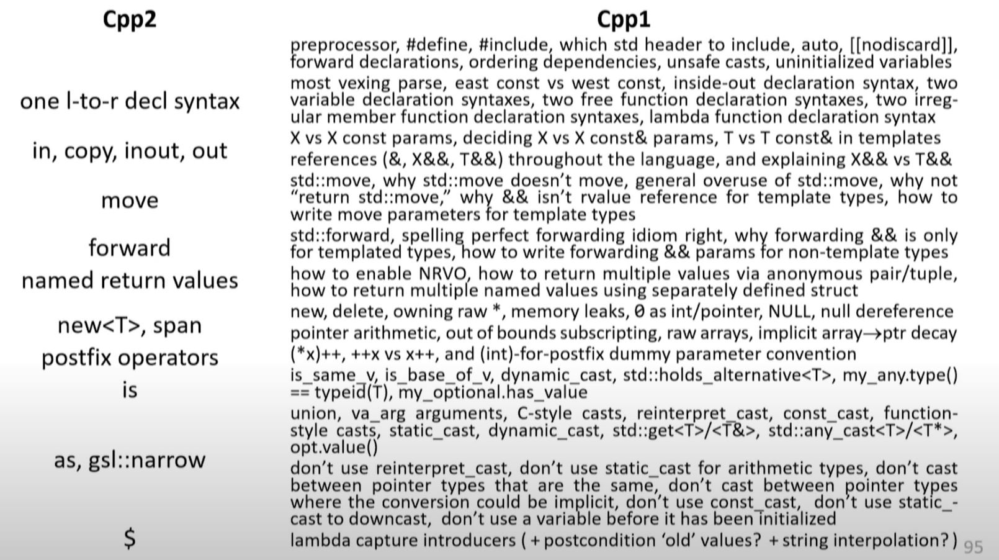

# Can C++ be 10x Simpler & Safer? - Herb Sutter

The goal:

reduce complexity (10x), increase safety (50x), improve toolability (10x), evolve more freely for another 30 years

- Support all C++20/23 ... evolution, embrace C++20/23 ... (e.g. default to C++20 modules, C++23 import std; ...etc)
- "directed evolution" of C++ itself - compiling to C++20/23, ...keeps us honest bring any results to ISO C++ evolution

Metrics to aim for:

- 50x safer = 98% fewer CVEs and bugs in these categories
- 10x simpler = 90% less total guidance to teach in C++ books and courses

What is C++:

- Zero-overhead abstraction
- Determinism and control
- Friction-free interop with C and C++prev

The problem:

- We've been incremental (10%) better, not game changing (10x) better on making progress, and the major reason is that **we need to maintain 100% syntax backward compatibility**

> - "Inside C++, there is a much smaller and cleaner language struggling to get out ... B. Stroustrup
> - Say 10% of size of C++ in definition and similar in front-end compiler size ... Most of the simplification would come from generalization" ... B. Stroustrup

The question and the strategy of tacking the problem:

- Apply the zero-overhead principle to backward source compatibility, pay only if you use it. Is this possible?
- e.g. What could we do if we had a cleanly demarcated bubble of new code, via an alternate syntax for C++?
- e.g. **What if we could do "C++ 11 feels like a new language" again for the whole language?**

> What are the common piece we could unify?

> What are the pieces we could refactor out so that we have smaller, simpler composable, general features that still allows us express what we want to express, but the concept count is lower?

- Remember concept count is the number of things you have to teach, it's not just the number of keywords in language, it's also the number of exceptions. Anytime you have an irregularity, anytime you have 2 ways to say the same thing, anytime you have "2 features works together something different happens", there is another thing to teach. ... That's why we want to reduce concept count.

C++ itself basically went through the same problem from C and (younger) Bjarne succeeds to achieve the goal to change C and became C++, can we do this to C++ again?

- Back then, it was "C with classes" as goal, with
  - adding value (C lacks of abstraction),
  - adding availability (C lacks of optimizers, linkers, debuggers, tools, ...)
  - keep compatibility (full interop with C, including mix C and C++ sources)

- Hence the new project: [cppfront](https://github.com/hsutter/cppfront) - a "C++ syntax 2 experiment" project to achieve the new C++.

## Design principle - conceptual integrity

Refactor: fewer composable general features

1. **be consistent**: Don't make similar things different. Make important differences visible.
2. **be orthogonal**: avoid arbitrary coupling. Let features be used freely in combination.
3. **be general**: Don't restrict what is inherent, don't arbitrarily restrict a complete set of uses. Avoid special cases and partial features.

## Design stakes: embracing constraints

Goals: safety, simplicity, toolability

- There are lots of things to improve, some of them are just personal opinion. We want those that can actually make a measurable impacts.

1. **stay measurable**: each change must address a known C++ weakness in a measurable way. (e.g. remove X% fof rules we teach, remove X% of reported vulnerabilities ...etc)
2. **stay C++**: never violate zero-overhead, opt-in to "open the hood"

syntax & grammer isn't the point, making syntax prettier isn't the point

- syntax is the gate to the newer area, if it's new, it should be pretty. But it's just syntax.

1. context-free: Especially parsing never requires sema
2. order-independent: no forward declarations or ordering gotchas
3. declare l-to-r: declarations are written left to right
4. declare $\equiv$ use: declaration syntax mirrors use syntax

Some demo around [18:15 -> 37:03]

## [Safety](https://youtu.be/ELeZAKCN4tY?t=2375)

C++ actually got called out by government as it's "not memory safe" ... so we need to do something, and it's done in cppfront

[2022 CWE Top 25 Most Dangerous Software Weaknesses](https://cwe.mitre.org/top25/archive/2022/2022_cwe_top25.html): Among them ... some common scenes that we want to tackle in cppfront:

- Use after free - **lifetime safety**
- Use before initialized - **initialization safety**
- Type confusion - **type safety**
- Stack corruption - **bounds safety**
- Out of bounds read - **bounds safety**
- Heap corruption - **lifetime safety**

Approach: take the best practices we already teach and promote, and ...

1. enforce them by default
2. direct programmers to what we already say to "do this instead"
3. focus any new additions on filling remaining holes.

Remaining of talks, mainly on demo of safety/simplicity improvement.

Things brought up in the talk:

