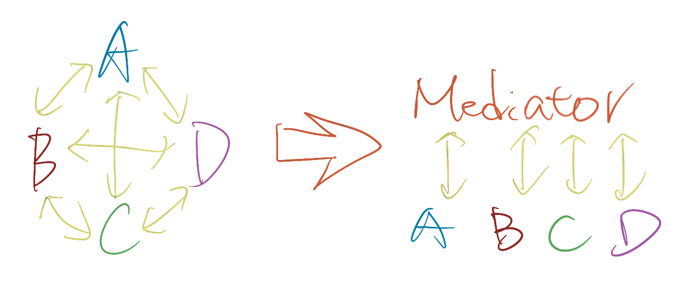

# Quick fact
- Mediator is a mechanism for facilitating communication between the components. Overall, it lets you reduce chaotic dependencies between objects.
    - there are situations when you don’t want objects to be necessarily aware of each other’s presence.
    - Or, perhaps you do want them to be aware of one another, but you still don’t want them to communicate through pointers or references
- The pattern restricts direct communications between the objects and forces them to collaborate only via a mediator object.

- The mediator itself needs to be accessible to every component taking part, maybe a reference that gets injected into every component.
- The Mediator pattern suggests that 
    - you should cease all direct communication between the components which you want to make independent of each other. 
    - Instead, these components must collaborate indirectly, by calling a special mediator object that redirects the calls to appropriate components.
    - As a result, the components depend only on a single mediator class instead of being coupled to dozens of their colleagues.

# Applicability
- Use the Mediator pattern when it’s hard to change some of the classes because they are tightly coupled to a bunch of other classes.
    - The pattern lets you extract all the relationships between classes into a separate class, isolating any changes to a specific component from the rest of the component.
- Use the pattern when you can’t reuse a component in a different program because it’s too dependent on other components.
    - After you apply the Mediator, individual components become unaware of the other components. They could still communicate with each other, albeit indirectly, through a mediator object.
- Use the Mediator when you find yourself creating tons of component subclasses just to reuse some basic behavior in various contexts.
    - Since all relations between components are contained within the mediator, it’s easy to define entirely new ways for these components to collaborate by introducing new mediator classes, without having to change the components themselves.

# Comparison
- Facade and Mediator have similar jobs: they try to organize collaboration between lots of tightly coupled classes.
    - Facade defines a simplified interface to a subsystem of objects, but it doesn’t introduce any new functionality.
        - The subsystem itself is unaware of the facade. Objects within the subsystem can communicate directly.
    - Mediator centralizes communication between components of the system.
        - The components only know about the mediator object and don’t communicate directly.
- In most cases, you can implement either Mediator and Observer; but sometimes you can apply both simultaneously.
    - The primary goal of Mediator is to eliminate mutual dependencies among a set of system components. Instead, these components become dependent on a single mediator object.
    - The goal of Observer is to establish dynamic one-way connections between objects, where some objects act as subordinates of others.
- There’s a popular implementation of the Mediator pattern that relies on Observer.
    - The mediator object plays the role of publisher, and the components act as subscribers which subscribe to and unsubscribe from the mediator’s events.
    - When Mediator is implemented this way, it may look very similar to Observer.
- When you’re confused, remember that you can implement the Mediator pattern in other ways.
    - Mediator but no observer: You can permanently link all the components to the same mediator object. This implementation won’t resemble Observer but will still be an instance of the Mediator pattern.
    - Observer but not mediator: Imagine a program where all components have become publishers, allowing dynamic connections between each other. There won’t be a centralized mediator object, only a distributed set of observers.
