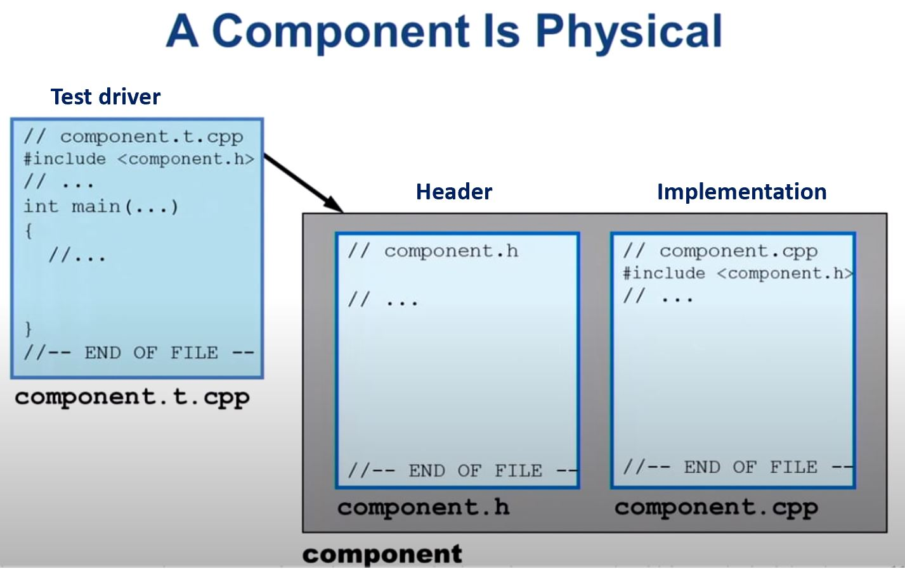
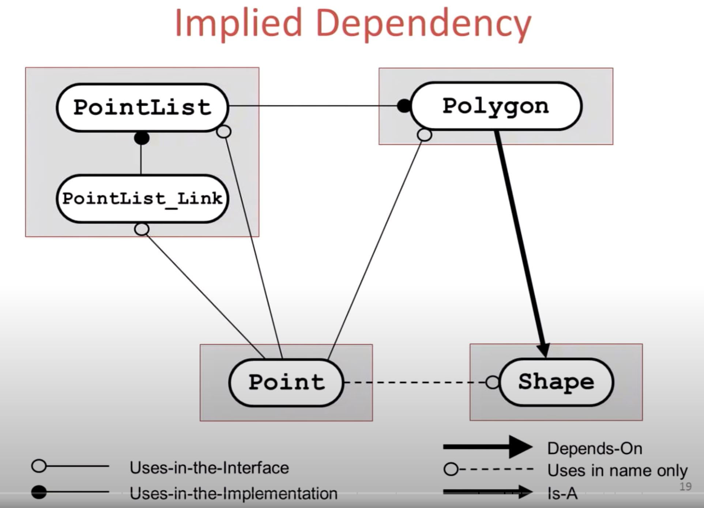
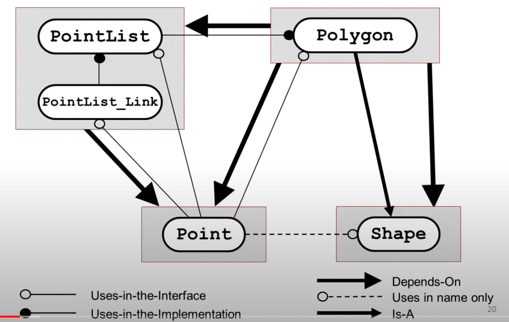
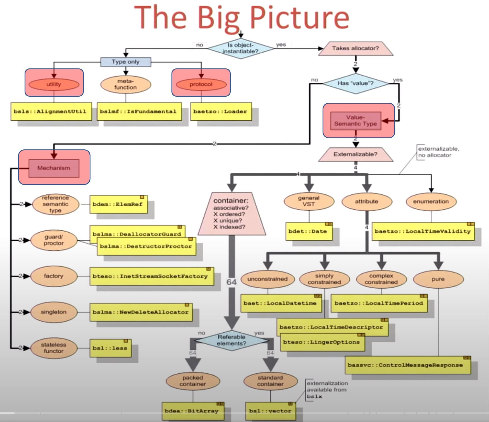

# Value Semantics: It ain't about the syntax!, Part I - John Lakos


## :flags:Introduction and Background:flags:

## What's the problem?

In large-scale C++ software design

- Involves many subtle logical (classes and functions) and physical (files and libraries) aspects
- Requires an ability to isolate and modularize logical functionality within discrete, fine-grained physical components
  - "Component": uniform "physical" structure, it's THE fundamental unit of design
  - 
  - 
- Compels the designer to delineate logical behavior precisely, while managing the physical dependencies on other subordinate components
  - How do we describe the logical behavior within components in English contracts? And be mindful about the physical dependencies it resolves
  - Example: Component diagram with logical relationship like this:
    - 
    - 
- Demands a consistent, shared understanding of the properties of common class categories: Value types

## The big pictures

A random github repo might exist something like this about how you navigate across class categories

- The primary things are: utility, protocol, mechanism and value-semantics type



## :flags:Understanding value semantics:flags:

## Purpose of this talk

- Answer some key questions about **value**
  - What do we mean by value?
  - Why is the notion of value important?
  - Which types should be considered value types?
  - What do we expect syntactically of a value type?
  - What semantics should its operations have?
  - How do we design proper value-semantic types?
  - When should value-related syntax be omitted?

## Value versus Non-Value Types

- Not all useful C++ classes are value types (for example, allocator isn't.)
- Still, value types form an important category.
- Goal: begin with understanding some basic properties of value types, then contrast them with non-value types, to create a type-category hierarchy. Then we can dig in further for value syntax and semantics (part II of the talk).

## The story

- We were discussing what was meant by stating two `std::match_result` were the same?
- What do we mean by "the same" in general?
  - The 2 objects are identical? Same address, same process, or same time (:thinking:)?
  - The 2 objects are distinct, yet have certain properties in common (:white_check_mark:).
- Say it's the later, was the meaning clear?? What exactly has to be "the same"?
  - Whatever the copy constructor preserves (:thinking:)?
  - As long as the two are "equal" (:thinking:)?
  - As long as they're "equivalent" (:thinking:)?
- It turns out, what it means for 2 objects to be "the same" is an important, pervasive, and recurring concept in practical software design. And it's all based on the notion of "value"

## :flags:So what do we mean by "value"?:flags:

## What does a copy ctor do?

- After copy construction, the resulting object is substitutable for the original one with respect to some criteria. But what criteria?
- Same object? No, consider:

```cpp
std::vector<double> a, b(a);
assert(&a == &b); // Nope
assert(0 == b.size());
a.push_back(5.0);
assert(1 == b.size()); // Nope
```

- Same state? No, consider:

```cpp
class String {
    char* d_array_p; // if this got copied, there will be 2 references
    //...
}
```

- Same behavior? If we apply the same sequence of operations to both objects, the observable behavior will be the same. No ... consider below, generally, the very fact that we have different object, no matter how much they might be the same might be, their address alone might be enough to make them no substitutable to have the same behavior.

```cpp
void f(bool takeA) {
    std::vector<int> a;
    std::vector<int> b(a); // assert (a == b)
    a.push_back(5);
    b.push_back(5);
    auto& r = takeA? a: b;
    if (&r[0] == &a[9]) { std::cout << "alright\n"; }
    else { std::cout << "...\n"; }
}
```

- So ... same what!??? Conclusion about the idea, the two objects should represent the same **value**. What do we mean by value? Let's expand it ...
- When you are going to design something, before you actually start typing, the think of what you are trying to do. And having thought about it, you have the mental model in your head. I got this thing that I want to implement, and now I'm going to see how should I put it in C++. But before you start typing, you have that mental model. The mental model is the specification, the theoretical, mathematical type, and now we are going to approximate it with C++.

## Mathematical type

A mathematical type consists of

- A set of globally unique values
  - Each one describable independently of any particular representation
  - For example, the decimal integer 5 can be represented in several ways ... 5, 101, IIIV, five ...
- A set of operations on those values
  - For example: +, -, *, ...

## C++ Type

- A C++ type **may** represent (an approximation to) an abstract mathematical type
  - For example, C++ type `int` represents (an approximation to) the mathematical type *integer*
- An object of such a C++ type represents one of (a subset of) the globally unique values in the set of that "abstract mathematical type"
- The C++ object is "just another representation" of that globally unique, abstract value, e.g. 5

===tmp@19:32===