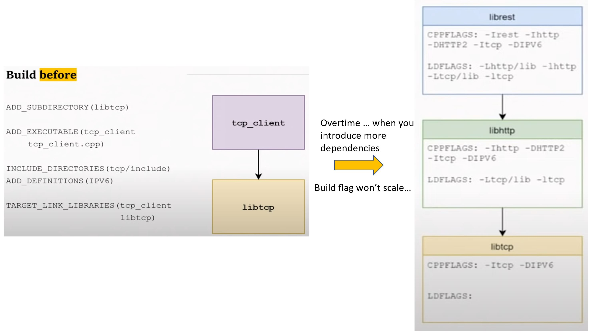
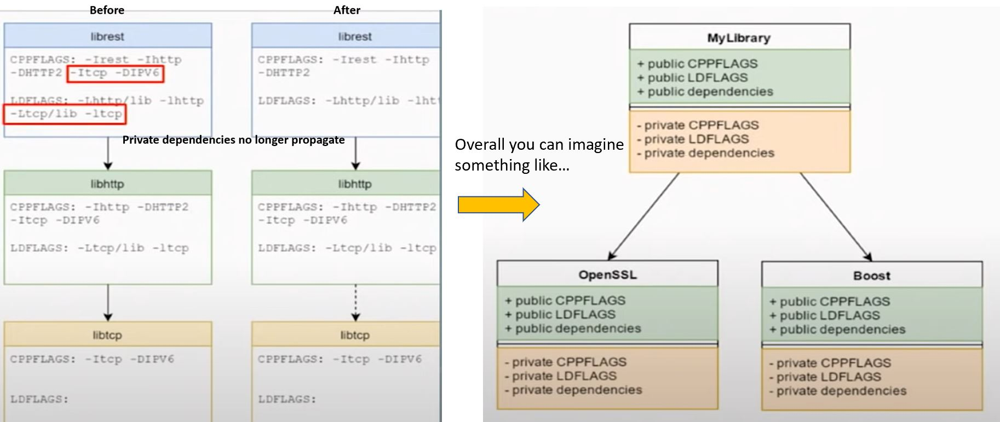

# Using Modern CMake Patterns to Enforce a Good Modular Design - Mathieu Ropert

## CMake is a "Cross-platform C++ build generator", not a build system

- You tell CMake what project you want to build, and it generates the script for your build system (no matter it's make, visual studio, ..etc).
- The goal is cross-platform, you write it once, and it works everywhere.

```bash
cmake -G "Visual Studio 15 2017 Win64" . # on windows machine

cmake -DCMAKE_XCC_COMPILER="clang++" -DCMAKE_CXX_FLAGS="-stdlib=libc++ -m64" . # on linux machine
```

- It was published on 2020. Lots of things has evolved. C++ has modern C++. CMake also have modern CMake.
  - In practice, version 3.0.0

## A brief recap of the philosophy: modular design

- Retain control of your dependency graph
- Keep concerns separated
- Make modules reusable in other contexts at minimal scale
- Check talks from John Lakos, CppCon2016, advanced levelization technique, or his book, Large-scale C++ Software Design

## Modern build systems

- Same philosophy: very explicit in what you said, you are explicit about what you ask in terms of building something. You only ask for what you use. And the system will forbid you from using something you didn't declare.
- Overall, the philosophy facilitate large scale modular design and protect against antipatterns (circular, hidden dependencies).



The "build before"

- I'm saying:
  - I have this binary `ADD_EXECUTABLE...`
  - It needs these headers `INCLUDE_DIRECTORIES...`, `ADD_DEFINITIONS...`
  - And it needs to link to to other lib `TARGET_LINK_LIBRARIES...`
- I'm not talking about modules, I'm talking about all the build flags.
- The problem is that build flags don't scale, every change in public flags has to be propagated upwards
  - Most people usually give up and put every include directory in a common/root build file.
- It's not easy to detect bad code architecture patterns when looking at build flags
- If you can define build in terms of "modules depending on other modules", it should make the problem trivial

## Modern build, in practice

- Define your module build flags
- Define your module dependencies
- Keep out of other modules internals
- Each module has a set of private flags (required to build its implementation). Once you build the module for its implementation, nobody else should care about the private flags.
- Each module has a set of public flags (required to build against its interface).
- Build interfaces are transitive.

## Public/private dependencies

- Public dependencies are transitive and will be passed down to clients
- Private dependencies are not
- Overall, build flags aren't gone, only encapsulated.
- You can still have your all kinds of flags for your module, but external flags aren't your concern anymore.



## How to do this with CMake?

- Declare your module with `ADD_LIBRARY` or `ADD_EXECUTABLE`
- Declare your build flags with `TARGET_*`
- Declare your dependencies with `TARGET_LINK_LIBRARIES`
- Specify what is `PUBLIC` and what is `PRIVATE`

```cmake
# Global setup

cmake_minimum_required(VERSION 3.0)

## flags that should be on the top level to make sure all the libs are in the
## same page
if (MSVC)
    add_compile_options(/W3 /WX)
else()
    add_compile_options(-W -Wall)
endif()

# then declare your module

add_library(mylib
    src/file1.cpp
    src/file2.cpp
    #...
    )

# then declare your flags

target_include_directories(mylib PUBLIC include)
target_include_directories(mylib PRIVATE src)

if (SOME_SEWTTING)
    target_compile_definitions(mylib
        PUBLIC
            WITH_SOME_PUBLIC_SETTING_THAT_IS_REQUIRED
        PRIVATE
            WITH_SOME_PRIVATE_SETTING_THAT_ONLY_AFFECTS_IMPLEMENTATION
        )
endif()

# then declare your dependencies

## Public (interface) dependencies
target_link_libraries(mylib PUBLIC abc)

## Private (implementation) dependencies
target_link_libraries(mylib PRIVATE xyz)
```

- When we do `target_link_libraries(mylib PUBLIC abc)`, and `abc` is a project, we will get all the public flags needed recursively. If you have dependencies in static library, CMake will remember that, the first shared library or executable encountering it will link to it. It's taken care for you.
- If you have something only depended in your implementation (e.g. your header doesn't), you can put it in PRIVATE. Then this dependency will not be seen by your consumer.

## Header only library

- `INTERFACE` declares something that belongs to your public interface, but should not be used to build your library. (For header only library, you have nothing to build, but you want your client to see it, so you use `INTERFACE` keyword.)


```cmake
add_library(mylib INTERFACE)

target_include_directories(mylib INTERFACE include)

# you can link to something for your header only library if you want
target_link_libraries(mylib INTERFACE Boost::Boost)
```

## Recognize antipatterns

:rotating_light: Don't use macros that affect all targets

- `INCLUDE_DIRECTORIES()`
- `ADD_DEFINTITIONS()`
- `LINK_LIBRARIES()`
- If you put these in your top-level, everything downstream will use it. This just creates hidden dependencies everywhere.

:rotating_light: Don't use `TARGET_INCLUDE_DIRECTOREIES()` with a path outside your module

:rotating_light: Don't use `TARGET_LINK_LIBRARIES()` without specifying PUBLIC, PRIVATE or INTERFACE.

:rotating_light: Don't use `TARGET_COMPILE_OPTIONS()` to set flags that affect the ABI

## External dependencies

```cmake
find_package(GTest)
add_executable(foo ...)
target_link_libraries(foo
    Gtest::GTest GTest::Main)
```

Modern finders provide targets instead of flags (Another reason to upgrade your CMake version!)

- CMake 3.4: OpenSSL
- CMake 3.5: Boost, GTest, GTK, PNG, TIFF
- CMAKE 3.6: PkgConfig
- CMAKE 3.7: Bzip2, OpenCL
- CMAKE 3.8: OpenGL

## Hand-made finder

- You should provide one with your public libraries
- CMake can even generate it for you

```cmake
find_library(BAR_LIB bar HINTS ${BAR_DIR}/lib)
add_library(bar SHARED IMPORTED)
set_target_properties(bar PROPERTIES
            LOCATION ${BAR_LIB})
set_target_properties(bar PROPERTIES
            INTERFACE_INCLUDE_DIRECTORIES ${BAR_DIR}/include
            INTERFACE_LINK_LIBRARIES Boost::boost)
```

## Conclusion

For a modern build:

- Keep your flags to yourself
- Think in terms of modules
- Let the build system handle transitivity
- Switch to CMake 3.X
- Use the `TARGET_*` version of macros
- Specify if a property is PUBLIC, PRIVATE, or INTERFACE.
- Link against targets to get their build flags

For a external packages

- Use modern finders that declare targets
- Generate them with CMake, from your actual project definition
- Use a package manager