# 105 STL Algorithms in Less Than an Hour - Jonathan Boccara

## Why STL?

**STL algorithm can make code more expressive**

- Raising levels of abstraction
- Sometimes, it can be spectacular -> checkout C++ seasoning talk

Avoid common mistakes

- Off-by-one
- Empty loops
- naive complexity

Used by lots of people

- A common vocabulary
- Whatever the version of your compiler

[The map in presentation](https://www.fluentcpp.com/getTheMap/)

## :world_map: Longly islands

`std::for_each`

<details><summary markdown="span">Pic</summary>

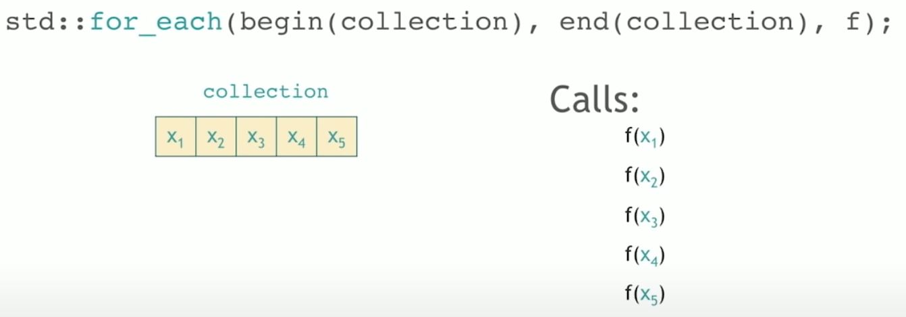

</details>

- Note that `std::for_each` doesn't care the return value of `f`. (So `f` can return void.)
- Function returns void oftentimes have SIDE-EFFECTS. Ideally try to use other algorithm without the side-effects in general

`std::transform`

<details><summary markdown="span">Pic</summary>

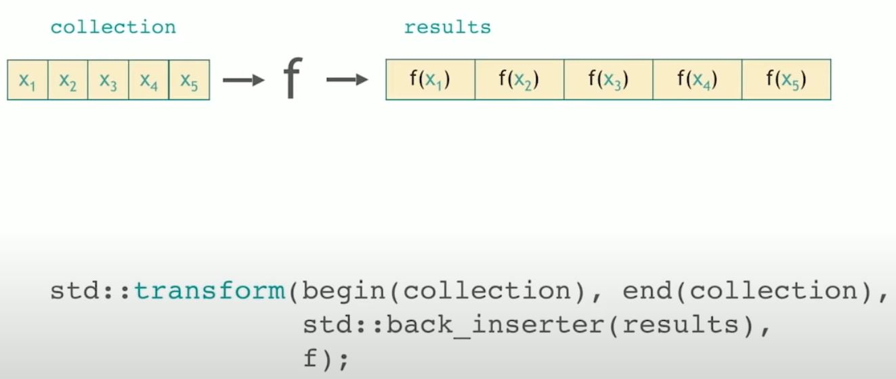
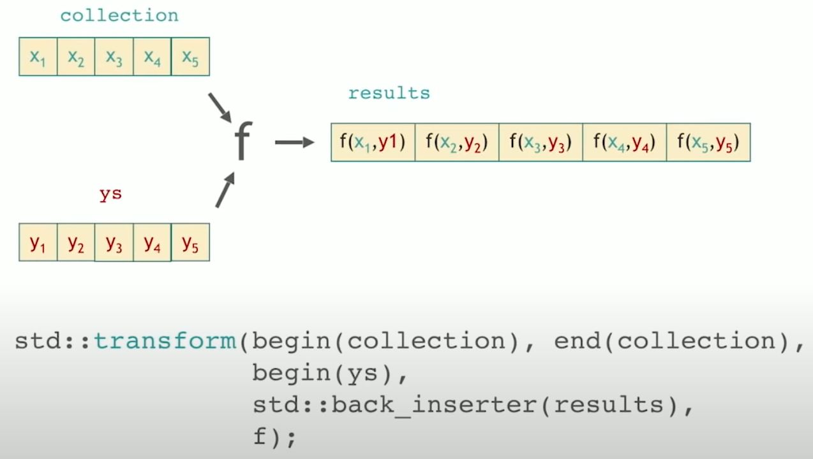

</details>

## :world_map: Lands of Permutations - elements moving around a collection

### :mountain: Heaps

`std::make_heap(begin(numbers), end(numbers));`

<details><summary markdown="span">Pic</summary>

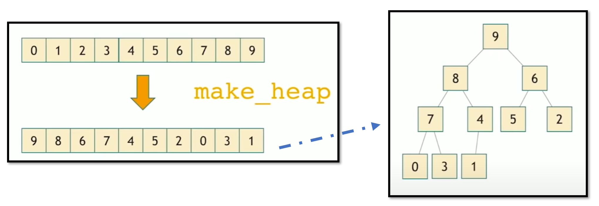

</details>


`std::push_heap(begin(numbers, end(numbers)));`

<details><summary markdown="span">Pic</summary>

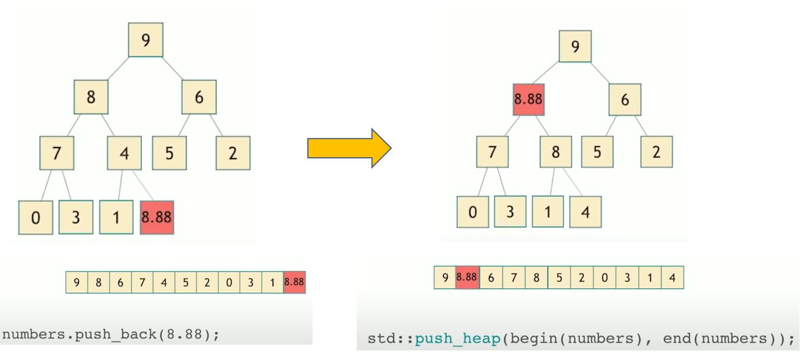

</details>

`std::pop_heap(begin(numbers, end(numbers)));`

- Note: pop_heap didn't pop the (max) element out
- You have to call `numbers.pop_back();` to remove it.
- And if you call `pop_heap()` n times without `pop_back()`, then it becomes sorted array.
- (This is what `std::sort_heap()` does)

<details><summary markdown="span">Pic</summary>

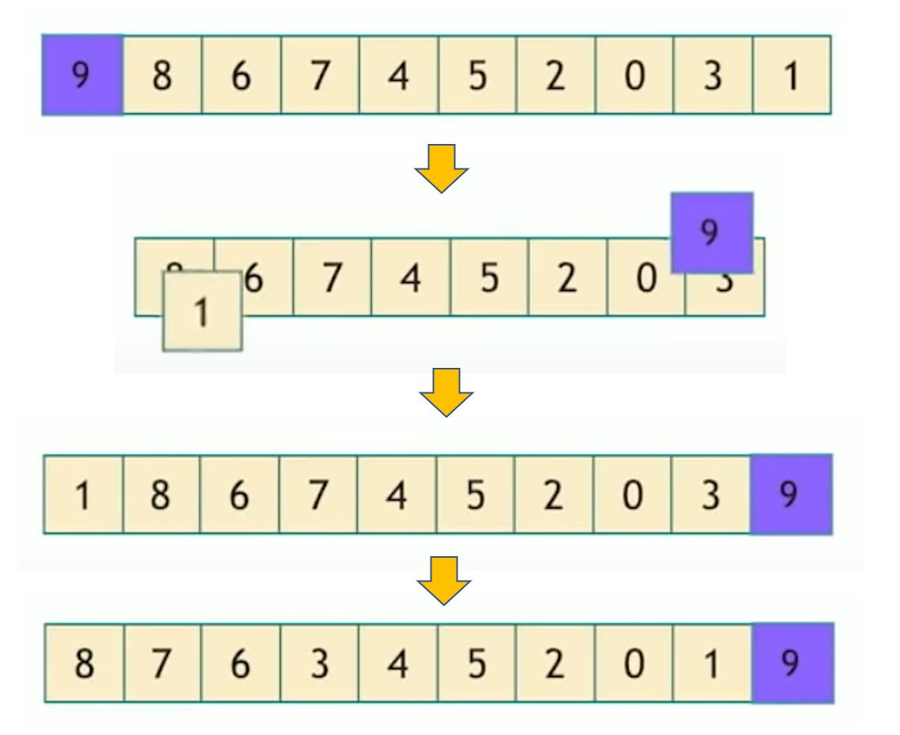

</details>

### :mountain: Shore of sorting

`std::sort`

`std::partial_sort`: sort the partial range, remaining unordered

`std::nth_element`: just make sure the nth element will be in the right position if it's in sorted array. For the rest, everything on the left is smaller but not sorted. Everything on the right is larger but not sorted.

`std::sort_heap`: mentioned already - the n operation of `pop_heap()`

`std::inplace_merge`: for 2 sorted part, the merge makes them sorted together.


### :mountain: Region of partitioning

- Partition is look at a collection through a predicate (something returns boolean). Then partition makes all the elements that makes predicate true to the begin of the collection. The boarder for predicate being true/false is called partition point, and it should be at next to the last element that predicate returning true.

`std::partition`

`std::partition_point`

<details><summary markdown="span">Pic</summary>

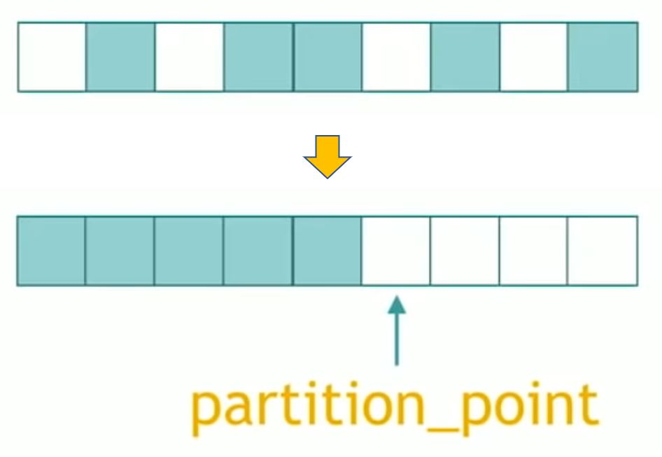

</details>

### :mountain: Other permutations

`std::rotate`: move back to front

`std::shffle`: rearrange elements randomly

`std::next_permutation`, `std::prev_permutation`

<details><summary markdown="span">Pic</summary>


</details>

`std::reverse`

### :sparkles: Secret runes for lands of permutation

- Things that you can combine with other algorithm to generate new algorithm

`stable_*`: keep the same relative order when rearrange

- `stable_sort`
- `stable_partition`

`is_*`: return boolen indicating whether it is *

- `is_sorted`
- `is_partitioned`
- `is_heap`

`is_*_until`: return the first iterator that the predicate no longer holds

- `is_sorted_until`
- `is_partitioned_until`
- `is_heap_until`

## :world_map: Lands of Queries

### :mountain: Querying a value

<details><summary markdown="span">Pic</summary>

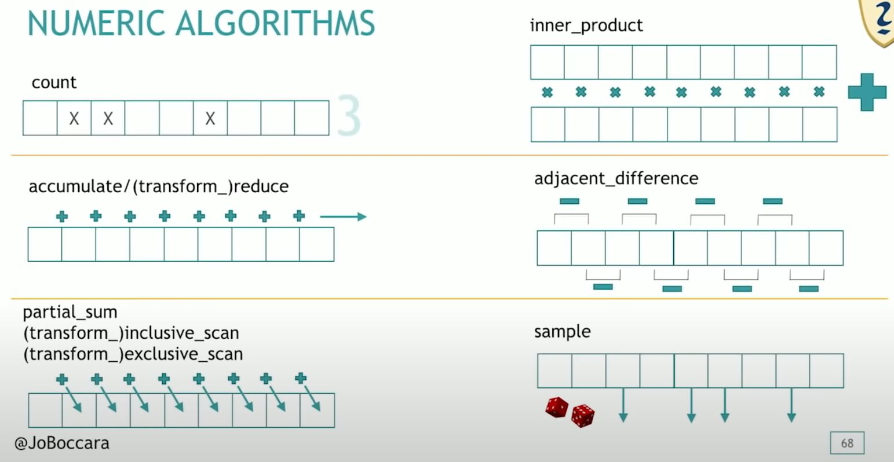

</details>

`std::count`

---

`std::accumulate`

`std::transform_reduce`

`std::reduce`

---

`std::partial_sum`

`std::transform_inclusive_scan`

`std::transform_exclusive_scan`

---

`std::inner_product`

---

`std::adjacent_difference`

---

`std::sample`

### :mountain: Querying a property

<details><summary markdown="span">Pic</summary>

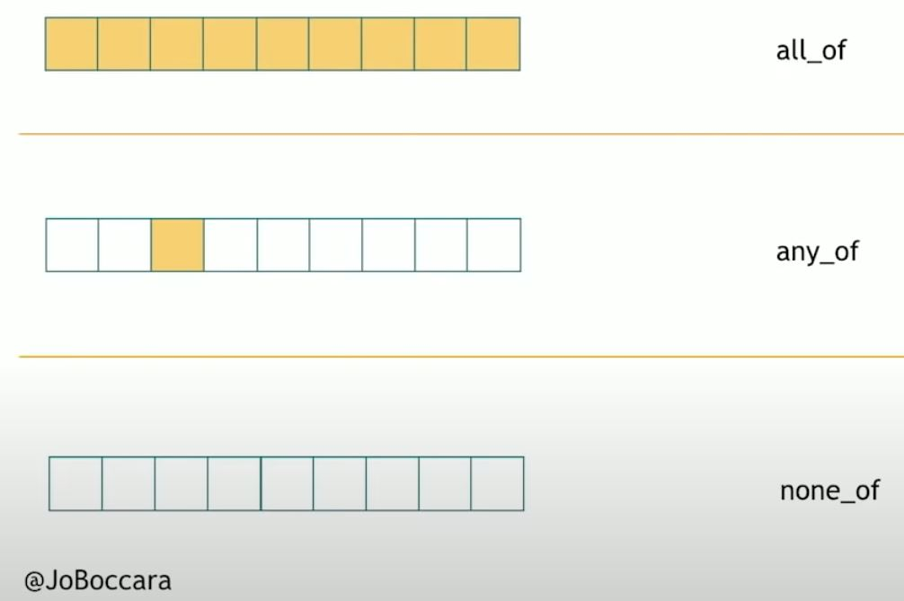

</details>

`std::all_of`: returns true for empty collection

`std::any_of`: returns false for empty collection

`std::none_of`: returns true for empty collection

### :mountain: Querying a property on 2 ranges

Essentially different ways to compare 2 ranges

<details><summary markdown="span">Pic</summary>

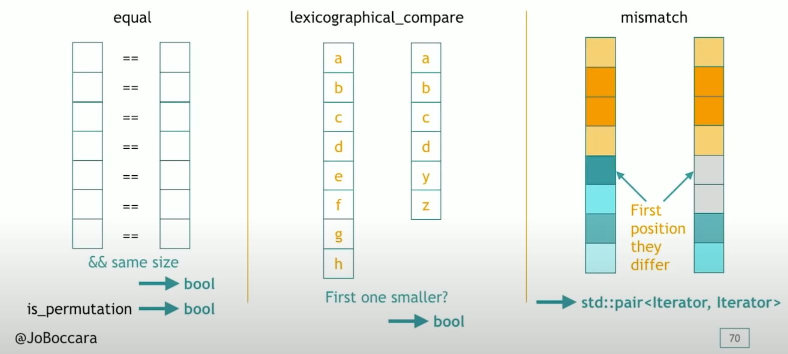

</details>

`std::equal`: return bool

`std::lexicographical_compare`: return true if first one is smaller

`std::mismatch`: return `std::pair<Iterator, Iterator>` for the mismatched point on each range.

### :mountain: Search a value

<details><summary markdown="span">Pic</summary>

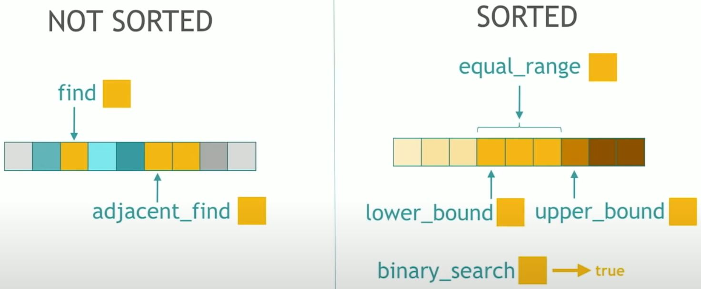

</details>

Not-sorted input:

- `std::find`
- `std::adjacent_find`: returns the first iterator where 2 adjacent values equal to input

Sorted input:

- `std::equal_range`
- `std::lower_bound`
- `std::upper_bound`
- `std::binary_search`


### :mountain: Search a range

<details><summary markdown="span">Pic</summary>

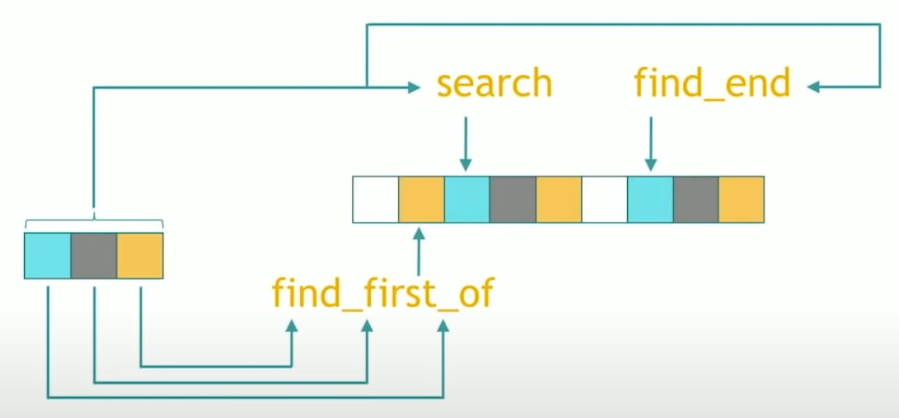

</details>


`std::search` (note, naming: "search" a range and "find" a value)

`std::find_end` (but then find_end for a range at the end...)

`std::find_first_of` (find first value in the small range in bigger range)

### :mountain: Search a relative value

<details><summary markdown="span">Pic</summary>

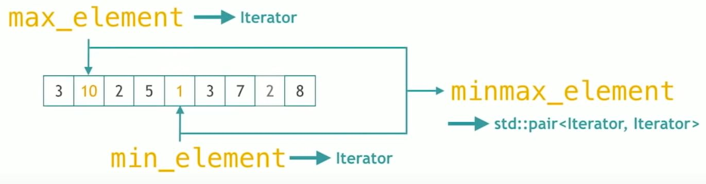

</details>

`std::max_element`

`std::min_element`

`std::minmax_element`


## :world_map: Algos on sets

Note: "set" is any sorted collection. E.g. sorted vector is also a set for these algorithms

<details><summary markdown="span">Pic</summary>

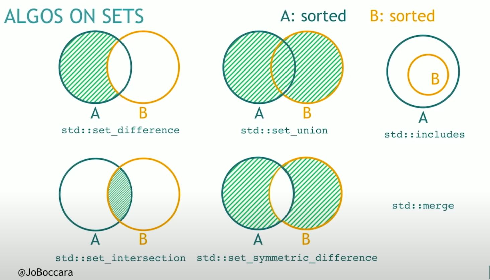

</details>

`std::set_difference`: elements in A but not B

`std::set_intersection`: elements in A and B

`std::set_union`: elements in A or B

`std::set_symmetric_difference`: A or B - (A and B)

`std::includes`

`std::merge`: combines 2 sorted sets into one bit sorted set

## :world_map: Territory of movers

<details><summary markdown="span">Pic</summary>

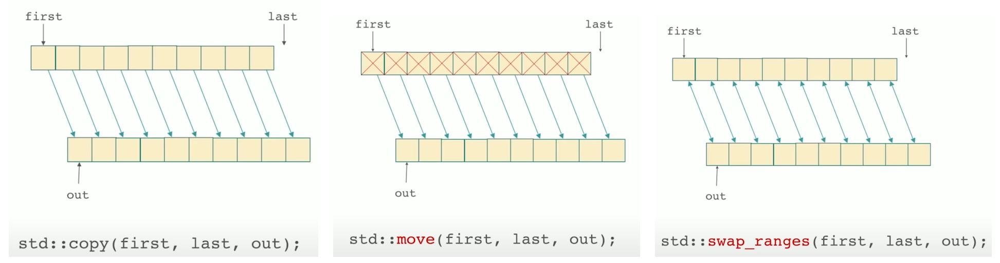
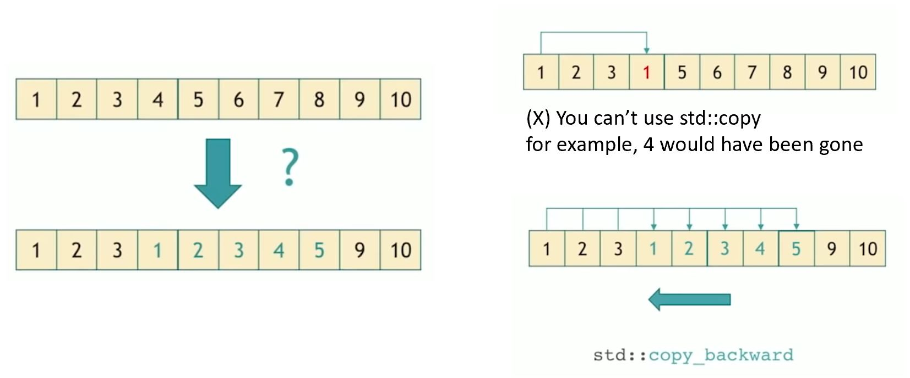

</details>

`std::copy`

`std::move`

`std::swap_ranges`

`std::copy_backward`

`std::move_backward`

## :world_map: Land of value modifiers

<details><summary markdown="span">Pic</summary>

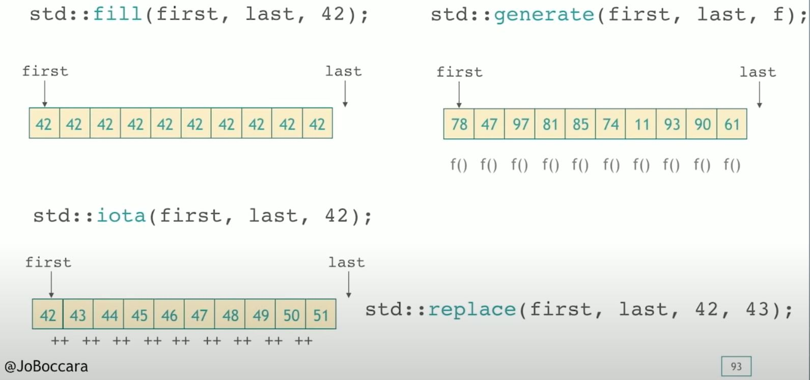

</details>

## :world_map: Island of structure changers

<details><summary markdown="span">Pic</summary>

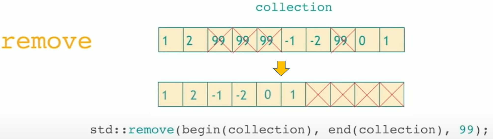
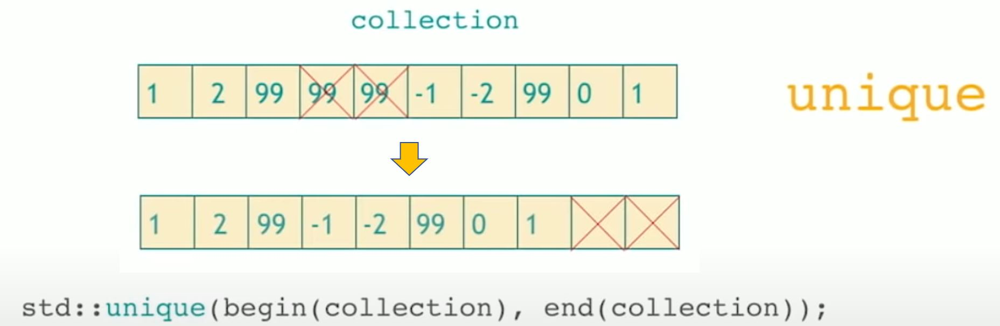


</details>

`std::remove`:

- note, it can't change the range, but putting or the removed one to the back of the range. (And the back could be anything, not necessarily the value you removed.)
- To "remove" like you expect, you need to do below --> e.g. erase the back of collection where `std::remove` has "marked" it as removed.

```cpp
collection.erase(std::remove(begin(collection), end(collection), val), end(collection));
```

`std::unique`

- note, similar to `std::remove`, but put adjacent duplicated value to the end. Also need to use the same `collection.erase(std::unique(...), end(collection));` like above to actually removed those adjacent duplicated values.


## :sparkles: Secret runes for lands of algos

`*_copy`

- like the prefix, but put those elements into the output iterator you specified and leave the original collection intact
- `remove_copy`
- `unique_copy`
- `reverse_copy`
- `rotate_copy`
- `partition_copy`
- `partial_sort_copy`

`*_if`

- Do something as long as predicate return true
- `find_if`
- `find_if_not`
- `count_if`
- `remove_if`
- `remove_copy_if`
- `replace_if`
- `replace_copy_if`
- `copy_if`


## :world_map: Peninsula of Raw Memory

`uninitialized_*`

- The ones without this prefix all use `operator=`, and the ones with are using the ctor:
  - `std::fill` (copy assignment) v.s. `std::uninitialized_fill` (ctor)
  - `std::copy` (copy assignment) v.s. `std::uninitialized_copy` (copy ctr)
  - `std::move` (move assignment) v.s. `std::uninitialized_move` (move ctr)

`std::uninitialized_fill`

`std::uninitialized_copy`

`std::uninitialized_move`

`std::destroy`

`std::uninitialized_default_construct`

`std::uninitialized_value_construct`

## :sparkles: Final rune - `*_n`

`*_n`: not using the end range iterator but the size `n` that would have been used by the prefix algorithm.

- `copy_n`
- `fill_n`
- `generate_n`
- `search_n`
- `for_each_n`
- `uninitialized_copy_n`
- `uninitialized_fill_n`
- `uninitialized_move_n`
- `uninitialized_default_construct_n`
- `uninitialized_value_construct_n`
- `destroy_n`


## More algorithms

- Boost.Algorithms
  - `boost::gather`
  - `boost::sort_subrange`
  - `boost::is_palindrome`
  - `boost::boyer_moore`
  - `boost::one_of`
  - ...