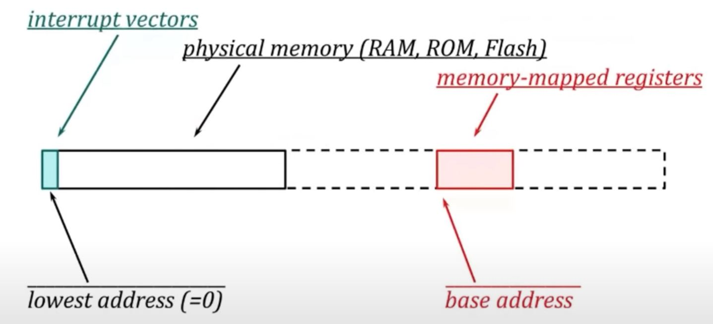

# Memory-Mapped Devices as Objects - Dan Saks

## Device drivers and device registers

- A **device driver** is a software subsystem that controls an **external** device attached to computer
- "External" means outside the CPU, even if it's on the same chip as the CPU.
- CPUs typically communicate with external devices via device registers
- A device register is circuitry that provides an interface to a device.

## Device register functions

A single device may use different registers for different functions.

- A **control** register:
  - Configures the device
  - Initiates an operation
- A **status** register:
  - provides information about the device's state
- A **transmit** register:
  - sends a data value to the device
- A **receive** register:
  - receives a data value from the device

## Sample device registers

- An example single-board computer which a UART (serial port) employs 6 device registers

|Offset|Register|Description|
|--|--|--|
|0x00 (0) | ULCON | line control |
|0x04 (4) | UCON  | control |
|0x08 (8) | USTAT | status |
|0x0C (12)| UTXBUF| transmit buffer |
|0x10 (16)| URXBUF| receive buffer |
|0x14 (20)| UBRDIV| baud rate divisor (control) |

## Why call device "register"?

- A device register is a register because it has similarities to...
  - A CPU register or
  - ordinary memory
- In particular, a device register is
  - a collection of bits
  - accessible as a conventional storage unit, such as a byte, or a word

## Memory-mapped registers

- Most modern computer architectures use memory-mapped addressing
- That is, a memory-mapped [device] register ...
  - connects to the CPU's (address and data) bus structure, and
  - responds to bus signals **almost** as if it were ordinary memory
- This enables CPU to communicate with the device without special instructions
- In short, memory-mapped addressing disguises the device registers to be addressable like "ordinary" memory.

## "Typical" address space



- Full box (including dash) is the entire address space
- Usually the amount of memory on the system doesn’t occupy the whole address space
- Typically a small amount of memory in the low memory space stores interrupt vectors
- Memory-mapped registers would be somewhere high in the address space, and usually access relative to some base address

## Easy to use incorrectly (than ordinary memory)

With ordinary memory, you can set clearer individual bytes to store values in there, and it doesn't upset anything else. There is not so much difference other than the bit position between various bits in memory.

But with devices, since each bit in the register, or say, in the control register, has a very specific meaning and has some interaction with the hardware, it becomes very easy to make programming error like ...

- misread the state of a device.
- put a device into an invalid state
- inadvertently trigger an operation

The problem is, when you misuse a device register, the resulting bugs can be

- spurious and
- hard to debug/reproduce

## The technique to cutdown the error rely on common practice

The C tradition is to declare device registers using fairly primitive types, typically:

- integers or
- characters

This is less work up front but it leave too many opportunities for programming errors.

In C++, you should wrap device registers inside classes, specifically

> :man_teacher: Declare device registers as non-public data members

> :man_teacher: Declare public functions with restrictive interface that prevent invalid operations on those registers

This is more work up front, but the resulting device drivers will be simpler and more robust. You pay now or pay later (and when it's later, you usually pay a lot more).

- **You define each device type at most once. The upfront cost of thoughtful class design is not a repeated cost**
- You could easily access each device many times.
  - The inconvenience of a poor interface could be a frequently repeated cost.
  - The upfront cost of a good interface could amortize itself many times over.

> :man_teacher: Make interfaces easy to use correctly and hard to use incorrectly (Scott Meyers)

> :man_teacher: Or in other words ... program in a style that turns potential run-time errors into compile time errors. (Dan Saks)

The following talks is the incremental step to build up a class to model the device with such philosophy.

## Choosing the register type(s)

A good starting point is to declare each device register using an appropriate integer type. For example...

- A 2-byte register might be `uint16_t` from `<cstdint>
- For register occupies a 4-byte word, use `uint32_t` works well.

Using a meaningful type alias is often better style

```cpp
using device_register = uint32_t; // alias declaration in modern c++
```

## Placing ordinary objects in memory

- One huge issue for memory-mapped device is that although you want it to be just like normal object, it's not.
- With ordinary object in memory, the compiler takes the declaration and definition that you write and figures out where those object is going to be.
- Compiler doesn't do all this by itself, sometimes, it gets help from the linker. - Other times, it gets help from the run-time system.
- But it's all done automatically, by these entities, on your behave.

```cpp
int foo() {
  int i;             // automatic duration
  static char *p;    // static duration
}
```

- For `i`, which has automatic storage duration.
  - They will be on the stack. Where exactly will they be? Compiler will figure it out.
  - The compiler sets aside so many bytes at some offset **from the frame pointer.**
  - But where is the frame pointer for compiler to set the offset? It only knows till runtime. The program sets the frame pointer value when it enters the function at runtime.
  - So it's a compile time offset computation plus the placement of the value   of frame pointer at runtime that determines where the object is going to live.
- For `p`, which has static storage duration
  - The compiler sets aside so many bytes at some offset **within a particular data segment.**
  - The linker glues together the data segments, and finally picks the address for the object to reside.

## Placing memory-mapped objects

- For a memory-mapped register, the compiler doesn't get to choose where the object resides because the hardware already determine it.
- C++ has no standard way to define an object to reside at a specified address.
- You have several alternatives...

## Method 1: At-placement

- Some compilers let you declare an object at a specified address, they provide a non-standard syntax such as

```cpp
device_register UTXBUF0 _at(0x03FFD00C);
device_register UTXBUF0 @ 0x03FFD00C;
```
- These notations called at-placement are non-standard.
- In this example, UTXBUF0 is at offset 0xD00C relative to 00x03FF0000, the base address of the device registers.
- Note for above syntax, it's a compile time and link time machinery to specify that the hardware is going to reside there. It doesn't involve runtime computation.
  - On the contrary, placement new is a runtime operation, it executes something at runtime to identify where the device is.
- Using at-placement, you can manipulate the device register as an object, as in

```cpp
UTXBUF0 = c; // OK: send c's value to the serial port
```

- This assignment writes the value of character c to UART 0's transmit buffer.
- The assignment initiates serializing the value and sending it to the serial port.

## Method 2: Linker-placement

- Alternatively, you can declare a memory-mapped object using a standard extern declaration, such as

```cpp
extern device_register UTXBUF0;
```

- This **doesn't define** UTXBUF0, it just **declares** it.
- Again, C++ has no standard notation to define an object at a specific address, you have to do it with the linker.
- For example, the GNU linker accepts a command-line argument like:

```bash
--defsym UTXBUF0=0x3FFD00C
```

- It places the symbol at the desired address.
- Again, the syntax of the extern declaration is valid Standard C++. However, the resulting program is not. You didn't write the definition in Standard C++.
- According to standard, this could actually violate ODR. You declare something you never define in C++. You use some other tool to patch in the address. Regardless, it's still a viable way to do.
- According to measurement, this technique shows the worst performance in several platform. Mainly because compiler doesn't know the addressing at all as it all defers to the linker. So compiler uses worst case scenario to work on this. (E.g. assume this address is far far away and requires certain instructions to do sth etc.)
- This technique, called linker-placement, just pawns off the non-standard stuff to the linker

## Method 3: Pointer-placement

- You can define a pointer to the device register, then you can access the register by that pointer, as in:

```cpp
*UTXBUF0 = c; // OK: send c's value to the serial port
```

- You can use pointer-placement to cast an integer-valued address into a pointer value.
- Using an object-like macro is common in C:

```cpp
#define UTXBUF0 ((device_register*)0x03FFD00C)
```

- Of course, in C++, we favor using:
  - const objects over object-like macros and
  - "new style" casts over "old style" casts

```cpp
device_register* const UTXBUF0
  = reinterpret_cast<device_register *>(0x03FFD00C);
```

- In modern C++, we prefer using constexpr object definition:

```cpp
constexpr device_register* UTXBUF0
  = reinterpret_cast<device_register *>(0x03FFD00C); // compile error
```

- But this doesn't compile ... why? Standard C++ doesn't permit a `reinterpret_cast` in a constant expression
  - Even one with an integer-literal operand
- A `static_cast` can appear in a constant-expression:

```cpp
constexpr device_register* UTXBUF0
  = static_cast<device_register *>(0x03FFD00C); // compile error
```

- But with this particular usage, it still doesn't compile. Because a `static_cast` can't convert an integer to a pointer.

- So the first one is the only way to go currently. Although you want such placement being evaluated in compile time, we can only check it in run time with `reinterpret_cast`.
- Note that `reinterpret_cast` has **implementation-defined behavior**, though. (Behavior could vary from platform to platform.)
  - On many platforms, converting an integer to a (built-in) pointer doesn't transform the bits. E.g. whatever the bit pattern was for the integer, if a pointer is the same size as the integer, it just picks up those bits and put it into the pointer. No runtime cost to it, it's all done in compile time.
  - However, on some platforms, it might. There is no guarantee. There could be truncation or sign extension of bits even if pointer and integer have same size.
- So need to be alerted that although this works in most case, it does have implementation-defined behavior. The result might just differ for different platform. So it's potentially non-portable.

## Reference-placement

- Alternatively, you can define UTXBUF0 as a reference.
  - You can eliminate the `const` when doing so, and in fact you can't even do so. (You can do `T* const`, but you can't do `T& const`)
- However, you can't cast an integer-literal to a reference type.

```cpp
device_register& UTXBUF0 = reinterpret_cast<device_register&>(0x03FFD00C);
                                                         //^ compile error
```

- Instead, you must cast to a pointer type and dereference the result to obtain an object to which the reference can bind.

```cpp
device_register& UTXBUF0 = *reinterpret_cast<device_register*>(0x03FFD00C);
                         //^ need to dereference!
```

- This technique, called reference-placement, lets you treat UTXBUF0 as the device register itself:

```cpp
UTXBUF0 = C; // OK, send c's value to the serial port
```

- This is very close to the convenience of at-placement. But unlike at-placement, it's standard C++. (Though still have implementation defined behavior)

## Passing registers separately to functions is too error-prone

- Many UART operations involve more than one UART register.

```cpp
void UART_put (
  device_register& stat,
  device_register& txbuf,
  char c
);

UART_put(UTXBUF0, USTAT0, c); // wrong order?
UART_put(USTAT0, UTXBUF1, c); // mismatching UART #s
```

## The solution is clustering registers into class

```cpp
class UART {
public:
  bool get(char& c);
  bool put(char c);
private:
  device_register ULCON;
  device_register UCON;
  device_register USTAT;
  device_register UTXBUF;
  device_register URXBUF;
  device_register UBRDIV;
};

void UART_put(UART& uart, char c);
```

- if you use `struct`, it would still be error-prone for misuse
- Declare device registers as non-public class data members
- Declare public functions with restrictive interfaces that prevent invalid operations on those registers


## Unwelcome optimization

- Device registers aren't ordinary memory
- Device register accesses (reads and writes) may have side effect. For example:
  - Writing to a control register may initiate an operation
  - Reading from a receiver buffer may set or clear bits in a a status register
- Compiler optimizations might eliminate register accesses
  - Eliminating accesses eliminates those side effect
  - Eliminating those side effects might cause device drivers to fail

## The volatile qualifier

- Declaring an object `volatile` inhibits optimizations
- In particular, the compiler can't eliminate accesses to `volatile` objects... even when nit seems safe to do so.


## The right dose of volatility

- This declares `com0` as a "const pointer to a volatile UART" (e.g. pointer always points to the same spot, and the thing it's pointing to shall have all its access taken literally. There will be no access optimization.)

```cpp
UART volatile * const com0
  = reinterpret_cast<UART*>(0x03FFD000);
```

- This declares `com1` as a "reference to a volatile UART"

```cpp
UART volatile & com1
  = *reinterpret_cast<UART*>(0x03FFE000);
```

- Note: `volatile` here isn't part of the UART type - so you have to declare it every time. Failure to declare can lead to subtle bugs.

```cpp
UART &com1  // BAD! missing volatile
  = *reinterpret_cast<UAR*>(09x3FFE000);
```

- Again, the compiler might optimize-away some accesses to `com1`'s registers and eliminate needed side effects.
- If every `UART` should be volatile, then volatile should be part of the `UART` type.
- One way could be:

```cpp
class UART {
  bool get(char& c);
  bool put(char c);
private:
  device_register volatile ULCON;
  device_register volatile UCON;
  device_register volatile USTAT;
  device_register volatile UTXBUF;
  device_register volatile URXBUF;
  device_register volatile UBRDIV;
};
```

- But when a device has many registers, this is tedious


- Can we make class volatile?

```cpp
volatile class UART { // error: missing declarator
  //...
};
```

- Compiler w2ants to apply `volatile` to a declarator

```cpp
volatile class UART { // OK, but type UART isn't volatile.
} u;                  // instead, only object u is volatile
```

- You can try defining a class for a non-volatile

```cpp
class nv_uart {
public:
  bool get(char& c);
  bool put(char c);
private:
  device_register ULCON;
  device_register UCON;
  device_register USTAT;
};
//...
using UART = nv_uart volatile;
```

- Unfortunately, this leads to problems calling `nv_uart` member functions applied to UART objects.

```cpp
char c = 'a';
UART &com0 // using UART = nv_uart volatile;
  = *reinterpret_cast<UART*>(0x03FFE000);
com0.put(c); // error: conversion loses qualifier(s)
com0.get(c); // error: conversion loses qualifier(s)
```

- C++ won't let you apply a non-volatile member function to a volatile object ... you have to declare many, if not all, of the nv_uart member functions as volatile:

```cpp
class nv_uart {
public:
  bool get(char& c) volatile;
  bool put(char c) volatile;
private:
  device_register ULCON;
  device_register UCON;
  device_register USTAT;
};
```

- This is tedious ... so what's the recommendation?

## Push volatile to device_register instead

```cpp
using device_register = uint32_t volatile;
```

- Typically, all device registers (not just those in UARTs) are volatile
- In that case, just declare device_register as a volatile type
- The class definition reverts to its earlier simple form:

```cpp
class UART {
public:
  bool get(char& c);
  bool put(char c);
private:
  device_register ULCON;
  device_register UCON;
  device_register USTAT;
  //...
};
```

- so now, you no longer needs define member function as volatile.
- UART isn't volatile anymore, but every non-static UART data member is.
- And now, you have


```cpp

UART* const com0 = reinterpret_cast<UART*>(0x3FFD000);

// or

UART& com1 = *reinterpret_cast<UART*>(0x3FFD000);
```

## "Standard-layout types"

- Next issue, how do you make sure the UART class has the exact layout?
- C++ provides storage layout guarantees, but only for standard layout types.
- Think of standard-layout type as a C type, with a little more.
  - A scalar type: arithmetic, enumeration or pinter type
  - An array with elements of standard-layout type
  - A standard-layout class, possibly declared as a structure or union
- A standard-layout class can also have some real C++ features...
- A standard-layout class have:
  - static and non-static data members: if the non-static data members are all standard-layout types
  - base classes: if they're all standard-layout types
  - static and non-virtual member function
  - nested constants and types
- A standard-layout class **can't** have
  - virtual functions or
  - virtual base classes
- The virtual add extra data that could disturb the layout. E.g. the virtual function pointers go to the beginning of class, it's going to push all the data register further down, and the offset would be incorrect

```cpp
class timer {
public:
  void enable();
  virtual value_type get(); // not standard layout
};
```

- All non-static data members of a standard-layout class must have the same access control
  - There is no guarantee about the ordering of data sections with different access control
  - despite how they declare, it will just disturb the layout.

```cpp
class widget {
public:
  device_register status;
protected:                  // not standard layout
  device_register control;
  device_register data;
};
```

All non-static data members of a standard-layout class must all be declared:

- in the most derived class, or
- in the same base class

For example, suppose you have 2 devices with a common register layout, you can put all the registers in a common standard-layout class...

```cpp
class IOP { // standard layout
protected:
  device_register IOPMOD;
  device_register IOPCON;
  device_register IOPDATA;
};

// private inheritance because we don't want the user of LEDs and switches to
// access the registers

class LEDs : private IOP { // standard layout too
  // as long as there is no additional non-static data
};

class switches : private IOP { // standard layout too
  // as long as there is no additional non-static data
};
```

However, the derived class won't be standard-layout if it **both inherits and declares non-static data members**

- There is no guarantee whether the base class part or the derived class part goes in any particular order, so you lose the standard layout guarantee

```cpp
class IOP { // standard layout
protected:
  device_register IOPMOD;
  device_register IOPCON;
};

class switches : private IOP { // NOT standard layout too
private:
  device_register IOPDATA;
};
```

## No need to guess: `is_standard_layout`

Use `static_assert` and `<type_traits>`  to verify that each memory-mapped class is standard layout

```cpp
#include <type_traits>

class timer {
  //...
};

static_assert(
  is_standard_layout_v<timer>,
  "timer isn't standard layout"
);
```

## Standard layout guarantees

For standard-layout classes, C++ guarantees only that:

- The first non-static data member is at offset zero
- Every other non-static data member has an offset greater than the data member declared just before it.
  - e.g. you know that within a given access section, all the data member are layout in the order of how you wrote them.

Say, `UART` is a standard-layout class

- `UART`'s first non-static data member, ULCON, will be at offset zero.

But is this sufficient? What about the offsets of other data members?

- No, it's not sufficient. Why? Because there could be padding.

## Padding

- The layout guarantees assure that the first non-static data member doesn't have padding bytes **before** it.
- However, every non-static data member may have padding bytes **after** it.
- This added padding could quietly push some data members to greater offsets.
- What can you do if the compiler inserts padding you don't want?

## Packing

- Pack means remove the padding
- There is no standard way, but you could do this in some compiler

```cpp
#pragma pack(push, 1) // turn padding off
class UART {
  //...
};
#pragma pack(pop)     // turn it back on
```

- or others support non-standard type attributes such as:

```cpp
class UART __attribute__(packed) { // turn padding off
  //...
};                                 // just for this type
```

## Using static assertions to verify layout

- Misaligned data members in device classes often lead to runtime failures
- Use `static_assert` to detect misaligned data members in memory-mapped device classes
- `offsetof(t, m)` (defined in <cstddef>) returns the offset in bytes of member `m` from the beginning of class type `t`
- If `t` isn't a standard-layout class, the behavior is undefined

```cpp
class UART {
  // ...
};

static_assert(offsetof(UART, UCON) == 4, "~~~");
static_assert(offsetof(UART, ULCON) == 8, "~~~");
```

- Checking the offset of each member can be tedious, this might be all you need:

```cpp
static_assert(
  sizeof(UART) == 6 * sizeof(device_register),
  "UART contains extra padding bytes"
);
```

## Nested types and constants

- Some UART member functions have parameter types specific to the class
- These types should be public class members

```cpp
class UART {
public:
  enum baud_rate {
    BR_9600 = 162 << 4,
    BR_19200 = 80 << 4,
  };
};
```

- Note that this public enumeration in the class is purely compile time. It does not disturbed the layout of the class. The class will still be standard layout


## Constructors

- UART objects should be initialized before use
- A constructor is the way to go, as it provides guaranteed initialization.
- That is, if class UART has a constructor, the compiler guarantees to initialize every UART object by calling a constructor
- E.g. you can't create an object without involving one of the constructor

```cpp
class UART {
public:
  UART(baud_rate br = BR_9600) {
    disable();
    set_speed(br);
    enable();
  }
};
```

- Unfortunately, all of the memory-mapped placement techniques that we've discussed invalidate the guarantee
- The placement notations provide **non-defining declarations, which don't invoke constructors**
- To see this, let's look at reference placement in details...
  - Remember that a memory-mapped objects isn't a normal object
  - For example, you don't define an object of the UART type, you just setup a reference to an existing location using `reinterpret_cast`
  - This denies the compiler an opportunity to generate a constructor call automatically
- `UART &com0 = *reinterpret_cast<UART*>(0x3FFD000);`
  - The cast invalidates the initialization guarantee.
  - The reference definition locates the UART object, but doesn't initialize it
- Fortunately, you can construct the UART object by using a placement new-expression...

## Constructors and new-expressions

- A new-expression allocates memory by calling an `operator new`
- C++ provides a default implementation for global `operator new`
- It's declared in standard header `<new>` as: `void* operator new(size_t n);`
  - Parameter `n` represents the size (in bytes) of the requested storage.
- A new-expression is actually a 2-step process:
  - 1. call an operator new to allocate storage for the object
  - 2. Apply a constructor to the allocated storage
- `operator new` and the constructor can be overloaded
- The compiler uses name lookup and overload resolution to select the functions called by a given new-expression
- A typical new-expression has the form:

```cpp
p = new T(v); // or {v} in modern C++
```

- It translates into something (sort of) like:

```cpp
p = static_cast<T*>(operator new(sizeof(T)));
p->T(v); // not real C++, conceptually means "apply to `*p` the `T` constructor
         // that accepts argument `v`" (not real C++)
```

- C++ provides a version of `operator new` that you can use to place an object at a specified location:

```cpp
void* operator new(size_t, void* p) noexcept {
  // The `noexcept` specifier means it doesn't propagate exceptions.
  return p; // It ignores its first parameter and simply returns its second.
}
```

- It seems like ... "you give me an pointer `*p` as second argument to the new operator, and all I do is return that pointer". Would this even be useful?? It's useful when you invoke expression like this:


```cpp
// a general form of "placement new-expression"
p = new (region) T(v); // or {v}
```

- Then it translates into something along the lines of:

```cpp
p = static_cast<T*>(operator new(sizeof(T), region));
p->T(v);
```

- So in effect, it constructs a `T` object in the storage addressed by `region`
- Placement operator new is often an inline function, which allows some optimization of simplifying

```cpp
p = static_cast<T*>(operator new(sizeof(T), region));
p->T(v);
```

to

```cpp
p = region; // e.g. take the region and store at p
p->T(v);    // then apply the constructor
```

- In effect, it applies the constructor to the storage at `region`

- So, you can use placement new to invoke the `UART` constructor:

```cpp
UART *const com0 = reinterpret_cast<UART*>(0x3FFD000);
com0 = new (com0) UART;
```

- In fact, assigning the new-expression to `com0` isn't necessary:

```cpp
UART *const com0 = reinterpret_cast<UART*>(0x3FFD000);
new (com0) UART;
```

- You can fold both statements into a single one:

```cpp
UART *const com0 = new (reinterpret_cast<UART*>(0x3FFD000)) UART;
```

- But it's not clear that it's an improvement.
- Placement-new works with reference-placement as well:

```cpp
UART &com0 = *reinterpret_cast<UART*>(0x3FFD000);
new (&com0) UART;
```

- Again, if the constructor accepts arguments, `placement new` will accept them and pass them along.

```cpp
UART &com0 = *reinterpret_cast<UART*>(0x3FFD000);
new (&com0) UART(UART::BR_19200);
```

- The key thing is, this doesn't really solve our initialization problems, though. Because you still do this in 2 steps.
- What we want to do here, is:
  - Using placement-new permits initialization, but doesn't guarantee it
  - It's the user's responsibility to call the constructor
- And, class-specific `operator new` offers a remedy

## Class-specific new

- Use class-specific `operator new` to guarantee initialization for memory-mapped objects
- C++ lets you declare `operator new` as a class member.
- If `T` is a class with a member `operator new` then this uses `T`'s `operator new`

```cpp
p = new T(v); // or {v}
              // ==> this expression won't call the global operator new
              // it will look into the class to find the class specific one
```

- A member `operator new` is a `static` member, even if not declared so explicitly.
- A member `operator new` can place a device at a specified memory-mapped address:

```cpp
class UART {
public:
  void* operator new(size_t) {
    return reinterpret_cast<void*>(0x3FFD000);
  }
};
```

- This is an inline function because it's defined within its class definition. (even if it's not a `constexpr`, compiler will optimize this)
- Now, you can create a `UART` object using a conventional new-expression in one step:

```cpp
UART* const com0 = new UART;
```

- It "places" a default-initialized `UART` object in its memory-mapped location
- This new-expression initializes the `UART` by calling a different constructor:

```cpp
UART* const com0 = new UART{UART::br_38400}; // can pass argument as wll
```

## "Reference-placement with initialization"

- Alternatively, you can bind a reference to the placed `UART`

```cpp
UART& com0 = *new UART;
```

- The *(dereference) makes for an unusual-looking new-expression, but it makes `com0` look like a `UART`, not a "pointer to UART":

```cpp
com0.put(c); // not com0->put(c);
```

## What about the other UARTs?

- What if the hardware supports more than one UART, say 4?
- This `operator new` supports only one:

```cpp
class UART {
public:
  void* operator new(size_t) {
    return reinterpret_cast<void*>(0x3FFD000);
  }
};
```

- Actually, you can augment `operator new` with additional parameters
- Here, the additional paramenter specifies the UART number:

```cpp
class UART {
public:
  void* operator new(size_t, int n) {
    auto address = 0x3FFD000 + n * 0x1000;
    return reinterpret_cast<void*>(address);
  }
};

// then you can write:

UART& com0 = *new(0) UART; // use UART 0
UART& com2 = *new(2) UART; // use UART 2
```

- The issue is, unfortunately, it compiles for invalid values.

```cpp
UART& com2 = *new (42) UART;  // shouldn't compile but it did
```

- You can't prevent this with a static assertion.
- You could use a run-time check to restrict the placement argument
- Even better, you can use an enumeration type to catch the error at compile time.

```cpp
class UART {
public:
  // use a constrained type!!!
  enum uart_number { zero, one, two, three };
  void* operator new(size_t, uart_number n) {
    auto address = 0x3FFD000 + n * 0x1000;
    return reinterpret_cast<void*>(address);
  }
};

// then you can write:

UART& com0 = *new(UART::zero) UART; // use UART 0
UART& com2 = *new(UART::two) UART; // use UART 2
```

- With this enum defined, your UART number is limited to only zero (=0) to three (=3).
- Ant this will no longer compile:

```cpp
UART& com2 = *new (42) UART;  // won't compile now, catch error in compile time!
```

## Can we make class `operator new` to `constexpr`?

```cpp
class UART {
public:
  enum uart_number { zero, one, two, three };
  constexpr void* operator new(size_t, uart_number n) { // CAN'T DO THIS
    auto address = 0x3FFD000 + n * 0x1000;
    return reinterpret_cast<void*>(address);
  }
};
```

- No we can't... why? `reinterpret_cast` can't appear in constant expression
- By the same token, it can't appear in the body of a `constexpr` function.

## Summary

:heavy_check_mark: Make interfaces easy to use correctly and hard to use incorrectly

:heavy_check_mark: Program in a style that turns potential run-time errors into compile-time errors

:heavy_check_mark: Declare memory-mapped device registers as non-public class data members

:heavy_check_mark: Declare public functions with restrictive interfaces that prevent invalid  operations on those registers.

:heavy_check_mark: Build volatility into the device classes, at the register level if possible

:heavy_check_mark: Use `static_assert` and `<type_traits>` to verify that each memory-mapped class is standard-layout

:heavy_check_mark: Use `static_assert` to detect misaligned data members in memory-mapped device classes

:heavy_check_mark: Use class-specific `operator new` to guarantee initialization for memory-mapped objects


================== tmp @ 56:55==================