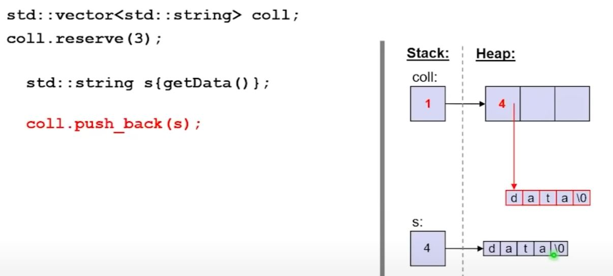
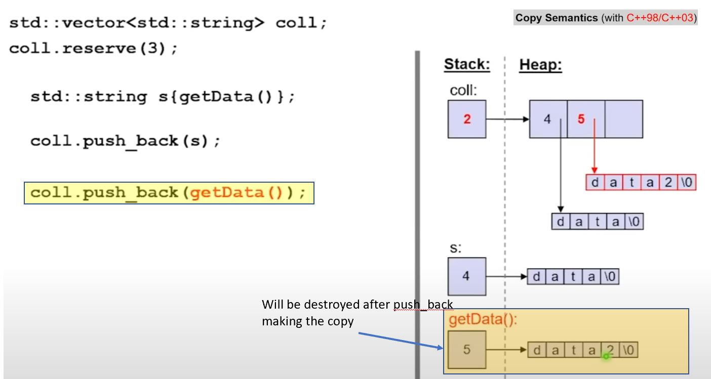
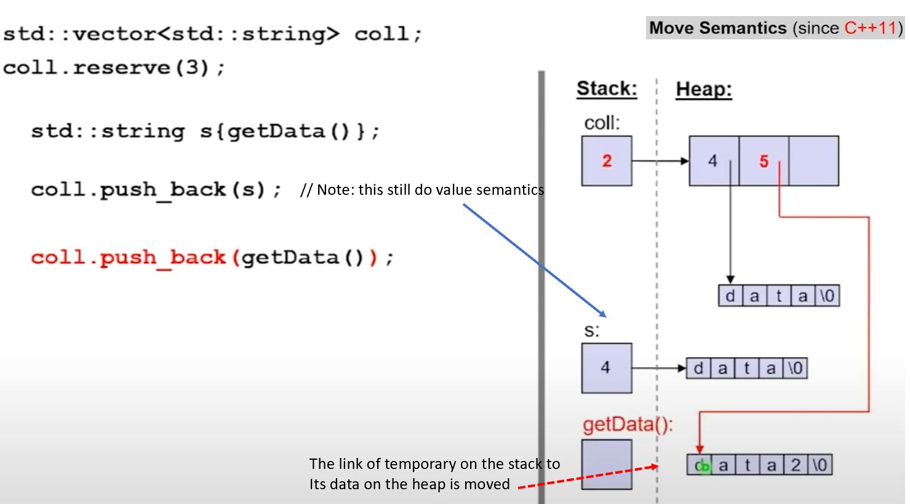
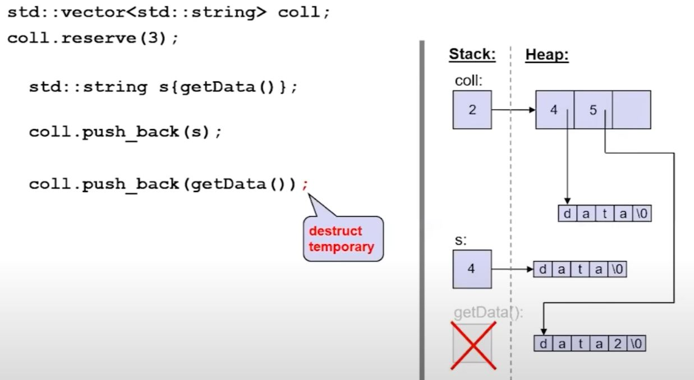
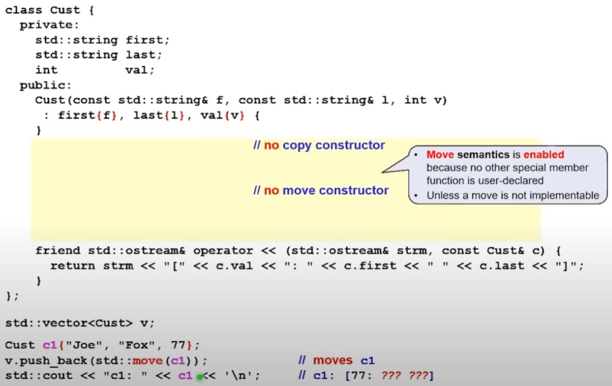
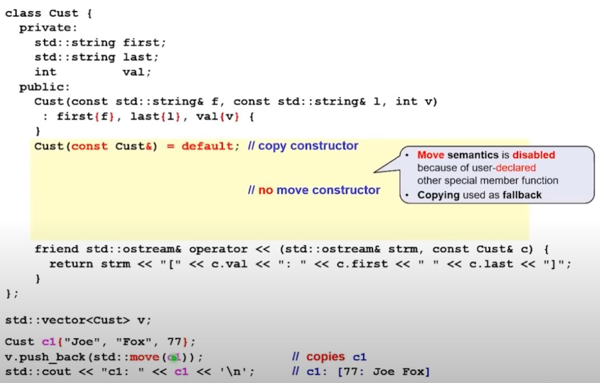
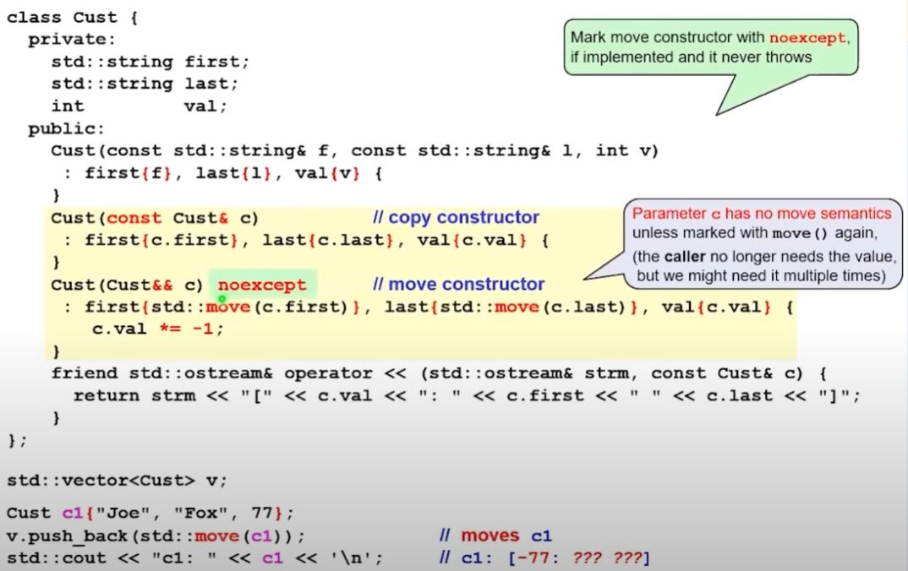
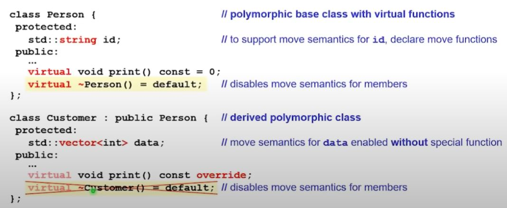
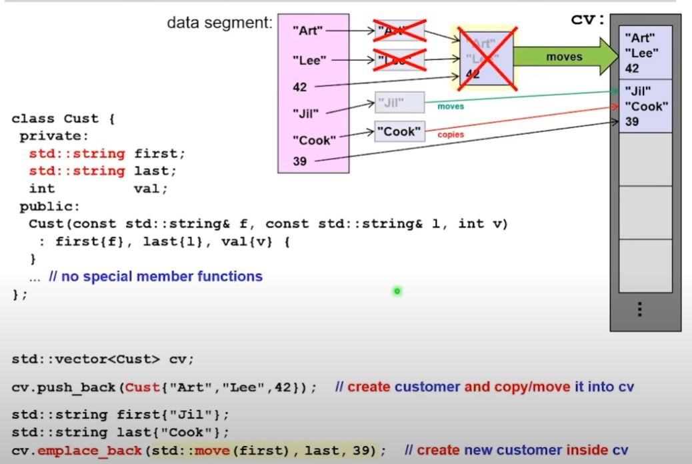

# Back to Basics: Move Semantics - Nicolai Josuttis


## :flags:Motivation:flags:

## copy semantics



- Disregard the small string optimization, in general, when thing got pushed to container, it basically make a deep copy on the heap.



- Pre C++-11, when you call `coll.push_back(getData())`, a temporary is created and then the `coll` make a deep copy
- At the end, the temporary will be destroyed, which is redundant
- Doing this, we have return value, allocating memory, allocating new memory, copy the data over, and then we free the original memory, all on heap.

## Move semantics



- You can imagine it's now a shallow copy of the temporary's element count and memory address, so the data in the temporary is not copied but moved to the collection



- Since C++11, this move semantics happen automatically.
- But note, we still have the temporary constructed. And at the end, the temporary on the stack is still destroyed. The destructor of the temporary will not free any memory as it no longer has pointer to the data during the move.
- The lesson here is that for unnamed returned type, the move semantics kick in automatically.

## We want to avoid objects with name to trigger move semantics, but what if we just have named object? We need `std::move()`

> :man_teacher: `std::move()` implies "I no longer need the data here", as a result, the code triggers the move semantics instead of the copy semantics

Common scenario

- When you need an object/value multiple times

```cpp
std::string str{getData()};
//...
coll1.push_back(str); // copy (still need the value of str)
coll2.push_back(std::move(str)); // move (ok, no longer need the value)
```

- When you deal with **parameters**

```cpp
void reinit(std::string& s) {
    history.push_back(std::move(s)); // move (ok, no longer need the value)
    s = getDefaultValue(); // rewrite other data to s
}
```

## A moved-from library object is in a valid but unspecified state

- This requires corresponding implementation which can only guaranteed for library object. If you library allocate memory, it's your task to ensure this is also the situation.
- "valid but unspecified" means, you can still do something with it, for example, for a moved `std::string a`, you can still `cout << s` it or call `s.size()`, you you don't sure what would it shows. It's probably empty with 0 size, but there is no guarantee. You can also `s.append('.')`, it will guaranteed to have size >= 1, but no exact value. And as it's now having size >= 1, you can call `s[0]`, but it might not be the `.` you just append. And if you called `s[5]` - it could be a UB as `s` might not have that many chars.
- The safe to do thing is simply reassign it, like call `s = "hello"` then it returns back to a specified state, like the call snippet do:

```cpp
std::string row;
while (std::getline(myStream, row)) { // read next line into row
                                      // (re-using moved object is valid operation)
    allRows.push_back(std::move(row)); // and move it to collection of rows
}
```

or another example, you can also do:

```cpp
void swap(std::string& a, std::string& b) {
    std::string tmp{std::move(a)};
    a = std::move(b); // assign new value to moved-from a
    b = std::move(tmp); // assign new value to moved-from b
}
```

## :flags:R-value reference:flags:

## vectors without move semantics in C++03

- Containers have value semantics
  - New elements are copied into the container
  - Passed arguments are not modified
- This leads to unnecessary copies with C++98/C++03

```cpp
// C++03 vector signature have
// void push_back(const T& elem);
std::vector<std::string> coll;
std::string s = getData();

// following call all use this push_back:
coll.push_back(s); // copy s into coll
coll.push_back(getData()); // copy temporary into coll
coll.push_back(s + s); // copy temporary into coll
```

## vectors with move semantics since C++11

- With rvalue references you can provide move semantics
- Rvalue references bind to rvalues
  - Caller no longer needs the value
  - May steal but keep valid
- Consider the rvalue reference parameter to imply "ok to steal"

```cpp
// since C++11 vector signature have
// void push_back(T&& elem);
std::vector<std::string> coll;
std::string s = getData();

// now unnecessary copy is reduced
coll.push_back(s); // copy s into coll
coll.push_back(getData()); // move temporary into coll
coll.push_back(s + s); // move temporary into coll
```

## How to the moved temporary actually implemented? String with move semantics

- Move semantics is usually implemented in:
  - A move constructor
  - a move assignment operator
- As optimized copying
  - Steals by keeping the source valid

```cpp
class string {
private:
    int len;
    char* data;
public:
    string(const string& s) : len{s.len} { // copy len
        if (len > 0) {                     // if not empty
            data = new char[len + 1];      // allocate new memory
            memcpy(data, s.data, len + 1); // copy chars over
        }
    }
};
```

- copy constructor use a `const string&`, const lvalue reference, as we still need the variable. And the counter part of move constructor would look like:


```cpp
public:
    // create a copy of s with its content moved
    string(string&& s) : len{s.len},       // copy len
                         data{s.data} {    // copy pointer to memory
        s.data = nullptr;                  // erase memory at source
                                           // so we really move ownership
        s.len = 0;
    }
```

- Note: `std::move(y)` is essentially equivalent to `static_cast<T&&>(y)`

## Overloading on references

`void foo(const T&)`

- pass value without creating a copy
- can bind to everything (including rvalue reference)
- read-only access
- in-parameter for reading

`void foo(T&)`

- pass named entity to return a value
- can only bind to non-const named object (lvalues)
- write access
- inout-parameter

`void foo(T&&)`

- pass value that is no longer needed
- can only bind to rvalue, like objects without name or with `move()`
- move access
- in-parameter to adopt value

`void foo(const T&&)`

- possible, can compile, but semantic contradiction: caller no longer needs the value, so using rvalue reference. But with const, we are not allowed to "steal" from it.
- usually covered by `const Type&`

```cpp
std::vector<std::string> coll;
const std::string s = getData();
coll.push_back(std::move(s)); // will copy the s, even though the std::move cast!
```

> :man_teacher: don't use `const` if you later going to move

or

```cpp
const std::string getValue();
std::vector<std::string> coll;
coll.push_back(getValue()); // will also copy the temporary!
```

> :man_teacher: don't use `const` when returning by value

## :flags:Move semantics for classes:flags:

## Basic move support:

- **Guarantees for library objects**: "unless otherwise specified, ... moved-from objects shall be placed in a valid but unspecified state"

- **Copy as fallback**: If no move semantics is provided, copy semantics is used.
  - You can disable this fallback. For example, moved-only types like `std::thread`, streams, `std::unique_ptr`
- **Default move operations are generated**: Move constructor and move assignment operator (by moving members)
- **But only if this can't be a problem:**: Only if there is no user-declared special member function. E.g.
  - No copy ctor
  - No assignment operator
  - No dtor


|||
|--|--|
|||



## Move semantics in polymorphic classes

- Declared virtual destructor disable move semantics
  - Moving special member functions are not generated
  - If and only if a polymorphic base class has members expensive to copy, it might make sense to declare/define move operations.
- Don't declare destructor in derived classes (unless you have to). Otherwise it disables move semantics for members in the derived class!



## :flags:Perfect forwarding:flags:

## Motivation

- Overloading for const/non-const lvalues and rvalues

```cpp
class C {
  //...
};

void foo(const C&); // read-only access (binds to all values)
void foo(C&);       // write access (binds to non-const lvalues)
void foo(C&&);      // move access (binds to non-const rvalues)


C v;
const C c;
foo(v);             // calls foo(C&)
foo(c);             // calls foo(const C&)
foo(c{});           // calls foo(C&&)
foo(std::move(v));  // calls foo(C&&)
```

- Scenario: what if we are going to call `foo` indirectly? How do we make it behave the same?

```cpp
C v;
const C c;
callFoo(v);             // calls foo(C&)
callFoo(c);             // calls foo(const C&)
callFoo(c{});           // calls foo(C&&)
callFoo(std::move(v));  // calls foo(C&&)
```

- You can do this, but the implication is that for one parameter, you need to implement 3 overloads...

```cpp
void callFoo(const C& x) {
  foo(x);  // x is const lvalue => calls foo(const C&)
}
void callFoo(C& x) {
  foo(x);  // x is non-const lvalue => calls foo(C&)
}
void callFoo(C&& x) {
  foo(std::move(x)); // x is non-const lvalue (not rvalue)
                     // => needs std::move
                     // to forward move semantics
}
```

- You will have 3^n variations needed for n parameters, that's why language provides the special rule for perfect forwarding.

## 3 things needed for perfect forwarding

1. template parameter
2. Declaring the parameter as `&&` of the template parameter
3. `std::forward<>()`

```cpp
template<typename T>
void callFoo(T&& x) { // x is a universal (forwarding) reference
  foo(std::forward<T>(x)); // perfectly forwards move semantics
}

//`std::forward<>` is `std::move()` only for rvalues.

C v;
const C c;
callFoo(v);             // foo(std::forward<T>(x)) => foo(x)
callFoo(c);             // foo(std::forward<T>(x)) => foo(x)
callFoo(c{});           // foo(std::forward<T>(x)) => foo(std::move(x))
callFoo(std::move(v));  // foo(std::forward<T>(x)) => foo(std::move(x))
```

"Universal" (community term) / forwarding (C++ standard term) reference can ...

- refer to `const` and non-`const`
- refer to rvalue and lvalue

## Comparison to rvalue reference

`&&` declares ...

- For types: raw value reference
- For template params: universal/forwarding references

```cpp
class Type {};
void foo(Type&& x) { // rvalue reference
  // std::is_const<Type>::value is always false
}

Type v;
const Type c;
foo(v); // Error, can't bind lvalue to rvalue reference
foo(c); // Error, can't bind lvalue to rvalue reference
foo(Type{});       // Ok
foo(std::move(v)); // Ok
```

```cpp
class Type {};
template<typename T>
void foo(T&& x) { // universal reference
  // std::is_const<T>::value maybe be true/false
  bar(std::forward<T>(x));
  // x has valid but unspecified state
}

Type v;
const Type c;
foo(v); // ok, x is non-const
foo(c); // ok, x is const
foo(Type{});       // Ok, s is non-const
foo(std::move(v)); // Ok, s is non-const
```

## `push_back` and `emplace_back`



How is the `emplace_back`'s move and copy works at the same time? Variadic template of universal/forwarding references to perfectly forward each argument!

```cpp
template<typename... Args>
void emplace_back(Args&&... args) {
  place_element_in_memory(T(std::forward<Args>(args)...));
}
```

## :flags:Perfect Passing with `auto&&`:flags:

## Perfect forward a return value

- declare returned value as `auto&&`
  - Universal/forwarding reference without being a template parameter
- and forward

```cpp
// pass return value of compute() to process
process(compute(t)); // ok, perfect
```

- What if you want to do something with returned type and process?

```cpp
auto&& val = compute(t);
// ... do something with val
// note, such reference extends the lifetime of the temporary val
process(std::forward<decltype(val)>(val));
```

## `auto&&` as universal/forwarding reference

- Reference that can universally refer
  - to temporary objects and objects marked with `move` (e.g. rvalues)
  - to named objects (lvalue)
- keeps its non-constness
- is useful for perfect forwarding

```cpp
std::string returnTmpString();
const std::string& returnConstStringRef();
std::string s{"some value"};

const auto& s1 = s;                      // ok, s1 is const
const auto& s2 = returnTmpString();      // ok, s2 is const
const auto& s3 = returnConstStringRef(); // ok, s3 is const

auto& s4 = s;                       // ok, s4 is not const
auto& s5 = returnTmpString();       // ERROR - can't bind non-const lvalue to rvalue
auto& s6 = returnConstStringRef();  // ok, s6 is const

auto&& s7 = s;                      // ok, s7 is not const
auto&& s8 = returnTmpString();      // ok, s8 is not const
auto&& s9 = returnConstStringRef(); // ok, s9 is const
```

- `const auto&` can refer to everything const.
- `auto&` cannot refer to everything
- `auto&&` can refer to everything and keeps the non-constness

## C++20 universal/forwarding references for `ranges` and `views`

- `const views` might not support iterating: they might have to modify their state while iterating

```cpp
template<typename T>
void print(const T& coll) {
  for (const auto& ele : coll) {
    std::cout << ele << '\n';
  }
}
std::vector vec{1, 2, 3, 4, 5};
print(vec);                        // OK
print(vec | std::views::drop(3));  // OK, drop the first 3 elements
print(vec | std::views::filter(...)); // ERROR

std::list lst{1, 2, 3, 4, 5};
print(lst | std::views::drop(3));     // ERROR
```

- The problem: some views doesn't support const
- The solution is using forward reference, as it can refer to anything including const/non-const!

```cpp
template<typename T>
void print(const T&& coll)

//or

void print(auto&& coll)
```