# Back to Basics: Compiling and Linking - Ben Saks

## What goes where

C++ programs consists of **source files** and **headers**

- Source files and headers are usually text files (but need not to be)
- For simplicity, this talk always speak as if they are text

Much of the text in C++ source and header file represents **declarations**

- The declarations establish the existence of **entities** such as functions, namespaces, objects, templates, types and values.
- C++ has **no specific rules** about which declarations must go into source files and which must go into headers. We only have **conventions**.
- Standard doesn't even mention source files nor headers. It only mentions **translation unit**.

For a function, we typically

- **declare** it in a header
- **define** it in corresponding source file
  - The (main) reason that we don't just define in header is because if definition is in the header file, if you change anything the function does, you now change the header file, which could be a dependency for lots of different source files. Then you might need to compile most of your libs because of this.

However, for a function that's `inline`, `constexpr` or `consteval`, then we

- **define** it in a header file.


## Declarations and definitions

A **declaration** is a program statement that says to the compiler

- Here's "a name" and some attributes for an entity
- It might be here, or it might be somewhere else.

A definition is a declaration that says:

- Here's a name and the complete set of attributes for an entity that's right here.

:bulb: **All definitions are declarations**, not all declarations are definitions.

- This distinction is important for understanding the code organization guidelines.


|| implication|
|---|---|
|function declaration: `int foo(int n);`| The implication is, it lacks a function body, it tells the compiler how to generate code that calls this function, but it doesn't tell the compiler how to generate the code for the function itself.|
|function definition: `int foo(int n) { return n + 1; }` | It tells the compiler everything it needs to know to actually **create the function.**|

In C++, an object declaration (outside a class) is also a **definition unless it contains an `extern` specifier and no initializer.**

- side note: generally we want to avoid global object. If we really need to declare a global variable that is accessible to multiple source files, then we need the `extern` in the header. Otherwise, without extern, each source file will basically have its own definition of the variable, and has its own storage accordingly. Then we will hit the problem of "multiple defined symbols"

```cpp
int i; // definition
extern int j; // non-defining declaration, e.g. it introduce j into program,
              // but it doesn't say where j exists or what's its value
extern int k = 42; // definition
```

:bulb: **An object definition allocates storage for the object**

- **Other object declarations don't.**

- In effect, a non-defining declaration for a function means "it exists, but not here.", while a definition says "it exists, and here it is."
- There is a similar distinction for classes and templates.

## Build modes

You can typically build a program as either a

- **release build**: the program as intended for distribution
- **debug build**: the program augmented with symbolic information to facilitate debugging

We will focus on release builds in this talk.

## The translation process

In most traditional toolchains, C++ programs are built ("translated", as the Standard says) in three steps:

1. Preprocessing
2. Analysis and code generation
3. Linking

- Programmers often use the term "compiling"/"building" to describe this whole process.
- Sometimes they refer compiling as the first 2 steps.

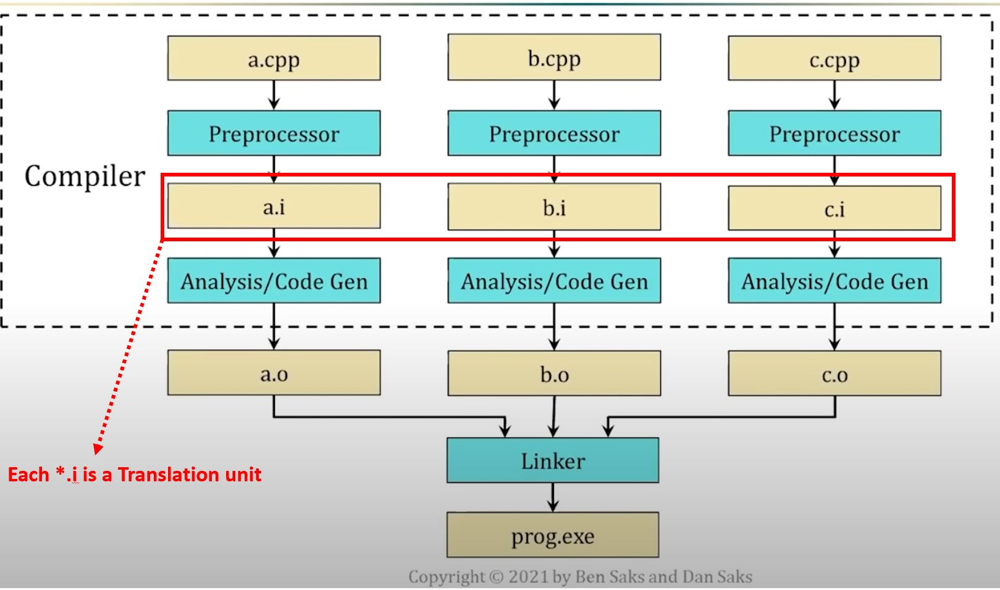

### Preprocessing

- Each source file is preprocessed separately
- The preprocessor performs text transformations, principally
  - header inclusion
  - conditional compilation
  - macro substitution

:bulb: The preprocessor's output is called a **translation unit**

  - It's a concept that the Standard uses for descriptive purposes

A preprocessor need not generate the translation unit as a file. (It rarely does.)

- Oftentimes, we have share declarations in header file, that we want to be available in many different translation unit, because it's going to be used in many parts of the program.


### Analysis and code generation

- The compiler analyzes each translation unit.
- The compiled output is called an **object file** or **object module** (no relation to C++20 Modules, avoid use this term in this context)
- When stored in a file system, object files typically use a `.o`, `.oo`, `.obj` extension
  - Storing the object files has the advantage that if you don't change the source file, you don't need to rebuild it.

Broadly speaking, an object file contains:

- **data**: 0s and 1s that actually become part of the executable program, and
- **metadata**: information that the linker uses to combine object files into the executable program.

The **data** is primarily:

- **machine instructions** (the generated program code, more or less), and
- **values** (for initialized program objects)

In release builds, the **metadata** in an object file is mostly symbols and values for:

- **function and object names**, and their **associated addresses**:
  - Some names represent "**defs**" (definitions)
  - Other names represent "**refs**" (non-defining declarations --> :bulb: all these "refs" will need to know where should it refer the definition. **Linker's job is basically make sure defs can match refs in different object files.**)
- **program section names** and **associated contents**, such as:
  - **text** or **code** for machine instructions
  - **literal** for initialized read-only data
  - **data** for initialized read-write data
  - **bss** for uninitialized read-write data.

### "Only mostly executable"

The machine instructions in an object file are "only mostly executable"

- In some cases, an instruction contains an external reference to an entity defined in an other translation unit.
- The code generator puts a placeholder for the entity in the object file.
- The linker makes the instruction executable by replacing the placeholder with the entity's address.
- In addition, the machine instructions in an object file are often generated to be "relocatable"
  - (e.g. when you look at the final generated executable, you will often see some references to absolute addresses. So relocatable basically means that the addresses are shown in a relative offset in an object file.)

## Linking

The linker resolves the external references by combining object files and libraries of previously-compiled object files.

It may also handle relocating the values and code.

## The One Definition Rule (ODR)

In general, every entity that a program "uses" must also be "defined" in that program.

Formally, the C++ Standard formalizes this notion using

- The ODR, which states that **no translation unit may define certain entities more than once**
- The term "odr-used", which spells out what uses of an entity require a program to define the entity exactly once.

The linker matches each external reference with its corresponding definition. In below graph, it's linker's job to draw the red arrow and connect things together.

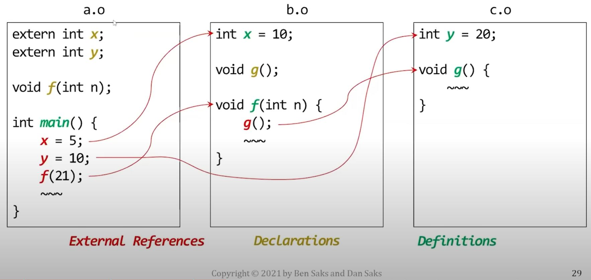

- Note that in a generated executable, every entity will have exactly one definition.

|Undefined references|Multiple definitions|
|---|---|
|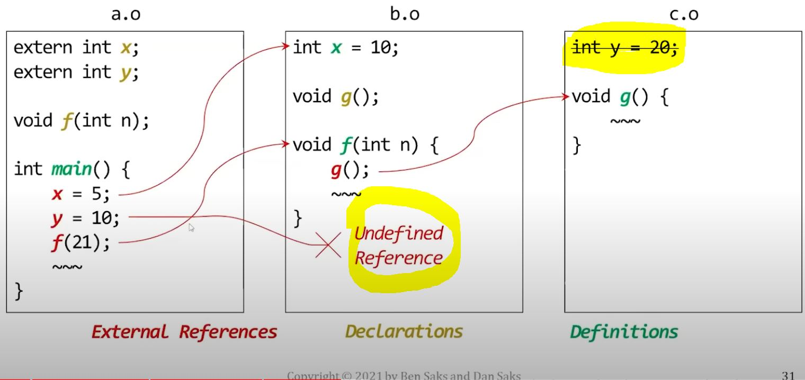|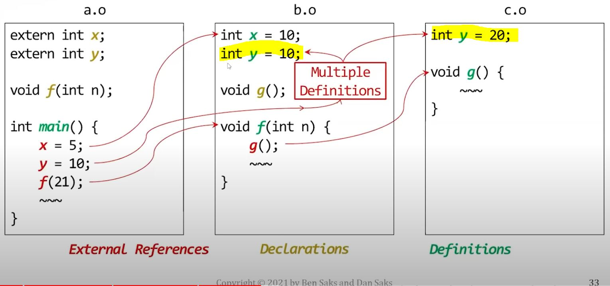|

Question is, how do linker get the "One definition", though.

- The translation process arrives at that one definition differently for different kinds of entities.

Some entities must be defined in exactly one translation unit:

- non-inline variables
- non-inline, non-template functions
  - `constexpr` and `consteval` functions are implicitly `inline`
  - Like other `inline` functions, they aren't included here.

:rotating_light: Many C++ programmers think of this as the ODR, but in fact, it's only one part of it.

Entities that are usually defined in headers, "Header entities"

- class and enumeration types
- inline variables
- inline functions (including constexpr and consteval functions)
- function templates
- class templates and their members
- partial template specializations

For these header entities, they are allowed to have more than one definition if

- Each definition appears in a different translation unit. AND
- All definitions are identical (e.g., consist of the same sequence of tokens).

There are additional requirements, but you can usually meet them all by:

- defining the entity in a single header that can be included by itself
- (i.e., the meaning of the header file isn't going to change depending on other headers file included before it. The header itself is standalone.)

If the definitions meet these requirements, the program behaves as if there were a single definition for the entire program.

If the definitions doesn't meet these requirements, **the behavior is undefined**.

- One way this can happen is if an object file isn't recompiled after a header file that it included is changed.

- These requirements are hard to verify, so the Standard doesn't require toolchains to do so. And **many don't**.

### Linking header entities

The Standard doesn't specify how the compiler and linker should resolve symbols for entities that are usually defined in header files. The common approach toolchains do is:

- Recall that the code generator records definitions and non-defining declarations as metadata in the object files.
- A common solution is to generate slightly different metadata for these entities that lets the linker identify and remove duplicate definitions. (Template instantiation.)

For example, MVC marks some of these entities with a "pick any" flag, which tells the linker that:

- It may see multiple definitions for an entity and
- it can simply choose one and discard the rest.

These kind of entities are sometimes referred to as "**weak symbols**"

- Many toolchains use the term "**weak symbols**", and there are some differences in behavior among them across different toolchains.
- If you search on-line for weak symbols, you might find it confusing because of the slight differences across different toolchains. So use this term loosely.

## Templates

We usually define templates in header files

```cpp
// a.h

template <typename T>
class foo {
public:
    // member declaration
    void f(T t);
};

// member definition
template <typename T>
void foo<T>::f(T t) { /*do something*/ }
```

However, we treat explicit template specialization like non-inline entities.

- (and we put the specialized definition in the source file as it's not inline)

```cpp
// a.h
// primary class template
template <typename T>
class foo;

// explicit specialization
template <>
class foo<int> {
public:
    // member declaration
    void f(int t);
};
```

```cpp
// a.cpp
// explicit specialization
void foo<int>::f(int t) { /*do something*/ }
```

So why are explicit specializations different?

- A function template isn't a function, it's a recipe for generating functions.
- Same, a class template isn't a class, it's a recipe for generating classes.
- Same rule applies for other template entities, such as variable templates.
- It holds for both primary templates and partially-specialized templates.

However, **explicit template specializations aren't recipes for generating entities**.

For example,

- An explicitly-specialized class template is a single (non-template) class and
- An explicitly-specialized function template is a single (non-template) function

So although it's accessed through the template syntax, it's treated like a non-template class/function.


Explicit specify member function for a class template

```cpp
// a.h
// primary class template
template <typename T>
class foo {
public:
    // member declaration
    void f(T t);
};


// explicitly-specialized declaration
template <>
void foo<int>::f(int n);
```

```cpp
// a.cpp
// member definition for explicit specialization
template <>
void foo<int>::f(int t) { /*do something*/ }
```

Same logic, the specialized member function is a function, not a recipe, so it's treated in a non-inline way.

### Explicit template instantiation

The linker usually decides where an entity generated from a template is defined.

- For example, by keeping the definition in one object file and discarding the rest.
- If you need to control where a generated entity is defined, you can use **explicit template instantiation**.
- But when do you need such control? We need to recap memory maps...


## Memory maps

Code generators and linkers usually separate entities into different program sections:

```txt
Memory:

Text(Code): for machine instructions
-----
Literals: for initialized read-only data
-----
Data: for initialized read-write data
-----
BSS: for uninitialized read-write data.
-----
Stack
-----
  v
  ^
-----
Heap
----
```

- The linker is often responsible for arranging these sections in memory
- This arrangement is the program's **memory map**
- Many linkers let you control how they generate the memory map through linker scripts or other tools.
- These scripts can be very valuable when working on platforms with multiple memory spaces. For example, many embedded systems have both RAM and Flash memory. Using a linker script, an embedded developer can load some entities into RAM and others into Flash.

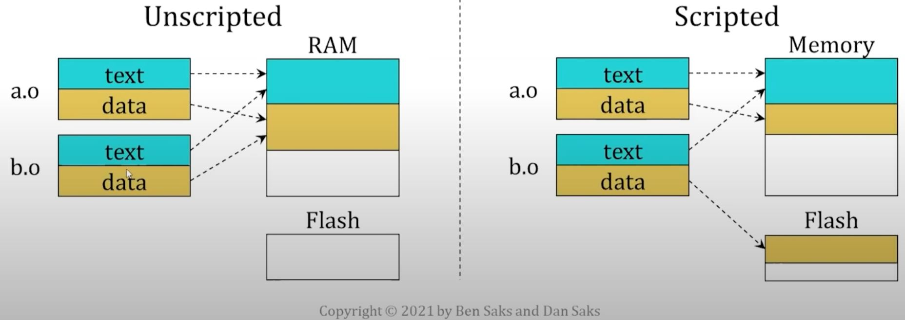

A linker script typically works at the **object file level**.

- You control the memory map by changing the mapping of one or more sections from an object file.
- This level of control works fine for entities defined in source file:
  - non-inline, non-template functions
  - non-inline variables
  - explicitly-specialized templates
- But it doesn't work very well for templates instantiated in multiple object files.
  - The linker will eliminate the duplicate definitions from all but one of the object files.
  - In general, you don't know which object file contains the definition that the linker keeps.
  - So you can use explicit template instantiation to choose which object file will contain template definition.

### How to explicit template instantiation

An explicitly-instantiated template is a single entity, it's not a recipe for generating entities


As such, you're expected to treat it more like a non-template entity

- You declare it in a header (with the keyword `extern`)
- You define it in a source file, but **don't provide a body**.
  - The body comes from the earlier template definition.
- Then the compiler generates a single definition for the entity in that source file's translation unit.

```cpp
// a.h
// function template definition
template <typename T>
void swap(T& x, T& y) {
    T temp(std::move(x));
    x = std::move(y);
    y = std::move(temp);
}


// explicit function instantiation declaration
extern template
void swap<int>(int& x, int& y);
```

```cpp
// a.cpp
// explicit function instantiation definition
// (don't define body - it just tells linker where the definition should go)
template
void swap<int>(int& x, int& y);
```

Similarly, you can also explicitly instantiate individual member functions and entire classes

- (Note) Explicitly instantiating an entire class generates a definition for every member, regardless of whether that member is actually used.

```cpp
// a.h
// class template
template <typename T>
class foo {
public:
    // member declaration
    void f(T t);
};


// explicit class instantiation declaration
extern template
class foo<int>;
```

```cpp
// a.cpp
// explicit class instantiation definition
template
class foo<int>; // no class body
```

## Putting it all together...

<details><summary markdown="span">Non-inline function</summary>

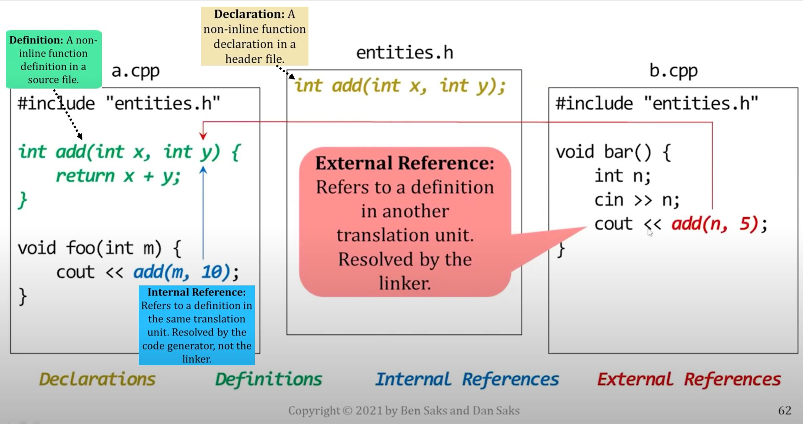

</details>

An inline function that isn't actually inlined

- If a function call is inlined, there's no need to refer to code defined elsewhere, the code is right there, inline.
- In this case, the function that's declared inline is recursive.
  - Recursive functions are hard to inline if the arguments aren't known at compile time.
  - Here, the arguments are run-time values:

<details><summary markdown="span">Original code with recursive inline function (that is hard to inline)</summary>

1. Original

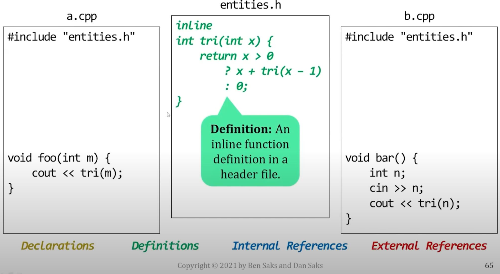

2. The include brings the psudo-external reference into a.cpp and b.cpp

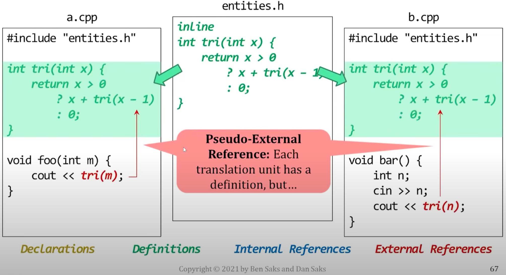

3. Eventually, linker remove one of the psudo definition

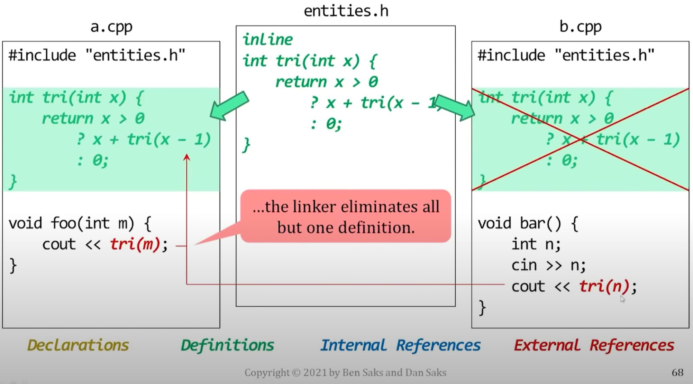

</details>


<details><summary markdown="span">class template</summary>

1. 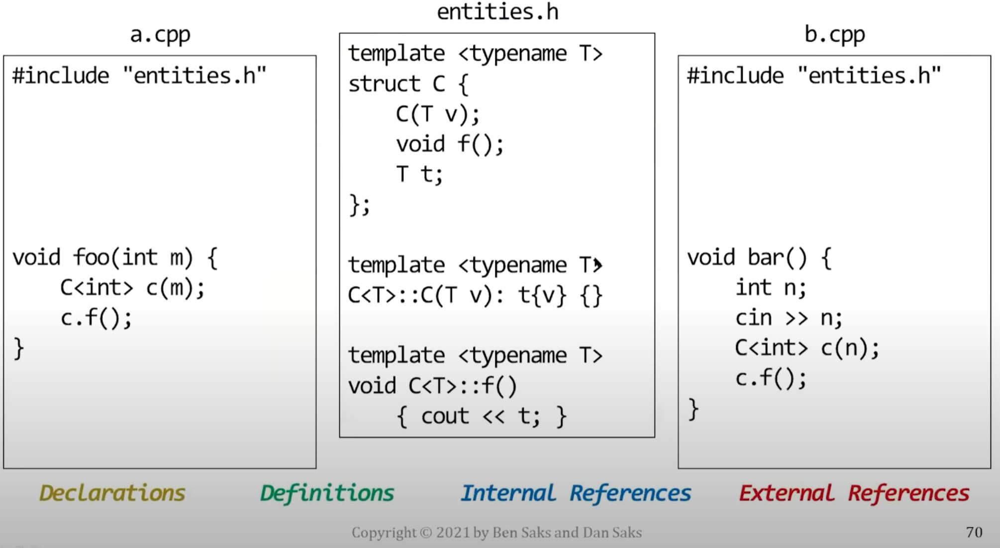
2. 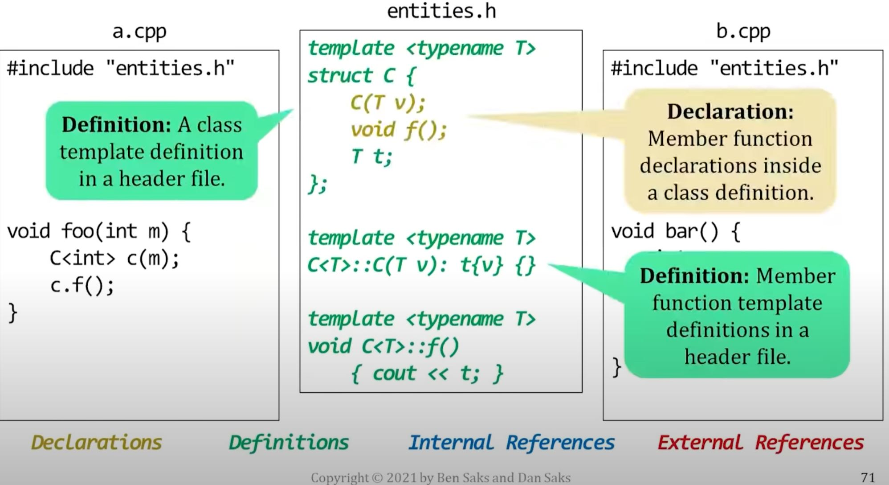
3. 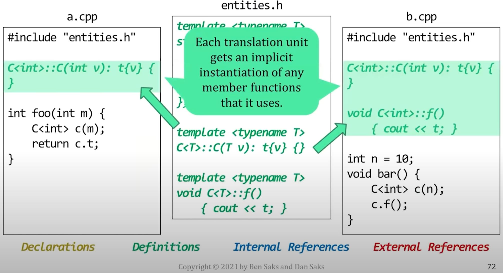
4. 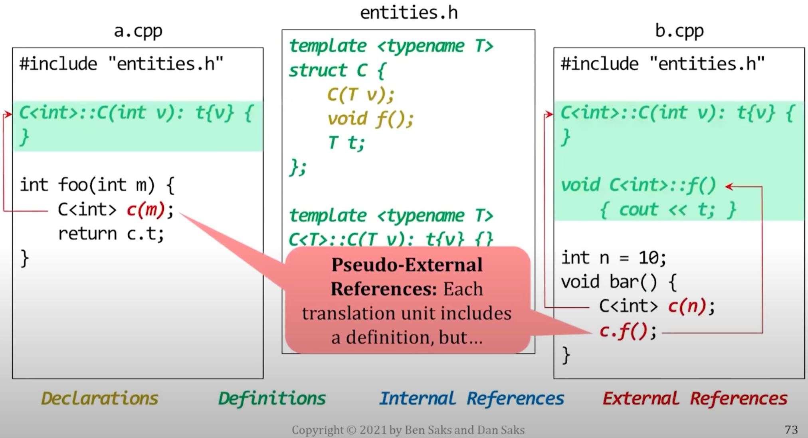
5. 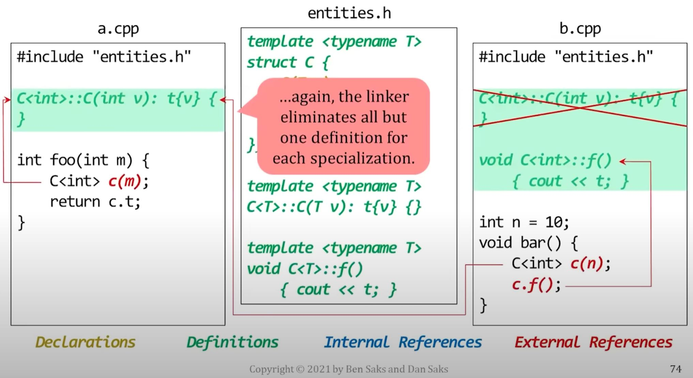

</details>

<details><summary markdown="span">explicit instantiation of a template</summary>

1. 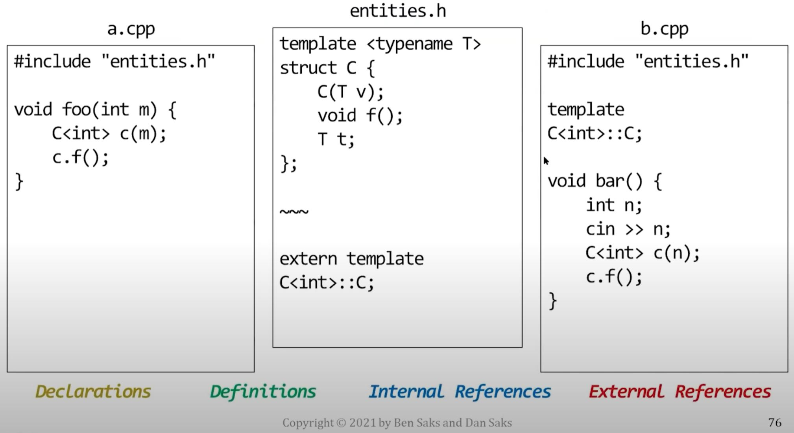
2. 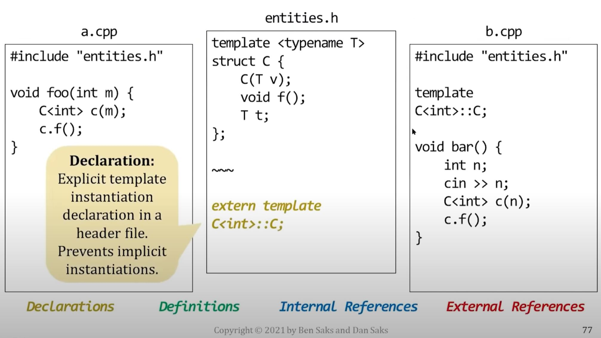
3. 
4. 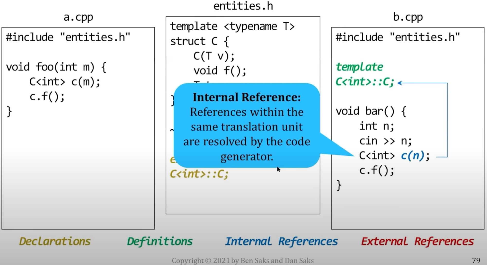
5. 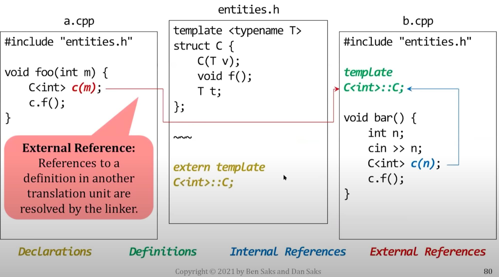

</details>