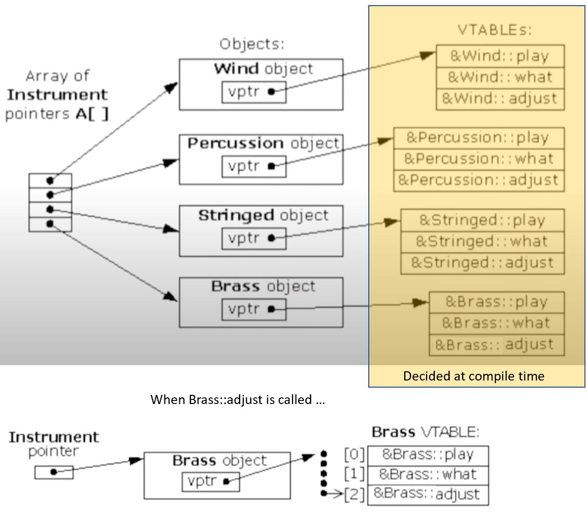
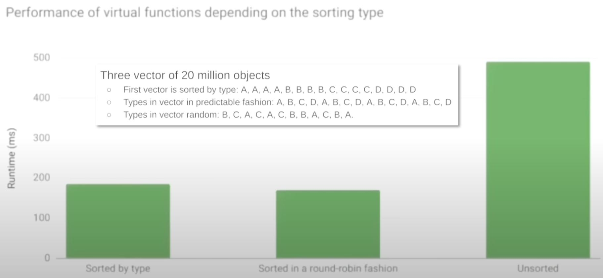

# The Hidden Performance Price of C++ Virtual Functions - Ivica Bogosavljevic

## How virtual functions work?

- C++ standard doesn't mandate implementation of virtual functions
- Most compilers, however, implement virtual functions in a similar manner

- Base class `Instrument`, and derived classes `Wind`, `Percussion`, ...
- VTable is a table attached to each type at compile time.
- At run time, inside each object instance, there is a pointer `vptr` which points to the corresponding virtual table.
- When a virtual function is called at runtime, program access the virtual pointer `vptr` of the object, dereference it, find the corresponding VTable to get the address of the virtual function, and then it calls the virtual function. (On the other hand, non-virtual function's address is just known at compile time so will be called right away.)

## Issue 1: Virtual is slow because its mechanism

- The virtual function's address is not known at compile time.
- The program needs to look up the virtual function's address at runtime.
- Virtual function's address lookup is done through virtual table pointer.

## Issue 2: memory layout is important for program

- To activate virtual function mechanism, you need to access the object through a pointer, or a reference.
- Objects need to be allocated on the heap
- Accessing objects on the heap can be slow
  - If the neighboring pointers do not point to neighboring elements on the heap, we can expect slow down from data cache misses.
- On the other hand, vector of objects is much better for the performance compared to vector of pointers
- The slow down discussed here isn't related to virtual function per-se, but when you use vector of pointers to achieve polymorphism, you might suffer
- Alternatives to vector of pointers:
  - `std::variant` + `std::visitor`
  - Use polymorphic_vector: uses virtual dispatching, but doesn't uses pointers. (Downside is increased memory consumption)
  - Use per type vector (e.g. `boost::base_collection`), if you don't need a specific ordering in the vector.

## Issue 3: compiler optimization for inline

- Compiler knows the address of non-virtual functions at compile time.
  - This means the compiler can inline the non-virtual function and avoid the function call
- Inlining saves a few instructions on the function call, but this is not all
- After inlining, the compiler can perform many other compiler optimizations, e.g.:
  - Move loop invariant code outside of the calling loop
  - Vectorization: use special instructions that can process more than one data at a time.
- But these are only possible if compiler can inline the function. And virtual function unfortunately can't be inlined (it needs to lookup the virtual function's address at runtime).
- A solution for this is **"type based processing"**, essentially:
  - Don't mix the types, each type has its own container and its own loop
  - The compiler can inline small functions and perform the compiler optimization
  - Already implemented in `boost::base_collection`
  - This approach is applicable if objects in the vector don't have to be sorted.
- The benefits of compiler optimization that happen due to inlining are vary case dependent
  - Smaller functions in principle benefit more.

## Issue 4: Jump destination guessing

- To speed up computation, modern CPUs do a lot of "guessing" (a.k.a. **speculative execution**)
- In the case of virtual function:
  - The CPU guesses which virtual function will get called
  - It starts executing the instructions belonging to the guessed virtual function
- If the guess is correct, this saves time.
- If the guess is wrong, the CPU needs to cancel the effect of wrongly executed instructions and start over, which costs time.

- Type sorted in predictable manner: the CPU can successfully predict the address of the virtual function and this speeds up the computation
- If types are appear randomly, the CPU cannot guess successfully and precious cycles are lost.
  - A solution to this is again, type based processing
  - (However, type based processing is not always usable)
- The effect is mostly pronounced with short virtual functions

## Issue 5: Instruction cache eviction

- Modern CPUs rely on "getting to know" the instructions they are executing
- The code that has already been executed is hot code
  - Its instructions are in the instruction cache
  - Its **branch predictors** know the outcome of the branch (true/false)
  - Its **jump predictors** know the target of the jump
- The CPU is faster when executing hot code compared to executing code code
- The CPU's memory is limited
  - The code that is currently hot will eventually become cold unless executed frequently
- Virtual functions, especially large virtual functions where each object has a different virtual function, mean that we are switching from one implementation to another. So most of the time, it's likely to execute cold code.
- Again, the phenomenon is not related to the virtual functions themselves, it will happen if each instance has a pointer to a different function.
- However, it is most likely to occur with large virtual functions on mixed type unsorted vectors with many different derived types.

## Conclusion

- Virtual functions do not incur too much additional cost by themselves
- It is the environment where they run which determines their speed.
- The hardware craves predictability: same type, same function, neighboring virtual address
  - When this is true, the hardware run at its fastest
  - It's difficult to achieve this with casual usage of virtual function
- :bulb: In game development, compared to OOP paradigm, they use another paradigm: data-oriented design (a.k.a **entity component system**). Check this [book](https://a.co/d/iC9zGli) for more.
  - One of its major parts is type based processing: each vector holds one type only.
  - This eliminates all the problems related to virtual functions - however, it's not applicable everywhere.
- :brain: If you need too use virtual functions, bear in mind:
  - The number one factor that is responsible for bad performance are **data cache misses**
    - **Avoiding vector of pointers on a hot path is a must!**
  - Other factors also play their role, but to a lesser extend
  - With careful design, you can reap most benefit of virtual functions without incurring too much additional cost
- :bulb: Here are a few ideas to fix your code with virtual functions:
  - Arrangement of objects in memory is very important.
  - Try to make small functions non-virtual
  - Most overhead of virtual functions comes from small functions, they cost more to call than to execute
  - Try to keep objects in the vector sorted by type.
- :bulb: Performance measurement tools: multitime, perf, [likwid](https://github.com/RRZE-HPC/likwid), other profilers...