# Refresher on Containers, Algorithms and Performance in C++ - Vladimir Vishnevskii

**Big O notation**

- Faster growing functions will overtake slower ones, but this can happen beyond the size of a real-life data set.
- As the constants and smaller terms are ignored for big O notation, **real life performance of algorithms can not be compared based on big O class.**

**Big O classes of typical operations**

- O(1): Random access to the item in continuous storage
- O(log(n)): Binary search in continuous sorted container or in Binary Search Tree
- O(n): Traversal or linear search for continuous or linked container is O(n)
- O(n of item after insert point): insertion into continuous storage
- O(position of insertion point) + O(1): insertion into linked list
- O(log size): insertion into balanced binary search tree in worst case.

---

## Memory access

- Beneficial for memory accesses with temporal and spatial locality: the data that was **recently accessed** or data located **near recently accessed** will be accessed soon.
- In case of miss (no data in cache) access to a level is significantly longer
- Cache is limited in size and is organized in aligned blocks (cache lines)
- check your notes about CPU caches--> [here](../../basics/cpu_cache.md)
- Try: cachegrind emulation

---

## Code complexity

Iron law of performance b(by Douglas Clark):

> CPU Time = # of instructions to be executed x cycles per instruction x cycle time

- Memory accessing instructions typically have higher latency
- More instructions and more memory accesses will increase execution time on the same platform.

---

**finding next element in `std::vector` v.s. in `std::list`**

- `std::list` needs to access memory to get address of a next item, but `std::vector` only immediate offset (+4 because example is a std::vector<int32_t>) is added to a pointer

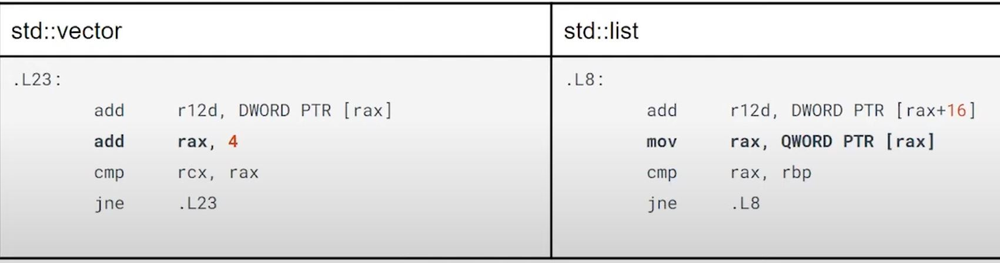

---

**Input size should be considered when choosing container**

- Insert n elements to the front of `vector` cost O(n^2)
- Insert n elements to the front of `list` cost O(n)
- However, when n is small (~800 items), `vector` is still quicker. Allocation is performed for each node within `list` while in `vector`, small blocks can still be effectively shifted.

---

**Insertion non-movable large object into front comparison**

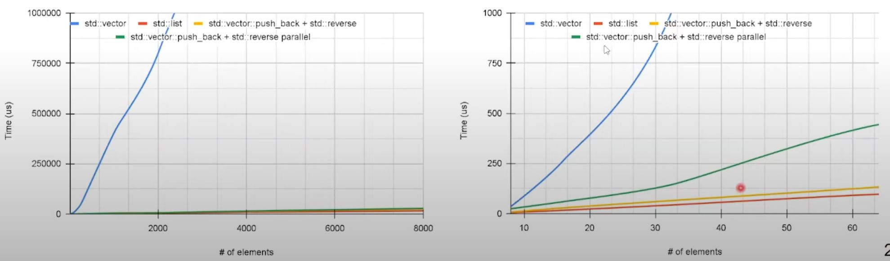

- copy/swap operations are expensive now, `vector` has disadvantage.
- `list` outperforms other options on all data set sizes.
- the parallel reversed is achieved through `std::reverse(std::execution::par, vec.begin, vec.end);` - it's not faster than the non-parallel one. Parallel algorithms should be applied with caution, they can't be considered as simple drop-in replacement and their applicability should be evaluated.

---

## :star: Factor lof performance

- Time complexity of algorithms for data organization and processing
- Memory data access patterns (cache efficiency for systems where it is relevant.)
- Generated code complexity
- Memory allocation patterns
- Nature of stored elements (cheap copy/movable, static footprint)
- Potential for parallelization

> Effective design should consider the individual container properties and usage scenarios to find proper application patterns.

---

## Operations on sorted sequence

**`std::lower_bound`, on `vector` v.s. `std::set::lower_bound`**

```cpp
std::vector<uint32_t> vec;
for (auto v : random_data) {
    const auto pos = std::lower_bound(vec.begin(), vec.end(), v);
    if (pos == vec.end() || *pos != v) {
        vec.insert(pos, v);
    }
}
```

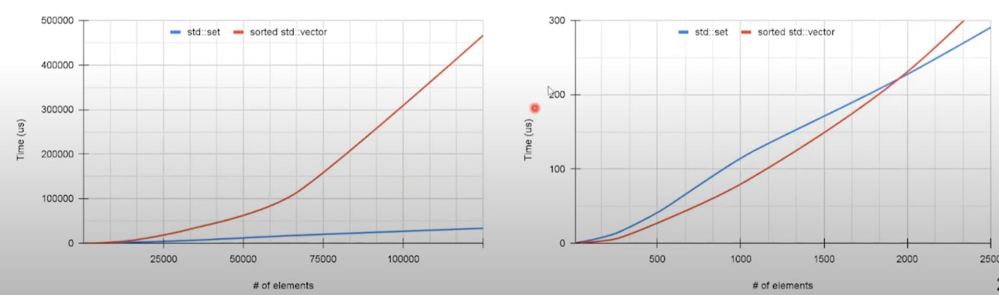

- Node based `std::set` outperforms on larger number of items as `std::vector` has overhead inflicted by shifting.
- However, up to ~1900 items, sorted `std::vector` still has advantage due to **higher cost of node allocation** in `std::set`

---

**Sorted sequence insertion: improvement on `std::vector`**

- 1. Improve allocation with `reserve(random_data.size()`
- 2. using unordered insertion then sorted at the end
- 3. further improve 2 through adding `std::execution::par` to `std::sort`

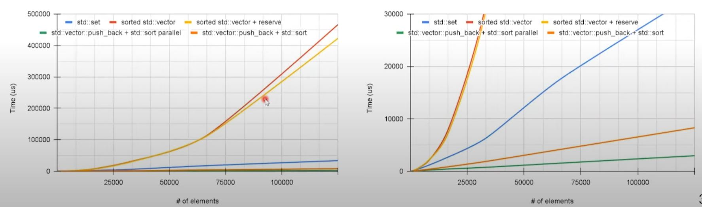

- Preallocation (`reserve`) improves timing especially for large dataset.
- Post-processing (`std::sort` after non-ordered `push_back`) has significant speedup.
- Parallel version of `std::sort` improves performance even further.

---

**Sorted sequence insertion: improvement on `std::set`**

- Allocation of nodes can be mitigated using custom allocation.
- Alternative implementation with improved allocation can be used: [EASTL](https://github.com/electronicarts/EASTL) has defined `fixed_set`
  - contains fixed capacity containers and implementation of standard algos.
  - Implementation allocates new nodes in the continuous storage.
  - Can be used without heap allocation (suitable for real time/embedded)

```cpp
template <typename Key
    , size_t nodeCount
    , bool bEnableOverflow = true
    , typename Compare = eastl::less<Key>
    , typename OverflowAllocator = EASTLAllocatorType
> class fixed_set;
```

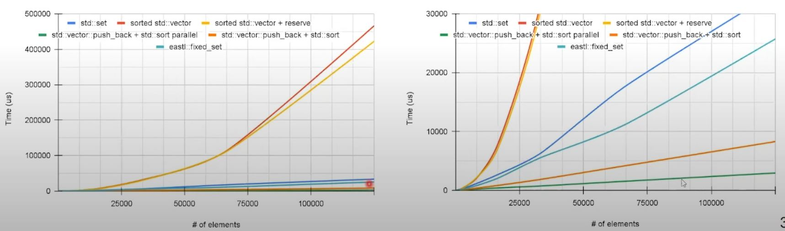

- Allocation pattern in `eastl::fixed_set` improves performance compared to `std::set`
- (But not better than `std::vector` with post-processing `sort`)

---

**Sorted sequence insertion: how about `boost::container::flat_set`?**

sorted `std::vector` with binary search looks and behaves like flattened set.
- Let's compare `boost::container::flat_set` where it provides set interface using random access container as a storage backend (`boost::container::vector`)

```cpp

boost::container::flat_set<uint32_t> container;
// extract internal from boost::container::flat_set
auto seq = container.extract_sequence();
seq.reserve(random_data.size());
for (auto v : random_data) {
    seq.push_back(v);
}

std::sort(std::execution::par, seq.begin(), seq.end());
// attach external sequence to boost::container::flat_set
container.adopt_sequence(boost::container::ordered_unique_range, std::move(seq));
```

---

**Sorted sequence search comparison**

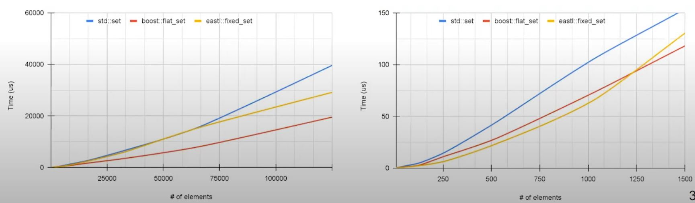

- `boost::flat_set` performs faster on larger dataset, likely because random-access
- On smaller dataset, `eastl::fixed_set` demonstrate an advantage.

---

**Sorted sequence traverse comparison**

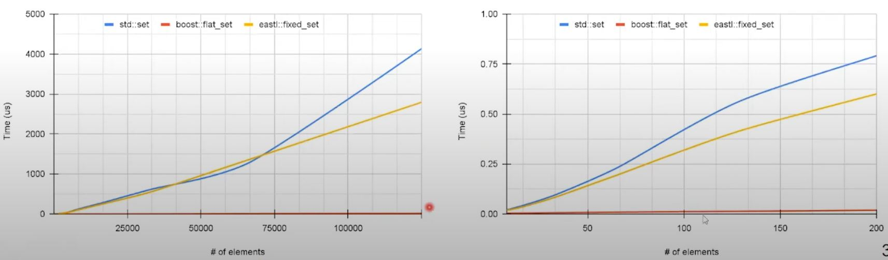

- Similar to search
- `boost::flat_set` is the fastest option.
- `eastl::fixed_set` is better than `std::set` - due to better data locality.

---

**Sorted sequence deletion comparison**

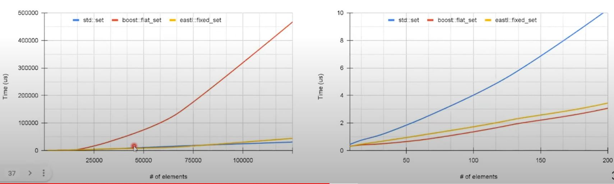

- Deletion in sequential container has similar issues as insertion - shift are performed for the items after the deleted one.
- On smaller data set faster lookup for object to delete provides advantage for container with continuous storage.

---

**Potential better delete on `boost::container::flat_map`: through deferred removal, if possible**

- Use erase/remove idiom with a `boost::container::flat_map` to store bool flag to indicate discarded items.

```cpp

boost::container::flat_map<uint32_t, bool> container;
auto erase_cnt{0u};
//....
for (const auto& it : data_to_delete) {
    container[it] = true;
    erase_count++;

    if (erase_count == erase_threshold) {
        erase_count = 0;
        container.erase(
            std::remove_if(container.begin(), container.end(),
            [](const auto& it) { return it.second; }), container.end()
        );
    }
}
```

If `erase_threshold` is 100 ...

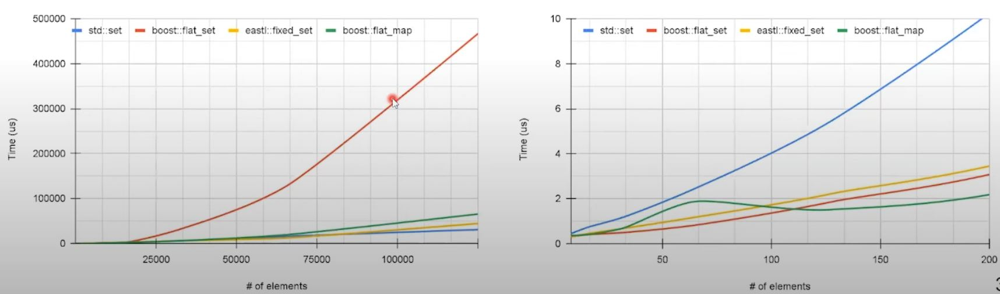

- significantly lowers deletion overhead as the number of shifts is reduced - all discarded items are removed in a single pass
- But doing so will make iteration slower as additional logic is needed to check if the item is not discarded yet.

---

## Unordered container

- Performance focus alternative of std one: `absl::flat_hash_set`, `absl::flat_hash_map` from [abseil](https://abseil.io/) using flat storage model.

---

**Unordered container: insertion**

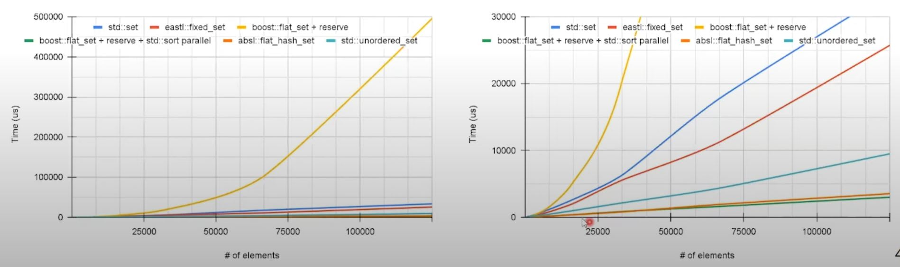

- `absl::flat_hash_set` outperforms `std::unordered_set`
- Also, `absl::flat_hash_set` supports `reserve` to preallocate memory.

---

**Unordered container: search**

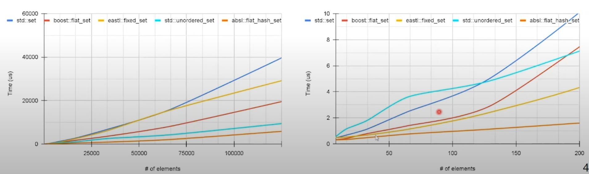

- search performance of unordered container is superior compared to other options
- with smaller data set size results vary so caution is required.

---

**Unordered container: traverse**

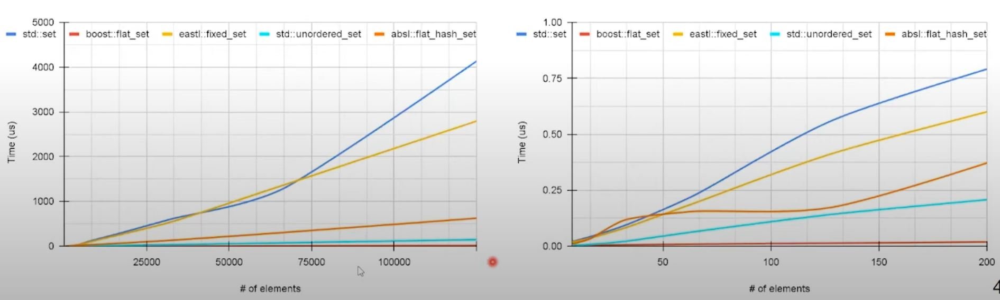

- `std::unordered_set` has relatively good traversal performance

---

**Unordered container: deletion**

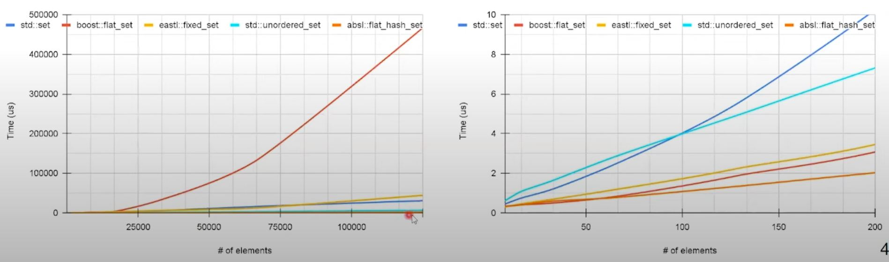

- Like insertion, deletion performance for unordered containers is superior in the test
- Similar to search benchmark - caution is required for small dataset.

## Container combination

- details discussion check original video...
- one thing - if string key is required, might consider `eastl::fixed_string`: It stores the string inline in continuous storage, which avoids indirection and provides better cache locality. (As the memory is fixed, it doesn't need to indirectly point to memory in some other places, which std::string needs to.)

**Container combination: Summary**

- Minimization of memory indirection by flattening data structures can demonstrate substantial speedup.
- Reduction of complex types into simpler ones by mapping reduces code complexity leading to reduction of execution time.
- Using precomputed data structures tailored for specific access pattern allows to reduce algorithmic complexity or minimize number of required operations.
- For insert/search/delete operations unordered hash-based containers can be preferable, but their performance can vary depending on dataset size.


## Summary

- Although some reasoning about performance can be done based on knowledge about existing containers, only benchmarking and profiling can validate hypothesis about a performance for particular settings.
- Apart from STL containers, third party alternatives can provide drop-in replacements, which often exhibits better performance.
- Combination of containers can complement functionality and mitigated downsides.
- Separation of data preparation and data access can allow to pick best suitable patterns and containers.
- C++17 parallel algorithms should be considered as they can provide speed-up, but their contribution should be evaluated.
