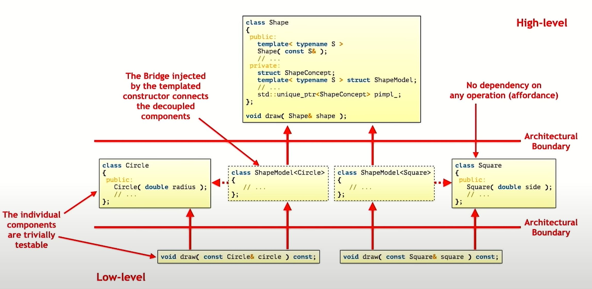

# Breaking Dependencies - C++ Type Erasure - The Implementation Details - Klaus Iglberger


## A motivating example

Would you provide an abstraction for callable by means of an inheritance hierarchy?

```cpp
class Command {
public:
    virtual void operator()(int) const = 0;
};
class PrintCommand : public Command { /**/ };
class SearchCommand : public Command { /**/ };
class ExecuteCommand : public Command { /**/ };

void f(Command* command);
```

NO, you wouldn't. `std::function` is probably a better approach! Type erasure instead of inheritance provides:

- no inheritance hierarchies
- non-intrusive
- less dependencies
- less pointers
- no manual dynamic allocation (and thus no manual life-time management)
- value semantics
- less code to write
- potentially better performance

```cpp
class PrintCommand { /**/ };
class SearchCommand { /**/ };
class ExecuteCommand { /**/ };

void f(std::function<void(int)> command);
```

> "Inheritance is rarely the answer. (Andrew Hunt, David Thomas, The pragmatic programmer)"

## Type erasure - terminology

Type erasure is not ...

- a `void*`
- a pointer-to-base
- a `std::variant`

Type erasure IS

- a **templated constructor** plus
- a completely **non-virtual interface** polus
- a mixed of severl design pattern: **External polymorphism + Bridge + Prototype**

## A type-erased Shape

```cpp
class Circle {
 public:
  explicit Circle(double rad)
      : radius{rad},  //...
  {}
  double getRadius() const noexcept;
  // getCenter(), getRotation(), ...
 private:
  double radius;
  // remaining data members
};

class Square {
 public:
  explicit Square(double s)
      : side{s},  //...
  {}

  double getSide() const noexcept;
  // getCenter(), getRotation(), ...
 private:
  double side;
  // remaining data members
};
```

So `Circle` and `Square` are ...

- don't need a base class
- don't know about each other
- don't know anything about their operations (affordances)

```cpp
struct ShapeConcept {
  virtual ~ShapeConcept() = default;

  virtual void do_serialize(/*...*/) const = 0;
  virtual void do_draw(/*...*/) const = 0;
};

template <typename ShapeT>
struct ShapeModel : public ShapeConcept {
  ShapeModel(ShapeT shape) : shape_(std::move(shape)) {}

  void do_serialize(/*...*/) const override { serialize(shape_, /*...*/); }
  void do_draw(/*...*/) const override { draw(shape_, /*...*/); }

  ShapeT shape_;
};
```

- So the key part of the `serialize` and `draw` call is that, the implementation of the virtual functions `do_serialize`/`do_draw` in the `ShapeModel` defines the affordances required by the type `T`.
- `serialize` and `draw` are free functions that is required to make compile to work. It's basically the same requirement that your base class enforces you.
- The `ShapeConcept` and `ShapeModel` are the external polymorphism design: we create a separate hierarchy, separate model for some independent types. By doing so, we extract the isolated operations out from class.

## The external polymorphism design pattern

- Allows any `shape_` to be treated polymorphically
- extracts implementation details (single responsibility principle)
- removes dependencies to operations (affordances)
- creates the opportunity for easy extension (open close principle)

## Continue the example

The affordances

- These functions resolve the requirements posed by the External Polymorphism design pattern
- There can be many implementation, spread over many header/source files (e.g. for OpenGL, Metal, ...)


```cpp
void serialize(const Circle&, /*...*/);
void draw(const Circle&, /*...*/);

void serialize(const Square&, /*...*/);
void draw(const Square&, /*...*/);
```

Usage

```cpp
void drawAllShapes(const std::vector<std::unique_ptr<ShapeConcept>>& shapes) {
  for (const auto& shape : shapes) {
    shape->draw();
  }
}

void main() {
  using Shapes = std::vector<std::unique_ptr<ShapeConcept>>;
  Shapes shapes;
  shapes.emplace_back(std::make_unique<ShapeModel<Circle>>{2.0});
  shapes.emplace_back(std::make_unique<ShapeModel<Square>>{1.5});
  shapes.emplace_back(std::make_unique<ShapeModel<Circle>>{4.2});
  drawAllShapes(shapes);
}
```

## Improved with real type-erased

- Create an outer class `Shape` and put `ShapeConcept` and `ShapeModel` into its `private` secction.
- Add a private member: `std::unique_ptr<ShapeConcept> pimpl;`
- Add a public templated constructor for the `Shape`
  - template parameter `ShapeT` is used to construct the `pimpl` accordingly in this templated constructor of `Shape`
  - You can imagine, the templated constructor creating a bridge to construct the `pimpl` (Bridge design pattern). It bridges implementation details.
- If we have a `Circle`, we put it into the constructor, the ctor will create the `ShapeModel`, instantiate it, gives it to the pointer of `ShapeConcept`, stores it in the `pimpl`, and we effectively erase the type `Circle` - all we stored is a pointer to the base `ShapeConcept`.
- Finally, we need few `friend` function to use the `pimpl`
  - For the 2 friend serialize/draw function, despite being defined inside the class definition, these friend functions are free functions and injected into the surrounding namespace.

```cpp
class Shape {  // newly added outer class
 private:
  struct ShapeConcept {  // same as before, but inside Shape
    virtual ~ShapeConcept() = default;

    virtual void do_serialize(/*...*/) const = 0;
    virtual void do_draw(/*...*/) const = 0;
  };

  template <typename ShapeT>  // same as before, but inside Shape
  struct ShapeModel : public ShapeConcept {
    ShapeModel(ShapeT shape) : shape_(std::move(shape)) {}

    void do_serialize(/*...*/) const override { serialize(shape_, /*...*/); }
    void do_draw(/*...*/) const override { draw(shape_, /*...*/); }

    ShapeT shape_;
  };

  std::unique_ptr<ShapeConcept> pimpl;  // newly created member

 public:  // newly added
  template <typename ShapeT>
  Shape(ShapeT shape)
      : pimpl{std::make_unique<ShapeModel<ShapeT>>(std::move(shape))} {}

  Shape(const Shape& other);             // To be discussed
  Shape& operator=(const Shape& other);  // To be discussed
  Shape(Shape&& other);                  // To be discussed
  Shape& operator=(Shape&& other);       // To be discussed

 private:
  friend void serialize(const Shape& shape, /*...*/) {
    shape.pimpl->do_serialize(/*...*/);
  }
  friend void draw(const Shape& shape, /*...*/) {
    shape.pimpl->do_draw(/*...*/);
  }
};
```

## Dig in further, how do we copy a `Shape`?

- We only have a pointer to base `ShapeConcept`, how do we copy while not knowing the actual type passed in constructor?
- We need to add a `clone()` function... (e.g. the Prototype design pattern)
  - Note that the use of copy constructor of the `ShapeModel` in `ShapeModel::clone`: This will always do the right thing even if other code changes.


```cpp
class Shape {
 private:
  struct ShapeConcept {
    virtual ~ShapeConcept() = default;

    virtual void do_serialize(/*...*/) const = 0;
    virtual void do_draw(/*...*/) const = 0;
    virtual std::unique_ptr<ShapeConcept> clone() const = 0;  // newly added
  };

  template <typename ShapeT>
  struct ShapeModel : public ShapeConcept {
    ShapeModel(ShapeT shape) : shape_(std::move(shape)) {}

    // newly added
    std::unique_ptr<ShapeConcept> clone() const override {
      return std::make_unique<ShapeModel>(*this);
    }

    void do_serialize(/*...*/) const override { serialize(shape_, /*...*/); }
    void do_draw(/*...*/) const override { draw(shape_, /*...*/); }

    ShapeT shape_;
  };

  std::unique_ptr<ShapeConcept> pimpl;

 public:
  template <typename ShapeT>
  Shape(ShapeT shape)
      : pimpl{std::make_unique<ShapeModel<ShapeT>>(std::move(shape))} {}

  // newly added implementations
  Shape(const Shape& other) : pimpl(other.pimpl->clone()) {}
  Shape& operator=(const Shape& other) {
    // copy-and-swap idiom
    Shape tmp(other);
    std::swap(pimpl, tmp.pimpl);
    // or you can use:
    // other.pimpl->clone().swap(pimpl);
    return *this;
  }
  Shape(Shape&& other);             // To be discussed
  Shape& operator=(Shape&& other);  // To be discussed

 private:
  friend void serialize(const Shape& shape, /*...*/) { /*...*/
  }
  friend void draw(const Shape& shape, /*...*/) { /*...*/
  }
};
```

## How about the move operations?

- Option 1: Moved-from shapes are semantically equivalent to a `nullptr` (e.g. the `pimpl` becomes `nullptr` under the hood)
- Option 2: Move remains undefined, copy servers as a fallback. However, the implication is that the move operations (which fallbacks to copy) are not `noexcept`.
- Option 3: Leave move constructor undefined (so fallback to copy), the move assignment operator is implemented in terms of swap

```cpp
// Shape(Shape&& other); // leave it undefined
Shape& operator=(Shape&& other) noexcept {
  pimpl.swap(other.pimpl);
  return *this;
}
```

## The usage

Inside of the `Shape`, it's a little bit complicated, but outside of it, for the user of `Shape`:

- No more pointers in the usage
- No manual dynamic allocation
- No manual life-time management
- value semantics

```cpp
void serialize(const Circle&, /*...*/);
void draw(const Circle&, /*...*/);

void serialize(const Square&, /*...*/);
void draw(const Square&, /*...*/);

void drawAllShapes(const std::vector<Shape>& shapes) {
  for (const auto& shape : shapes) {
    draw(shape);
  }
}

void main() {
  using Shapes = std::vector<Shape>;
  Shapes shapes;
  shapes.emplace_back(Circle{2.0});
  shapes.emplace_back(Square{1.5});
  shapes.emplace_back(Circle{4.2});
  drawAllShapes(shapes);
}
```

## What about testability?



- The concern is separated, so it's easier to test than you think
- "High level" `Shape` is the abstraction lives, which is more stable than the "low level". It doesn't contain any details of individual shapes.
- What if people still want to inject something for testing?

```cpp
template <typename ShapeT, typename DrawStrategy>
struct ExtendedModel : public Concept {
  explicit ExtendedModel(ShapeT shape, DrawStrategy drawer)
      : shape_(std::move(shape)), drawer_(std::move(drawer)) {}

  void do_draw() const override { drawer_(shape_, /* ... */); }
  void do_serialize() const override { drawer_(shape_, /* ... */); }

  std::unique_ptr<Concept> clone() const override {
    return std::make_unique<ExtendedModel>(*this);
  }

  ShapeT shape_;
  DrawStrategy drawer_;
};

// and then we can inject it with ...

class Shape {
  //..
  template <typename ShapeT, typename DrawStrategy>
  Shape(ShapeT shape, DrawStrategy drawer)
      : pimpl(std::make_unique<ExtendedModel<ShapeT, DrawStrategy>>(
            std::move(shape), std::move(drawer))) {}
  //...
};

// then in main, you could use a lambda as the DrawStrategy like this, and
// potentially inject some testing logic

void main() {
  using Shapes = std::vector<Shape>;
  Shapes shapes;
  shapes.emplace_back(Circle{2.0});
  shapes.emplace_back(Square{1.5});
  shapes.emplace_back(Circle{4.2},
                      [/* ... */](const Circle& circle, /* ... */) {
                        /* Implementing the logic for drawing a circle*/
                      });
  drawAllShapes(shapes);
}
```

## How about performance?

- It's actually similar to tradition OO with polymorphism.
- How to improve?

## Optimization 1: Small Buffer Optimization (SBO)

- This part of code is doing a dynamic memory allocation via `new`

```cpp
class Shape {
  //...
  std::unique_ptr<ShapeConcept> pimpl;

 public:
  template <typename ShapeT>
  Shape(ShapeT shape)
      : pimpl{std::make_unique<ShapeModel<ShapeT>>(std::move(shape))} {}
  //...
};
```

- We can do this instead...


```cpp
class Shape {
 private:
  struct ShapeConcept {
    virtual ~ShapeConcept() = default;

    virtual void do_serialize(/*...*/) const = 0;
    virtual void do_draw(/*...*/) const = 0;
    virtual void clone(Concept* memory) const = 0;  // newly added
    virtual void move(Concept* memory) const = 0;   // newly added
  };

  template <typename ShapeT>
  struct ShapeModel : public ShapeConcept {
    ShapeModel(ShapeT shape) : shape_(std::move(shape)) {}

    // newly added
    void clone(Concept* memory) const override { ::new (memory) Model(*this); }

    // newly added
    void move(Concept* memory) const override {
      ::new (memory) Model(std::move(*this));
    }

    void do_serialize(/*...*/) const override { serialize(shape_, /*...*/); }
    void do_draw(/*...*/) const override { draw(shape_, /*...*/); }

    ShapeT shape_;
  };

  Concept* pimpl() noexcept {
    return reinterpret_cast<Concept*>(buffer.data());
  }

  Concept* pimpl() const noexcept {
    return reinterpret_cast<Concept*>(buffer.data());
  }

  static constexpr size_t buffersize = 128UL;
  static constexpr size_t alignment = 16UL;
  alignas(alignment) std::array<std::byte, buffersize> buffer;

 public:
  template <typename ShapeT>
  Shape(const ShapeT& shape) {
    using M = Mode<ShapeT>;
    static_assert(sizeof(M) <= buffersize, "Given type is too large");
    static_assert(alignof(M) <= alignment, "Given type is over-aligned");
    ::new (pimpl()) M(shape);
  }

  ~Shape() { pimpl()->~Concept(); }  // newly added
  Shape(const Shape& other) { other.pimpl()->clone(pimpl()); }
  Shape& operator=(const Shape& other) {
    // copy-and-swap idiom
    Shape tmp(other);
    buffer.swap(copy.buffer);
    return *this;
  }
  Shape(Shape&& other) { other.pimpl()->move(pimpl()); }
  Shape& operator=(Shape&& other) {
    Shape tmp(std::move(other));
    buffer.swap(tmp.buffer);
    return *this;
  }
  //...
};
```

- If hardcoded size is not ideal, you could try...

```cpp
template<size_t buffersize = 128UL, size_t alignment = 16UL>
class Shape {
//...
};
```

or policy based design...

```cpp
template<typename StoragePolicy>
class Shape {
//...
};

class DynamicStorage { /*...*/ };
class StaticStorage { /*...*/ };
class HybridStorage { /*...*/ };
//...
```

- ... skip for this talk.

## Optimization 2: Manual virtual dispatch (MVD)

- Motivation, there is extra overhead here:

```cpp
void draw(const Shape& shape) { /*Drawing the given shape*/ }

int main() {
  Circle circle(1.2);
  Square square(2.3);
  draw(circle);
  draw(square);
}
```

- This will compile fine, but under the hood a temporary Shape is constructed whenever we make a call. (And, if without SBO, it will be an dynamic allocation)
- Can we have some kind of view like class that would have prevented the allocation nor copy?

```cpp
class ShapeConstRef {
public:
  template<typename ShapeT>
  ShapeConstRef(const ShapeT& shape)
    : shape_{&shape} // or shape_{std::addressof(shape)}
    // stateless lambda can be converted to function pointer
    , draw_{[](void const* shape) {
      draw(*static_cast<const ShapeT*>(shape));
    }}
  {}
private:
  friend void draw(const ShapeConstRef& shapeCR) {
    shapeCR.draw_(shape.shape_);
  }
private:
  const void* shape_{nullptr};
  using DrawOperation = void(void const*);
  DrawOperation* draw_{nullptr};
};

// Then we could do this:
// void draw(const ShapeConstRef& shape) { /*...*/ }
//
// and
// Circle circle;
// draw(circle);
//
// ... etc
```