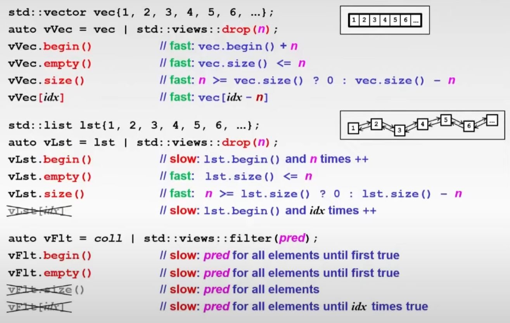
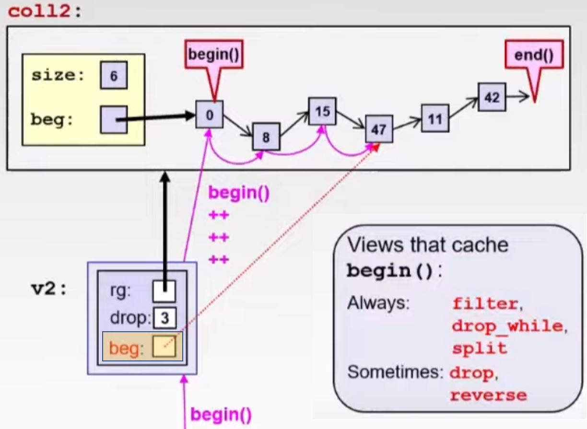
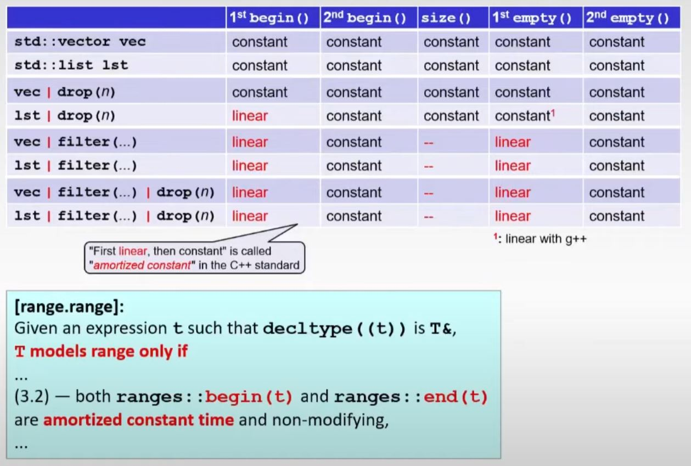

# Belle Views on C++ Ranges, their Details and the Devil - Nico Josuttis

## What is possible? Init a range with random numbers

- Pre C++20

```cpp
template <typename T>
void randomAdd(T& vals) {
  std::default_random_engine dre{std::random_device{}()};
  std::uniform_int_distribution<int> random{1, 99};
  for (auto& v : vals) {
    v += random(dre);
  }
}

std::vector<int> coll(8);
randomAdd(coll);
```

- first few change with C++20

```cpp
void randomAdd(auto& vals) { // since C++20
  std::default_random_engine dre{std::random_device{}()};
  std::uniform_int_distribution random{1, 99}; // auto deduction of type
  for (auto& v : vals) {
    v += random(dre);
  }
}
```

- Problem, imagine you do this. `queue` has no begin and end, so it can't do the range for.

```cpp
std::queue<int> q;
randomAdd(q); // ERROR with some terrible messages!
```

## C++20: Concepts as type constraints

```cpp
void randomAdd(std::ranges::forward_range auto& vals) { // since C++20
  //.. same above
}

std::queue<int> q;
randomAdd(q); // ERROR: constraint forward_range not satisfied
```

- but then, what if we do:

```cpp
std::vector<std::string> words = { "tic", "tac", "toe" };
randomAdd(words); // It CAB compile!!!
                  // but a random char might be added to the end of string
```

- So we can expand our constraint as such:

```cpp
void randomAdd(std::ranges::forward_range auto& vals)
requires std::integral<typename decltype(vals)::value_type>> {
  //.. same above
}
```

- Seems right, but you somehow get an error when you pass in `std::vector<int>` now. Why?
  - Because `std::vector<int>&::value_type` is not valid!
  - So we need to do ....


```cpp
void randomAdd(std::ranges::forward_range auto& vals)
requires std::integral<typename std::remove_cvref_t<decltype(vals)>::value_type>> {
  //.. same above
}
```

- Can we do better? Maybe `auto` is not the best idea here. Go back to template...

```cpp
template <typename RgT>
void randomAdd(Rgt& vals)
requires std::ranges::forward_range<RgT> &&
         std::integral<typename RgT::value_type> {
  //.. same as above
}
```

- Or maybe, we could:

```cpp
template <std::ranges::forward_range RgT>
void randomAdd(Rgt& vals)
requires std::integral<typename RgT::value_type> {
  //.. same as above
}
```

- But what if ...

```cpp
int data[] = {1, 2, 3}; // no value_type for raw array
randomAdd(data);
```

- We can do this to overcome

```cpp
template <std::ranges::forward_range RgT>
void randomAdd(Rgt& vals)
requires std::integral<std::ranges::range_value_t<RgT>> {
  //.. same as above
}
```

- You can also use above snippet for thread, and plus few C++20 features, you can make it do the right thing.


```cpp
template <std::ranges::forward_range RgT>
void randomAdd(Rgt& vals)
requires std::integral<std::ranges::range_value_t<RgT>> {
  auto init = [&](std::stop_token st) {
    std::default_random_engine dre{std::random_device{}()};
    std::uniform_int_distribution random{1, 99};
    for (auto& v : vals) {
      if (st.stop_requested()) return;
      std::atomic_ref{v} += random(dre); // v is atomic only in this context
    }
  };
  std::vector<std::jthread> threads;
  for (int i = 0; i < 4; ++i) {
    threads.push_back(std::jthread{init});
  }

  /*
  // implicit by jthread destructor
  for (auto& t : threads) {
    t.request_stop();
    t.join();
  } */
}

std::vector<int> coll(8);
randomAdd(coll);
```

- `std::jthread`, `std::stop_token` (since C++20)
  - Unlike `std::thread`, the `jthread` logically holds an internal private member of type `std::stop_source`, which maintains a shared stop-state.
  - The `jthread` constructor accepts a function that takes a `std::stop_token` as its first argument, which will be passed in by the jthread from its internal `std::stop_source`. This allows the function to check if stop has been requested during its execution, and return if it has.
- `std::atomic_ref`: For the lifetime of the atomic_ref object, the object it references is considered an atomic object. If one thread writes to an atomic object while another thread reads from it, the behavior is well-defined

## C++ 20 views

```cpp
std::vector<int> vec(8);
auto v = vec | std::views::take(5);
randomAdd(v);
print(vec2); // could give us 251 267 358 159 266 0 0 0


std::list<int> lst(8);
auto l = lst | std::views::drop(2) | std::views::take(5);
randomAdd(l);
print(lst); // could give us 0 0 156 161 240 108 123 0

// If you add a print of to show the size of input range in randomAdd
// std::cout << std::ranges::size(vals) << '\n';
// the result would have been 5 and 5
```

- The cool thing of views above is well understood by the unix folks. We know the power of using little building blocks to create really interesting complex stuff.

- Ok, above all looks nice, but what if you do...

```cpp
auto gt0 = [](const auto& val) { return val > 0; };
auto l2 = lst | std::views::filter(gt0);
randomAdd(l2);
```

- Now the compiler will error, and complaining there is no `std::ranges::size(vals)` ... why?

## How expensive is view's `begin()`?

- The `begin` of `drop` view of `vector` is O(1)
- But the `begin` of `drop` view of `list` is O(n)


- Also think about the operations for `filter`...lots of operations are basically O(n) because you need to find the `begin` where the `pred` is true.




## The improvement done in the library: cache `begin()`

- A lazy cache of the `begin()` (e.g. stored when it got called the first time)
- Only when it's needed, like there is no random access.





====tmp@31:09====