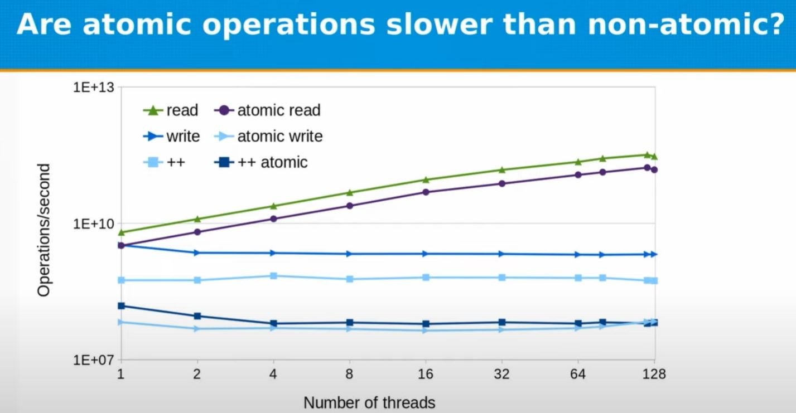
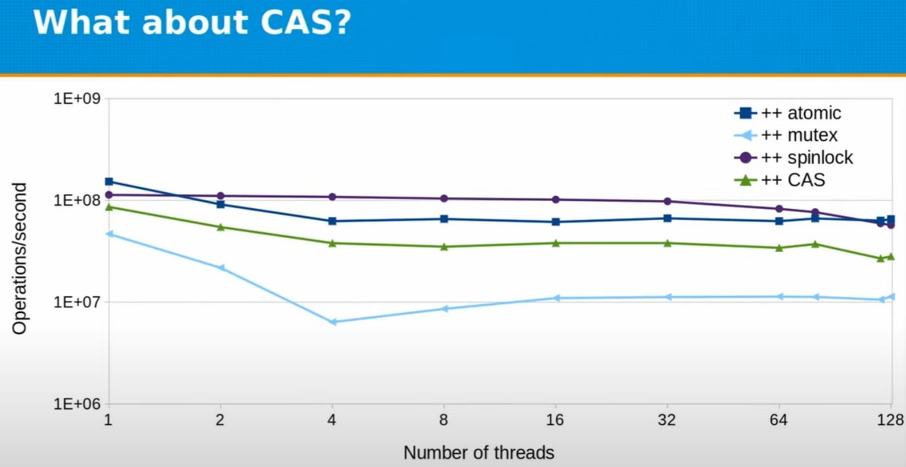
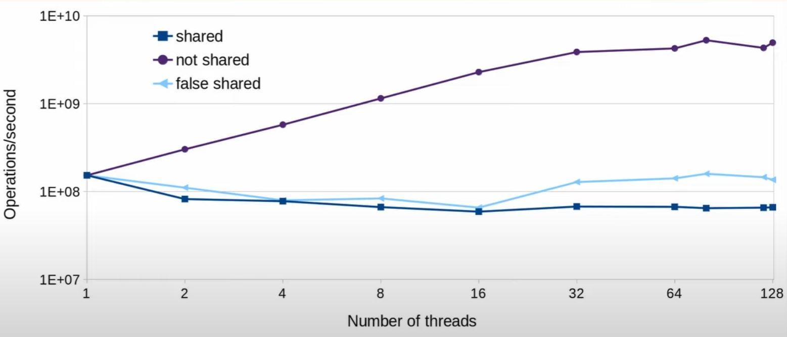
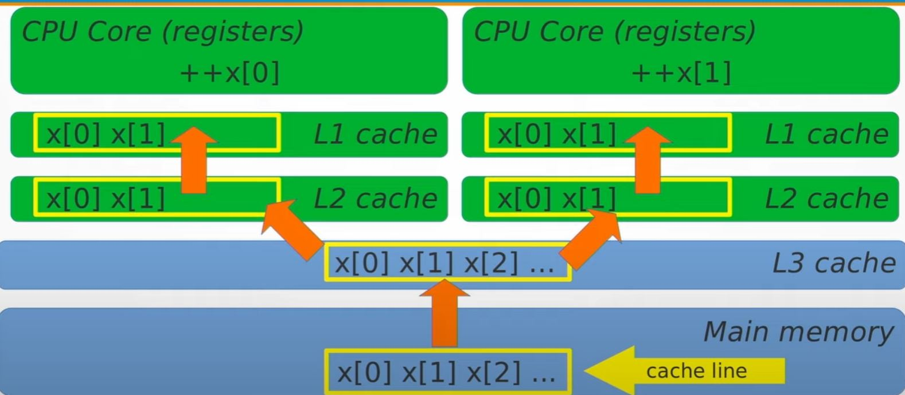
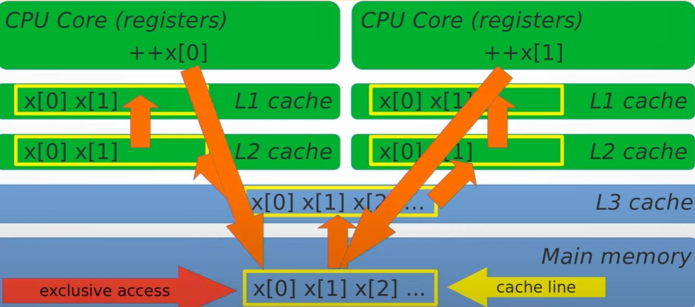

# Concurrency in C++: A Programmer’s Overview (part 2 of 2) - Fedor Pikus

## What is an atomic operation?

- Atomic operation is an operation that is guaranteed to **execute as a single transaction. E.g. Other threads will see the state of the system before the operation started or after it finished, but cannot see any intermediate state.**
- At the low level, atomic operations are special hardware instructions (hardware guarantees atomicity)
- NOTE: This is a general concept, not limited to hardware instructions (example: database transactions)

```txt

    int x = 0;
-----------------------
thread 1  |   thread 2
   ++x    |      ++x
-----------------------
    x = ?
```

- Increment is a "read-modify-write" operations: read x from memory, add 1 to x, write new x to memory.
- Normally Read-modify-write increment is non-atomic, so there could be a data race (which will resolve to undefined behavior!)

```txt

    int x = 0;
------------------------------------------
thread 1            |   thread 2
int tmp = x; //0    |   int tmp = x; //0
++tmp; // 1         |   ++tmp; // 1
x = tmp; // 1       |   x = tmp; // 1
------------------------------------------
    x = 1 (!!!)
```

## More insidious atomic operation example

- On x86, in practice, for built-in types (int, long, <= 64bytes), reads and writes do not have to be atomic (though theoretically it's UB)
- E.g. when you write something into an int, and read it from other thread. The reader thread should also not see the half-result of the write. (But if you are doing, say, int 128 bytes, you don't have this guarantee)

## What's really going on for atomic

Say we have 3 threads working on 3 cores, and all accessing x. The mental model should be like:

```txt
CPU core 1  | CPU core 2  | CPU core 3  |
L1 cache    | L1 cache    | L1 cache    |
L2 cache    | L2 cache    | L2 cache    |
-----------------------------------------
L3 cache
-----------------------------------------
Main memory
-----------------------------------------
```

- Variable x is in the main memory, when we are going to do ++x, x is being copied into L3 cache -> L2 cache -> L1 cache, then being ++'ed by the CPU.
- All the L2 cache/L1 cache of each core/thread will all have the copy.
- What atomic do is that, if core 1 is ++'ing x, it will make sure the value is flush back to main memory, and for thread 2/core 2, thread 3/core 3, they will have to read the x again all the way from L3 cache -> L2 cache -> L1 cache

## What C++ types can be made atomic?

- Any trivially copyable and copyable/movable type can be made atomic (Anything else will not compile)

**What is trivially copyable?**

- Continuous chunk of memory
- Copying the object means copying all bits (`memcpy`)
- No virtual functions, `noexcept` constructor

So:

```cpp
std::atomic<int> i; // OK
std::atomic<double> x; // OK
struct S { long x; long y; };
std::atomic<S> s; // ALSO OK
```

## What operations can be done on these types and are all operations on atomic types atomic?

There are actually 4 group of operations

- Assignment (read and write) - always supported regardless of `T`
- Special atomic operations which are exclusively to atomic
- Operations depend on the type `T`
- Operation that just won't be supported by atomic

Think about below ...

- One can't even be compiled
- Two of these are not the same as the others

```cpp
std::atomic<int> x{0};

++x;
x++;
x += 1;
x |= 2;
x *= 2;
int y = x * 2;
x = y + 1;
x = x + 1;
x = x * 2;
```

- All operations on the atomic variable `x` are atomic below (unless it's the case that it's not supported)

```cpp
std::atomic<int> x{0};

++x;     // Atomic pre-increment
x++;     // Atomic post-increment
x += 1;  // Atomic increment
x |= 2;  // Atomic bit set
x *= 2;  // <--- no atomic multiplication at all (won't compile)
int y = x * 2;  // atomic read of x
x = y + 1;  // atomic write of x
x = x + 1;  // atomic read followed by atomic write, not single atomic
x = x * 2;  // atomic read followed by atomic write, not single atomic
```

## `std::atomic<T>` and overloaded operators

- `std::atomic<T>` provides operator overloads only for atomic operations (incorrect code like `*=-` does not compile as expect)
- Unfortunately, any expression with atomic variables will not be computed atomically (easy to make mistakes - like `x = x + 1` and `x = x * 2;` --> they are not atomic like `x += 1` and `x *= 2` doesn't even compile. But they can be compiled)

> :brain::rotating_light: Don't use overloaded operators on atomic!

- `++x;` is the same as `x += 1;` is the same as `x = x + 1;` - unless x is atomic

## What operations can be done on `std::atomic<T>` for other types?

- Assignment and copy (read and write) for all types (Built-in and user-defined)
- Increment and decrement for raw pointers
- Addition, subtraction, and bitwise logic operations for integers
  - (`++`, `+=`, `-`, `-=`, `|=`, `&=`, `^=`)
- `std::atomic<bool>` is valid atomic on single byte, no special operations
- `std::atomic<double>` is valid, but it has no special operations
  - No atomic increment for floating-point numbers until C++20
  - (Since C++20) Atomic floating-point math is supported, but with caveat that result could differ from non-atomic
- Atomic wait and notify (C++20)

## What "other operations" can be done on `std::atomic<T>`?

- Use explicit read and writes:

```cpp
std::atomic<T> x;
T y = x.load(); // Same as T y = x;
x.store(y);  // same as x = y;
```

- Atomic exchange, unconditional

```cpp
T z = x.exchange(y); // Atomically do z = x; x = y;
```

- Conditional exchange: compare-and-swap (The key to most lock-free algorithms)

```cpp
// y is old value you assume, z is what you want to become
// if you ignore y, it's a unconditional exchange, but with y, there is condition
bool success = x.compare_exchange_strong(y, z); // T& y
// If x == y, make x = z and return true
// otherwise set y = x and return false
//
// e.g. exchange only happen if your guess of old value (y) is the same as the
// actually old value (x) while performing the operation.
//
// Note that y is a reference. If you guess wrong, then y is set to the actual
// current value of x
```
## What is so special about CAS?

- Compare-and-swap (CAS) is used in most lock-free algorithms
- Example: atomic increment with CAS

```cpp
std::atomic<int> x{0};
int oldVal = x;
while (!x.compare_exchange_strong(oldVal, oldVal + 1)) {}
// or you can simply
// x += 1;
// but it's because atomic support the += 1 operation.
```

For `int`, we have atomic increment, but CAS can be used to increment doubles, multiply integers and many more.

```cpp
while (!x.compare_exchange_strong(oldVal, oldVal * 2)) {}
```

## What other operations can be done on `std::atomic<int>`?

```cpp
std::atomic<int> x;
x.fetch_add(y);  // same as x += y;
int z = x.fetch_add(y); // same as z = (x += y) - y;
```

- Also `fetch_sub()`, `fetch_and()`, `fetch_or()`, `fetch_xor()`
  - Same as `-=`, `&=`, `|=`, `^=`
- More verbose but less error-prone than operators and expressions
  - Including `load()` and `store()` instead of `operator=()`

## :rotating_light: better avoid std::atomic overloaded operations

- `std::atomic<T>` provides operator overloads only for atomic operations (incorrect code does not compile)
- Any expression with atomic variables will not be computed atomically (easy to make mistakes)
- Member functions make atomic operations explicit
- Compilers understand you either way and do exactly what you asked (But not necessarily what you wanted)
- Programmers tend to see what they thought you meant, not what you really meant (for example, `x = x + 1` isn't atomic increment, but `x += 1` is! So just use `x.fetch_add(1)` for safety!)

## Question, how fast are atomic operations?

To measure, few things to note:

- Caution: measurement results will be hardware and compiler specific and should not be over-generalized!
- Caution: comparing atomic and non-atomic operations may be instructsive for understanding of what the hardware does, but it rarely directly useful (Comparing atomic operation with a thread-safe alternative is valid and useful)
- Experiment below, the higher the better (e.g. # operations per second).
- Check out [code](../../low-latency/benchmark_playground/concurrency_comp.h)
- Note that Fidor uses `-mavx2` [in the talk for compiling](https://youtu.be/R0V4xJ9HZpA?t=1710)


### Atomic v.s. non-atomic



- read/atomic read are scaled with thread #
- write/atomic write aren't scaled with thread # (as at hardware level, there will be constraint)

### Atomic v.s. locks v.s. CAS

- std::mutex could be slow, but checkout [Fedor's spinlock implementation](../../low-latency/benchmark_playground/spinlock.h)
- Still, it's just in this context, spinlock is fast. `std::mutex` might be okay in other context.




## Is atomic the same as lock-free?

:bulb: The big secret is, it's always atomic, but it's not always lock-free. E.g. it's not always done by atomic hardware instructions. Note that it will still be transactional, because of using lock.

- Throw below into godbolt.org

<table>
<tr><td> Code </td> <td> gcc </td></tr>
<tr>

<td>

```cpp
long f1(const std::atomic<long>& i) { return i.load(std::memory_order_relaxed); }
struct S { int i, j, k; };
S f1(const std::atomic<S>& i) { return i.load(std::memory_order_relaxed); }
```

</td>

<td>

```txt
f1(std::atomic<long> const&):
        mov     rax, QWORD PTR [rdi]
        ret
f1(std::atomic<S> const&):
        sub     rsp, 40
        mov     rsi, rdi
        xor     ecx, ecx
        mov     edi, 12
        lea     rdx, [rsp+16]
        call    __atomic_load
        mov     edx, DWORD PTR [rsp+24]
        mov     rax, QWORD PTR [rsp+16]
        add     rsp, 40
        ret
```

</td></tr>
</table>

```cpp
long x; // std::atomic<long> is lock-free
struct A { long x; }; // // std::atomic<A> is lock-free
struct B { long x; long y; }; // nope
struct C { long x; int y; };  // nope
struct D { int x; int y; int z; }; // nope
struct E { long x; long y; long z; }; // nope
```

- Note that `std::atomic<long>` is lock-free in practice, but not required by standard
- Generally you can examine with `std::atomic<T>::is_lock_free()` or `constexpr std::atomic<T>::is_always_lock_free`
- Only `std::atomic_flag` is guaranteed to be lock-free.
- Compilers generate appropriate exclusion code for non-lock-free atomics.
  - (Often hidden behind library calls (`libatomic`)), and probably with certain spinlock + compare and swap mechanics.

## Do atomic operations wait on each other?

- Yes, when cacheline is shared, check out [code](../../low-latency/benchmark_playground/atomic_sharing.h)



## What's really going on?

|||
|-- |-- |
|  |  |

- Cacheline is 64 bytes on x86 machine
- If you want to acquire hardware level cache, on the cache, it must lock 64 bytes at a time. And if your thread access it, it's the only one they can access the 64 bytes, even though the thread might only want to access 4 bytes out of them.
- Atomic operations do wait on each other.
  - In particular, write operations do
  - Read-only operations can scale near-perfectly
- Atomic operations have to wait for cacheline access
  - Price of data sharing without races
- Accessing different locations in the same cacheline still incurs run-time penalty (false sharing)
- Avoid false sharing by aligning per-thread data to separate cachelines.
  - On NUMA machines, maybe even on separate pages.

## The C++17 cacheline size

```cpp
// (C++17 feature to find L1 cache size)
// https://en.cppreference.com/w/cpp/thread/hardware_destructive_interference_size
#ifdef __cpp_lib_hardware_interference_size
using std::hardware_constructive_interference_size;
using std::hardware_destructive_interference_size;
#else
// 64 bytes on x86-64 │ L1_CACHE_BYTES │ L1_CACHE_SHIFT │ __cacheline_aligned │
// ...
constexpr std::size_t hardware_constructive_interference_size = 64;
constexpr std::size_t hardware_destructive_interference_size = 64;
#endif
```

- What we are interested is `hardware_destructive_interference_size`, the distance implies, if you are closer than this, you will have "destructive interference", e.g. one variable could lock the other one.
- On the other hand, `hardware_constructive_interference_size` guarantee that, if you are closer than the value, then caching one variable must bring the other one into cache(line) together.

## Strong and weak compare-and-swap

- C++ provides 2 versions of CAS - weak and strong
- `x.compare_exchange_strong(old_x, new_x);` means:

```cpp
if (x == old_x) {
  x = new_x;
  return true;
} else {
  old_x = x;
  return false;
}
```

- `x.compare_exchange_weak(old_x, new_x);` means same thing, but can "spuriously fail" and return false even if `x == old_x`. But why would it?

- CAS, conceptually in Pseudo-code. (Noted that all the "lock" in Psedudo code are some cacheline wise hardware lock)

```cpp

bool compare_exchange_strong(T& old_v, T new_v) {
  Lock l; // say, the hardware cacheline lock
  T tmp = value; // read current value of atomic
  if (tmp != old_v) { // guess wrong
    old_v = tmp;
    return false;
  }
  // guess right
  value = new_v;
  return true;
}

bool compare_exchange_weak(T& old_v, T new_v) {
  T tmp = value; // read current value of atomic without lock
  if (tmp != old_v) { // guess wrong
    old_v = tmp;
    return false;
  }
  //-----------------------------------------
  Lock l; // say, the hardware cacheline lock
  tmp = value; // read again because value could have changed
  if (tmp != old_v) { // validate again and guess wrong
    old_v = tmp;
    return false;
  }
  // guess right
  value = new_v;
  return true;
}
```

- or, for the `compare_exchange_weak`, if exclusive access is hard to get, it could have been a timed out version. (Hardware do have ability to timeout on lock)


```cpp
bool compare_exchange_weak(T& old_v, T new_v) {
  T tmp = value; // read current value of atomic without lock
  if (tmp != old_v) { // guess wrong
    old_v = tmp;
    return false;
  }
  //-----------------------------------------
  TimedLock l; // timed out lock!
  if (!l.locked()) {
    return false;
  }
  tmp = value; // read again because value could have changed
  if (tmp != old_v) { // validate again and guess wrong
    old_v = tmp;
    return false;
  }
  // guess right
  value = new_v;
  return true;
}
```


=============TEMPORARY @ around 44:24=============================

