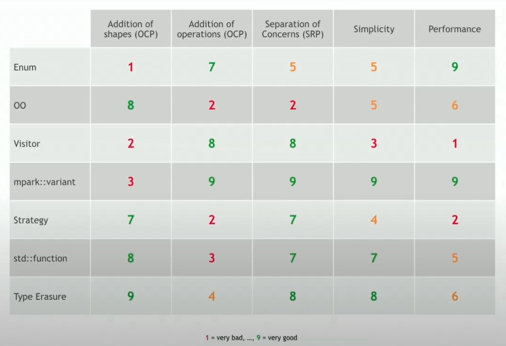
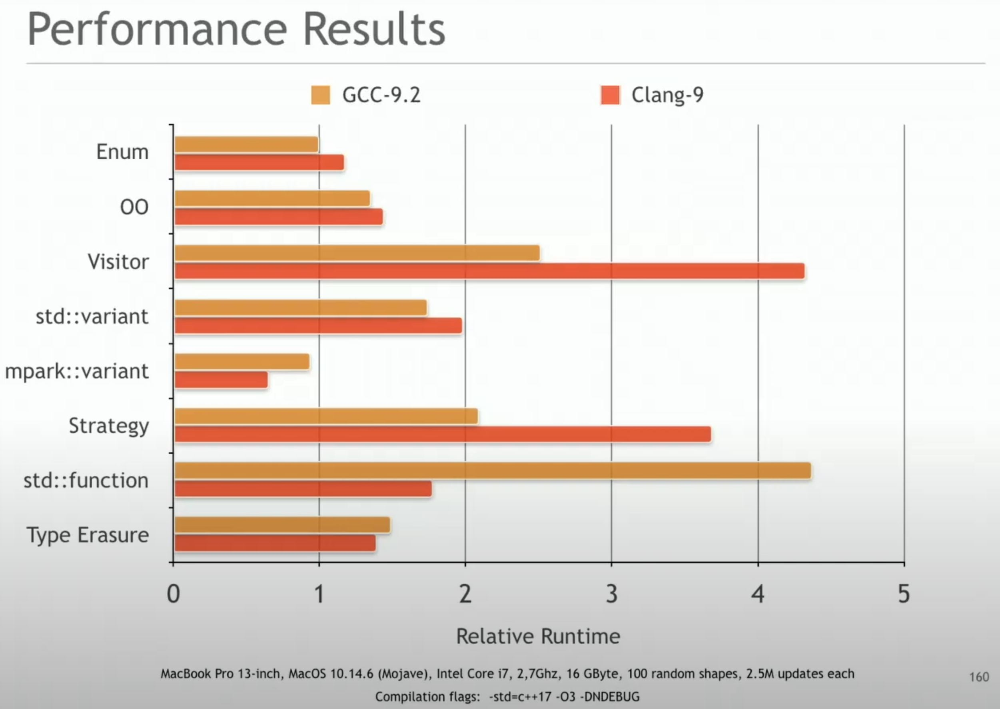

# "Embrace No Paradigm Programming!" - Klaus Iglberger

The talk is showing the question: "what kind of programming language is C++?" and use "drawing shapes" as the question to demonstrate the capability of C++

- C++ could be procedural, object-oriented, functional, generic, multi-paradigm programming... basically all kinds of paradigm

<details><summary markdown="span">Design comparison</summary>



</details>

<details><summary markdown="span">Performance comparison</summary>



</details>

---

## A procedural solution: The enum way

<details><summary markdown="span">Code</summary>

```cpp
enum ShapeType {
  circle,
  square,
};

class Shape {
 public:
  explicit Shape(ShapeType t) : type{t} {}
  virtual ~Shape() = default;
  ShapeType getType() const noexcept;

 private:
  ShapeType type;
};

class Circle : public Shape {
 public:
  explicit Circle(double r) : Shape{circle}, radius{r} {}
  ~Circle() override = default;
  ShapeType getType() const noexcept;

 private:
  double radius;
};

void translate(Circle&, const Vector3D&);
void rotate(Circle&, const Quaternion&);
void draw(const Circle&);

class Square : public Shape {
 public:
  explicit Square(double s) : Square{square}, side{s} {}
  ~Square() override = default;
  ShapeType getType() const noexcept;

 private:
  double side;
};

void translate(Square&, const Vector3D&);
void rotate(Square&, const Quaternion&);
void draw(const Square&);

void draw(const std::vector<std::unique_ptr<Shape>>& shapes) {
  for (const auto& s : shapes) {
    switch (s->type) {
      case circle:
        draw(*static_cast<const Circle*>(s.get()));
        break;
      case square:
        draw(*static_cast<const Square*>(s.get()));
        break;
    }
  }
}
```

</details>

- :weary: Drawback 1: Hard to add a new shape: everything basically depends on the enum type. When you add one enum, you have to add all the stuff again, plus compiler has to recompile everything as well. This violates the open close principle, the class is pretty hard to extend.
- :whale: Addition of operation is nice, just add new free function for each enum type basically.
- :whale: performance wise, not bad compared to other solution below.
- :whale: Shape itself not include the logic of those operations, from separation of concern's perspective, this doing good.

---

## An object-oriented solution: virtual function

<details><summary markdown="span">Code</summary>

```cpp
class Shape {
 public:
  Shape() = default;
  virtual ~Shape() = default;
  virtual void translate(const Vector3D&) = 0;
  virtual void rotate(const Quaternion&) = 0;
  virtual void draw() const = 0;
};

class Circle : public Shape {
 public:
  explicit Circle(double r) : radius{r} {}
  ~Circle() override = default;
  void translate(const Vector3D&) override;
  void rotate(const Quaternion&) override;
  void draw() const override;

 private:
  double radius;
};

class Square : public Shape {
 public:
  explicit Square(double s) : side{s} {}
  ~Square() override = default;
  void translate(const Vector3D&) override;
  void rotate(const Quaternion&) override;
  void draw() const override;

 private:
  double side;
};

void draw(const std::vector<std::unique_ptr<Shape>>& shapes) {
  for (const auto& s : shapes) {
    s->draw();
  }
}
```

</details>

- :whale: much easier to add new shape with virtual function. It follows the open-close principle!
- :weary: This design inverse the problem of previous implementation basically - when you need to add a new operation, you now need to touch all the shapes. So from adding operations' perspective, it broke the open-close principle.
- :weary: Now operations are tight to each function, which violates the separation of concern of the Shapes basically.
- :weary: Performance is a little bit worse than previous one in benchmark.

---

## The traditional visitor design pattern implementation


<details><summary markdown="span">Code</summary>

```cpp
class Circle;
class Square;

class Visitor {
 public:
  virtual ~Visitor() = default;
  virtual void visit(const Circle&) const = 0;
  virtual void visit(const Square&) const = 0;
};

class Shape {
 public:
  Shape() = default;
  virtual ~Shape() = default;
  virtual void accept(const Visitor&) = 0;
};

class Circle : public Shape {
 public:
  explicit Circle(double r) : radius{r} {}
  ~Circle() override = default;
  void accept(const Visitor&) override;

 private:
  double radius;
};

class Square : public Shape {
 public:
  explicit Square(double s) : side{s} {}
  ~Square() override = default;
  void accept(const Visitor&) override;

 private:
  double side;
};

class Draw : public Visitor {
 public:
  void visit(const Circle&) const override;
  void visit(const Square&) const override;
}

void draw(const std::vector<std::unique_ptr<Shape>>& shapes) {
  for (const auto& s : shapes) {
    s->accept(Draw{});
  }
}

```

</details>

- :weary: Slightly easier to add new shape compared to the first enum method, but not as good as the second OO normal polymorphic way.
- :whale: Very easy to add new operation. So how the visitor separate the concern of operation is really nice.
- :weary: Not that straight-forward to implement compared to the previous 2 methods.
- :weary: Performance is much worse than previous 2. Not that there are 2 virtual functions in Visitor and Shape.

---

## :bulb: The modern C++ visitor design pattern implementation with `std::variant`

- Note, Circle and Square no longer inherit from base Shape class.
- They can be put into same vector through define a variant type.
- `std::visit`!


<details><summary markdown="span">Code</summary>

```cpp
class Circle {
 public:
  explicit Circle(double r) : radius{r} {}
  ~Circle() override = default;

 private:
  double radius;
};

class Square {
 public:
  explicit Square(double s) : side{s} {}
  ~Square() override = default;

 private:
  double side;
};

class Draw {
 public:
  void visit(const Circle&) const override;
  void visit(const Square&) const override;
}

using Shape = std::variant<Circle, Square>;

void draw(const std::vector<std::unique_ptr<Shape>>& shapes) {
  for (const auto& s : shapes) {
    std::visit(Draw{}, s);
  }
}
```

</details>

- :weary: when adding a new shape, Draw need to change, variant Shape need to change. Basically all existing shape will be affected.
- :whale: brilliant way to make adding operations super easy. Best way to separate the concern of new operations on different types.
- :weary: performance is better than traditional way, but worse than the OO virtual function way. Why? `std::variant` has an array of functional pointer to reinterpret the pointer to a type, an extra indirection cost.


## :star: use the [magic lib mpark::variant](https://github.com/mpark/variant) instead of `std::variant` for visitor pattern

- :brain: The lib does a switch instead of an array of functional pointer, where there is some hardcode way that is limited to 32 types in the variant.
- :whale: all the good thing from previous implementation, plus even faster than the first procedural method!
- :weary: the main drawback is that only 32 types are allowed.

---

## Strategy pattern

<details><summary markdown="span">Code - the easily get wrong one</summary>

```cpp
class Circle;
class Square;

class DrawStrategy {
 public:
  virtual ~DrawStrategy() = default;
  virtual void draw(const Circle&) const = 0;
  virtual void draw(const Square&) const = 0;
};

class Shape {
 public:
  Shape() = default;
  virtual ~Shape() = default;
  virtual void translate(const Vector3D&) = 0;
  virtual void rotate(const Quaternion&) = 0;
  virtual void draw() const = 0;
};

class Circle : public Shape {
 public:
  explicit Circle(double r, std::unique_ptr<DrawStrategy> ds)
      : radius{r}, drawing{std::move(ds)} {}
  ~Circle() override = default;
  void translate(const Vector3D&) override;
  void rotate(const Quaternion&) override;
  void draw() const override;

 private:
  double radius;
  std::unique_ptr<DrawStrategy> drawing;
};

class Square : public Shape {
 public:
  explicit Square(double s, std::unique_ptr<DrawStrategy> ds)
      : side{s}, drawing{std::move(ds)} {}
  ~Square() override = default;
  void translate(const Vector3D&) override;
  void rotate(const Quaternion&) override;
  void draw() const override;

 private:
  double side;
  std::unique_ptr<DrawStrategy> drawing;
};

void draw(const std::vector<std::unique_ptr<Shape>>& shapes) {
  for (const auto& s : shapes) {
    s->draw();
  }
}

class OpenGLStrategy : DrawStrategy {
 public:
  ~OpenGLStrategy() override = default;
  void draw(const Circle&) const override;
  void draw(const Square&) const override;
};

```

</details>

<details><summary markdown="span">Code - the correct strategy implementation</summary>

```cpp
class Circle;
class Square;

class DrawCircleStrategy {
 public:
  virtual ~DrawCircleStrategy() = default;
  virtual void draw(const Circle&) const = 0;
};

class DrawSquareStrategy {
 public:
  virtual ~DrawSquareStrategy() = default;
  virtual void draw(const Square&) const = 0;
};

class Shape {
 public:
  Shape() = default;
  virtual ~Shape() = default;
  virtual void translate(const Vector3D&) = 0;
  virtual void rotate(const Quaternion&) = 0;
  virtual void draw() const = 0;
};

class Circle : public Shape {
 public:
  explicit Circle(double r, std::unique_ptr<DrawCircleStrategy> ds)
      : radius{r}, drawing{std::move(ds)} {}
  ~Circle() override = default;
  void translate(const Vector3D&) override;
  void rotate(const Quaternion&) override;
  void draw() const override;

 private:
  double radius;
  std::unique_ptr<DrawCircleStrategy> drawing;
};

class Square : public Shape {
 public:
  explicit Square(double s, std::unique_ptr<DrawSquareStrategy> ds)
      : side{s}, drawing{std::move(ds)} {}
  ~Square() override = default;
  void translate(const Vector3D&) override;
  void rotate(const Quaternion&) override;
  void draw() const override;

 private:
  double side;
  std::unique_ptr<DrawSquareStrategy> drawing;
};

void draw(const std::vector<std::unique_ptr<Shape>>& shapes) {
  for (const auto& s : shapes) {
    s->draw();
  }
}

class OpenGLCircleStrategy : DrawCircleStrategy {
 public:
  ~OpenGLCircleStrategy() override = default;
  void draw(const Circle&) const override;
};

class OpenGLSquareStrategy : DrawSquareStrategy {
 public:
  ~OpenGLSquareStrategy() override = default;
  void draw(const Square&) const override;
};

```

</details>

- Overall somewhat similar to the OO virtual function implementation. Has good extensibility when adding new shape, but more complex to add new operations.
- :weary: Performance is bad as the 2 virtual function indirection in Strategy (draw function) and context (shape itself).

---

## Strategy pattern but with std::function

<details><summary markdown="span">Code</summary>

```cpp
class Circle;
class Square;

class DrawCircleStrategy = std::function<void(const Circle&)>;
class DrawSquareStrategy = std::function<void(const Square&)>;

void draw(const Circle& circle) const;
void draw(const Square& square) const;

struct Draw {
  template <typename Drawable>
  void operator()(const Drawable& drawable) const {
    draw(drawable);
  }
};

class Shape {
 public:
  Shape() = default;
  virtual ~Shape() = default;
  virtual void translate(const Vector3D&) = 0;
  virtual void rotate(const Quaternion&) = 0;
  virtual void draw() const = 0;
};

class Circle : public Shape {
 public:
  explicit Circle(double r, DrawCircleStrategy ds = Draw{})
      : radius{r}, drawing{std::move(ds)} {}
  ~Circle() override = default;
  void translate(const Vector3D&) override;
  void rotate(const Quaternion&) override;
  void draw() const override;

 private:
  double radius;
  DrawCircleStrategy drawing;
};

class Square : public Shape {
 public:
  explicit Square(double s, DrawSquareStrategy ds = Draw{})
      : side{s}, drawing{std::move(ds)} {}
  ~Square() override = default;
  void translate(const Vector3D&) override;
  void rotate(const Quaternion&) override;
  void draw() const override;

 private:
  double side;
  DrawSquareStrategy drawing;
};

void draw(const std::vector<std::unique_ptr<Shape>>& shapes) {
  for (const auto& s : shapes) {
    s->draw();
  }
}

// usage, you can just do
// std::vector<std::unique_ptr<Shape>> shapes;
// shapes.push_back(std::make_unique<Circle>(2. 0));
// the default Draw template will take care of the std::function
// If we don't like the behavior of Draw, we can still pass in
// our intended custom function!
```

</details>

- :whale: Easy to add new shape, basically like the OO virtual function way
- :weary: Less convenient to add new operations.
- :whale: Separation of concern and simplicity is nice. The Shape has a default interface to inject the operations.
- :weary: Performance is bad, though...

---

## The type-erased solution

<details><summary markdown="span">Code</summary>

```cpp
class Circle {
 public:
  explicit Circle(double r) : radius{r} {}
  ~Circle() override = default;
  ShapeType getType() const noexcept;

 private:
  double radius;
};

void translate(Circle&, const Vector3D&);
void rotate(Circle&, const Quaternion&);
void draw(const Circle&);

class Square {
 public:
  explicit Square(double s) : side{s} {}
  ~Square() override = default;
  ShapeType getType() const noexcept;

 private:
  double side;
};

void translate(Square&, const Vector3D&);
void rotate(Square&, const Quaternion&);
void draw(const Square&);

class Shape {
  struct Concept {
    virtual ~Concept() {}
    virtual void do_translate(const Vector3D& v) const = 0;
    virtual void do_rotate(const Quaternion& v) const = 0;
    virtual void do_draw() const = 0;
    virtual Concept* clone() const = 0;
  };

  template <typename T>
  struct Model : Concept {
    Mode(const T& value) : object{value} {}

    void do_translate(const Vector3D& v) const override {
      translate(object, v);
    }
    void do_rotate(const Quaternion& q) const override { rotate(object, q); }
    void do_draw() const override { draw(object); }
    Concept* clone() const override { return new Mode(object); }

    T object;
  };

  Concept* pimpl;

  friend void translate(Shape& shape, const Vector3D& v) {
    shape.pimpl->do_translate(v);
  }
  friend void rotate(Shape& shape, const Quaternion& q) {
    shape.pimpl->do_rotate(q);
  }
  friend void draw(Shape& shape) { shape.pimpl->do_draw(); }

 public:
  template <typename T>
  Shape(const T& t) : pimpl{new Mode<T>(t)} {}
  ~Shape() { delete pimpl; }
  Shape(const Shape& s) : pimpl{s.pimpl.clone()} {}
  Shape& operator=(Shape s) {
    std::swap(pimpl, s.pimpl);
    return *this;
  }
}

void draw(const std::vector<std::unique_ptr<Shape>>& shapes) {
  for (const auto& s : shapes) {
    s->draw();
  }
}

// Usage:
// std::vector<Shape> shapes;
// shapes.push_back(Circle(2.0));
// shapes.push_back(Square(1.0));
// shapes.push_back(Square(1.3));
// ...
```

</details>

- :whale: very easy to add new shape
- :weary: still not that easy to add new operation
- :whale: performance is actually quite nice!

---

## Takeaways

- There is no "one-fits-all" solution.
- Understand the virtues of "Modern C++" (paticularly from implementations: `mpark::variant`, `std::function`, type erasure)
  - Reduce the use of pointers and inheritance hierarchies.
  - Prefer value semantics
  - Keep your code simple
- "No paradigm programming"
  - Learn about each implementation's advantages and weaknesses
  - Pick the good ideas
  - Don't shackle yourself with thinking about paradigms anymore.
