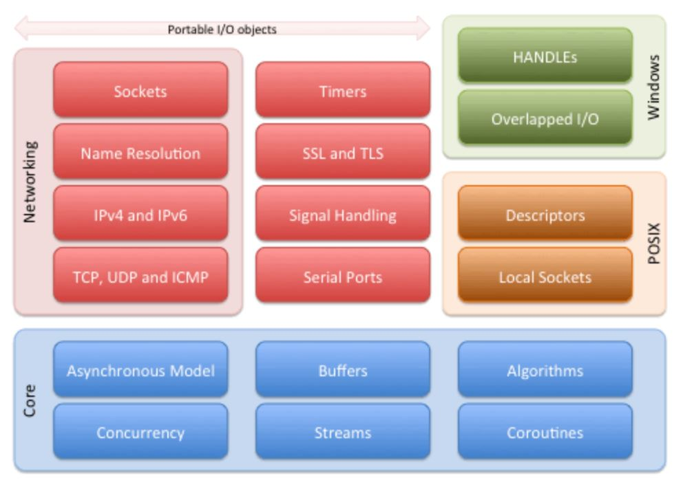
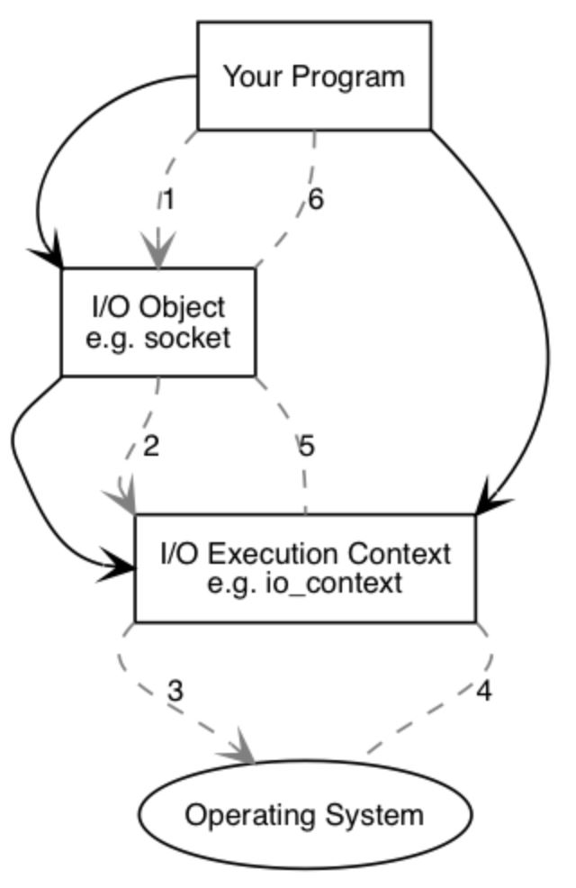
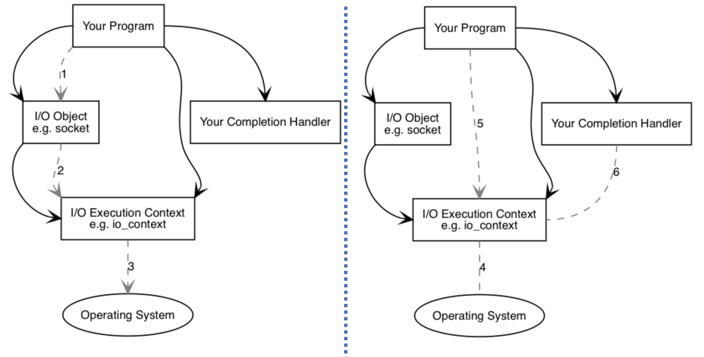

# 1. Basics

[think-async.com](https://think-async.com/Asio/)

## Rationale

- Most programs interact with the outside world in some way ... as is the case with networking, individual I/O operations can take a long time to complete.
- Asio provides the tools to manage these long running operations, without requiring programs to use concurrency models based on threads and explicit locking.
- Although Boost.Asio started life focused primarily on networking, its concepts of asynchronous I/O have been extended to include other operating system resources such as serial ports, file descriptors, and so on.

## Building blocks

- Asio provides the basic building blocks for C++ networking, concurrency and other kinds of I/O.




## [Basic Boost.Asio Anatomy](https://think-async.com/Asio/boost_asio_1_24_0/doc/html/boost_asio/overview/basics.html)

- Boost.Asio may be used to perform both synchronous and asynchronous operations on I/O objects such as sockets.
- Let's consider what happens when you perform a connect operation on a socket.


### (Simplified) synchronous connect with asio



Your program will have at least one I/O execution context, such as

- an `boost::asio::io_context object`,
- `boost::asio::thread_pool` object, or
- `boost::asio::system_context`.

This I/O execution context represents **your program's link to the operating system's I/O services.**

- To perform I/O operations your program will **need an I/O object such as a TCP socket:** `boost::asio::ip::tcp::socket socket(io_context);`

When a synchronous connect operation is performed, the following sequence of events occurs:

1. Your program initiates the connect operation by calling the I/O object: `socket.connect(server_endpoint);`.
2. The **I/O object forwards the request to the I/O execution context.**
3. The I/O execution context calls on the operating system to perform the `connect` operation.
4. The operating system returns the result of the operation to the I/O execution context.
5. The I/O execution context translates any error resulting from the operation into an object of type `boost::system::error_code`.

   - An error_code may be compared with specific values, or tested as a boolean (where a false result means that no error occurred).
   - The result is then forwarded back up to the I/O object.

6. The I/O object throws an exception of type `boost::system::system_error` if the operation failed. If the code to initiate the operation had instead been written as:

```cpp
boost::system::error_code ec;
socket.connect(server_endpoint, ec);
```

   - then the `error_code` variable `ec` would be set to the result of the operation, and **no exception would be thrown.**


### (Simplified) asynchronous connect with asio



1. Your program initiates the connect operation by calling the I/O object: `socket.async_connect(server_endpoint, your_completion_handler);`

   - where `your_completion_handler` is a function or function object with the signature: `void your_completion_handler(const boost::system::error_code& ec);`
   - The exact signature required depends on the asynchronous operation being performed.

2. The I/O object forwards the request to the I/O execution context.
3. The I/O execution context signals to the operating system that it should start an asynchronous connect.

... Time passes. (In the synchronous case this wait would have been contained entirely within the duration of the connect operation.)

4. The operating system indicates that the connect operation has completed by placing the result on a queue, ready to be picked up by the I/O execution context.
5. When using an `io_context` as the I/O execution context, your program must make a call to `io_context::run()` (or to one of the similar `io_context` member functions) in order for the result to be retrieved.
   - A call to `io_context::run()` **blocks** while there are unfinished asynchronous operations, so you would typically call it as soon as you have started your first asynchronous operation.

6. While inside the call to `io_context::run()`, the I/O execution context dequeues the result of the operation, translates it into an `error_code`, and then passes it to `your_completion_handler`.


## ChatGPT explain `io_context`

- The term "context" in `io_context` refers to the environment or the background in which the I/O operations take place.
- It represents the **context** or setting in which the asynchronous operations are managed and executed.

- The choice of the name "context" for this component is related to the idea that the `io_context` object **holds and maintains the necessary resources and state information needed for performing asynchronous I/O operations.**
  - It serves as the context or container that manages the execution of these operations.

  - The term "context" is often used in programming to describe a specific environment or state in which code is executed. In the case of `io_context`, it encapsulates **the necessary structures, buffers, and event handlers to handle asynchronous I/O, timers, and other related tasks.**

- By naming it `io_context`, Boost.Asio emphasizes the role of this component as **a central entity** that manages and coordinates the asynchronous I/O operations, providing the necessary context for their execution.
- In simple terms, you can think of `io_context` as the **control center or the heart of your asynchronous operations.**

- Imagine you have a bunch of tasks that need to be executed asynchronously, like
  - sending and receiving data over a network,
  - reading and writing files, or processing incoming requests.
- These tasks can take some time to complete, and you don't want your program to block and wait for each task to finish before moving on to the next one.

- This is where `io_context` comes in. It manages and coordinates all these asynchronous tasks efficiently. Instead of waiting for each task to complete, you tell `io_context` to perform the tasks **in the background and notify you when they are done.** You can then continue with other tasks or perform additional work while the asynchronous operations are happening.

- `io_context` handles tasks by using an event-driven model. It **waits for events to occur**, such as **incoming data or a completed operation**, and **triggers the appropriate callbacks or handlers associated with those events**. This allows your program to be responsive and continue executing other tasks while waiting for I/O operations to finish.

- Additionally, `io_context` provides other functionalities like managing timers, scheduling callbacks to be executed at specific times, and supporting concurrency by allowing multiple threads to work with it.

- In summary, `io_context` is the central part of Boost.Asio that enables asynchronous programming. It allows you to perform multiple I/O operations concurrently, receive notifications when they complete, and continue with other tasks without blocking. It simplifies the management of asynchronous operations and helps build responsive and efficient networked applications in C++.

