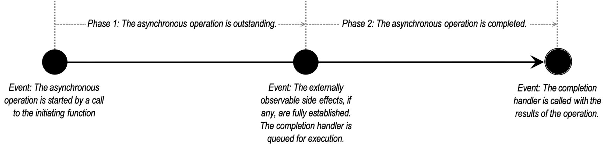

# 2. Asynchronous Model

- Boost.Asio library's asynchronous model enshrines asynchronous operations as **the fundamental building block of asynchronous composition**, but in a way that decouples them from the composition mechanism.
- The asynchronous operations in Boost.Asio support
  - callbacks,
  - futures (both eager and lazy),
  - fibers,
  - coroutines, and
  - approaches yet to be imagined.
- This allows the application programmer to select an approach based on appropriate trade-offs.

## Asynchronous Operations

- An **asynchronous operation** is the basic unit of composition in the Boost.Asio asynchronous model.
- Asynchronous operations represent work that is launched and performed in the background, while the user's code that initiated the work can continue with other things.
- Conceptually, the lifecycle of an asynchronous operation can be described in terms of the following events and phases:

- An initiating function is a function which may be called by the user to start an asynchronous operation.
- A completion handler is a **user-provided, move-only function object** that will be **invoked, at most once**, with the result of the asynchronous operation. The invocation of the completion handler tells the user about something that has already happened: the **operation completed, and the side effects of the operation were established**.

Synchronous operations, being embodied as single functions, have several inherent semantic properties as a consequence. Asynchronous operations adopt some of these semantic properties from their synchronous counterparts, in order to facilitate flexible and efficient composition.

|Property of synchronous operations|Equivalent property of asynchronous operations|
|--|--|
|When a synchronous operation is generic (i.e. a template) the return type is deterministically derived from the function and its arguments.|When an asynchronous operation is generic, the completion handler's arguments' types and order are deterministically derived from the initiating function and its arguments.|
|If a synchronous operation requires a temporary resource (such as memory, a file descriptor, or a thread), this resource is released before returning from the function.|If an asynchronous operation requires a temporary resource (such as memory, a file descriptor, or a thread), this resource is released before calling the completion handler.|

The latter is an important property of asynchronous operations, in that

- it allows a completion handler to initiate further asynchronous operations without overlapping resource usage.

Consider the trivial (and relatively common) case of the same operation being repeated over and over in a chain. By ensuring that resources are released before the completion handler runs, we avoid doubling the peak resource usage of the chain of operations.