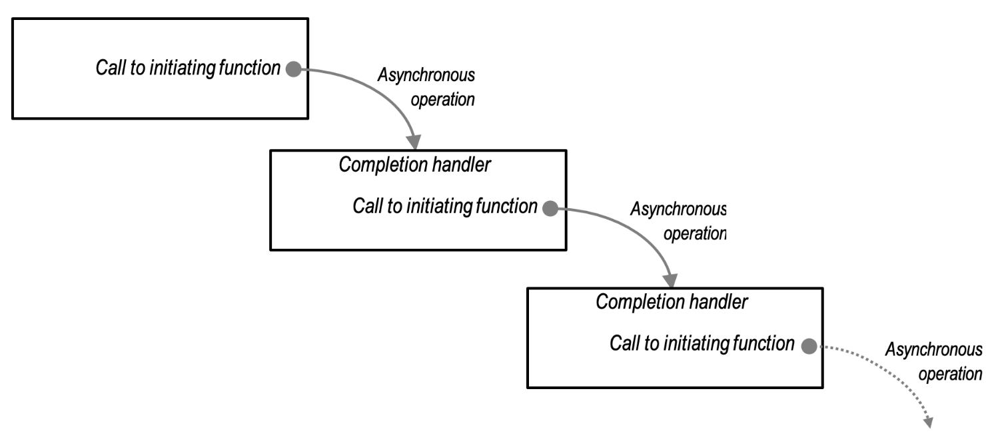
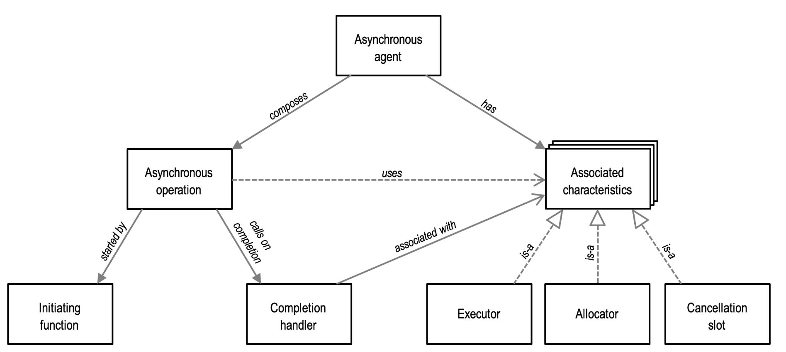
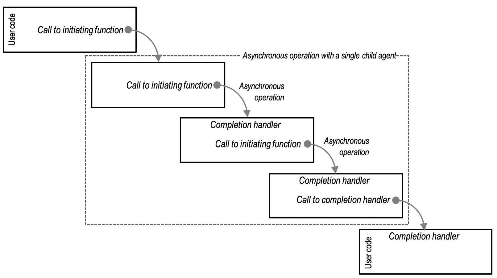
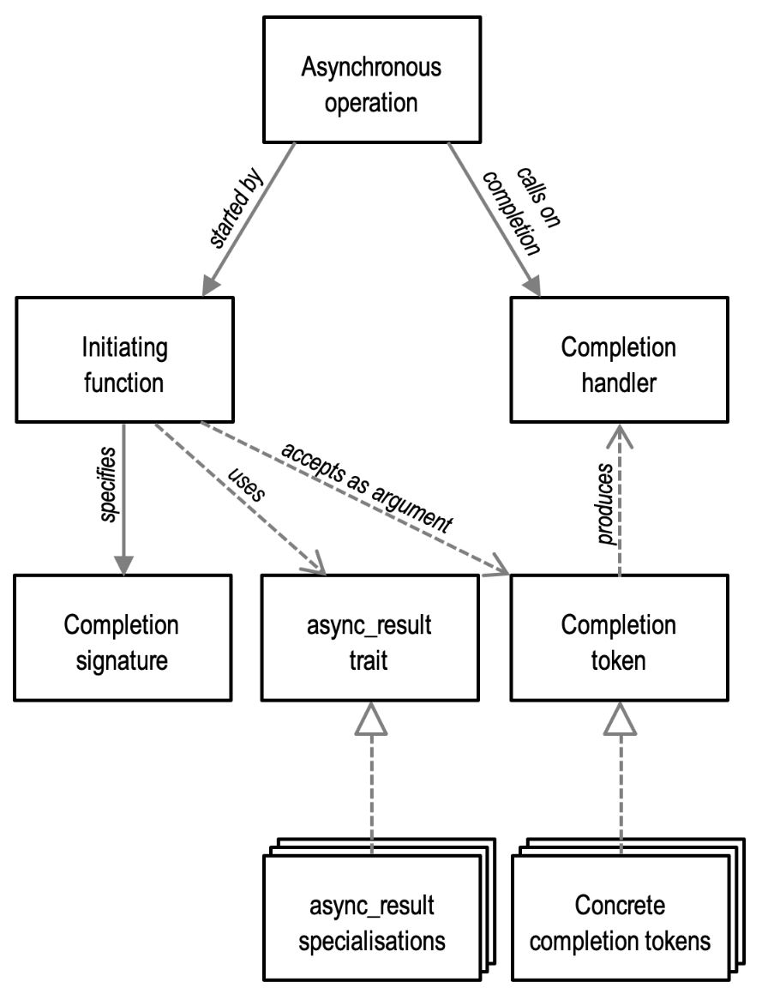
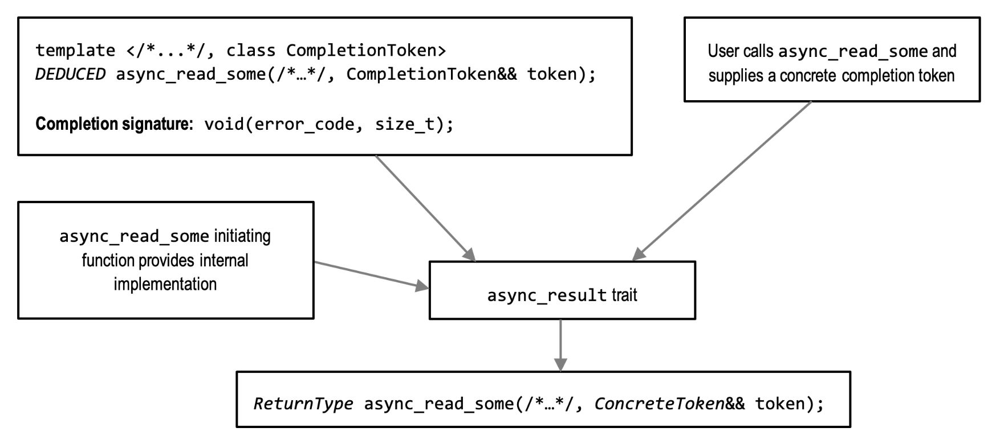

# [Asynchronous Agents](https://think-async.com/Asio/asio-1.28.0/doc/asio/overview/model/async_agents.html)

An asynchronous agent is a **purely notional construct** that allows us to **reason about the context for, and composition of, asynchronous operations in a program.**

- The library does not explicitly mention the term "asynchronous agent," and the specific mechanism used to combine asynchronous operations within an agent (such as chains of lambdas, coroutines, fibers, state machines, etc.) is not of significant importance.

An asynchronous agent is **a sequential composition of asynchronous operations**.

- Every asynchronous operation is considered to run as **a part of an asynchronous agent,** even if that agent contains only that single operation.
- An asynchronous agent is **an entity that may perform work concurrently with other agents**.
- Asynchronous agents are to asynchronous operations as threads are to synchronous operations.

We can visualize an asynchronous agent as follows:



- Asynchronous agents alternately wait for an asynchronous operation to complete, and then run a completion handler for that operation.
- Within the context of an agent, these completion handlers represent indivisible units of schedulable work.




## [Associated Characteristics and Associators](https://think-async.com/Asio/asio-1.28.0/doc/asio/overview/model/associators.html)

An asynchronous agent has associated characteristics that specify **how asynchronous operations should behave** when composed as part of that agent.

- When an asynchronous operation is run within an asynchronous agent, its implementation may query these associated characteristics and use them to satisfy the requirements or preferences they represent.
  - The asynchronous operation performs these queries by **applying associator traits to the completion handler.**
  - Each characteristic has a corresponding associator trait.


characteristics such as:

- An **allocator**, which determines how the agent's asynchronous operations **obtain memory resources**.
- A **cancellation slot,** which determines how the agent's asynchronous operations support **cancellation**.
- An **executor**, which determines how the agent's **completion handlers will be queued and run.**


An **associator trait** may be specialized for concrete completion handler types to:

- accept the default characteristic supplied by the asynchronous operation, returning this default as-is
- return an unrelated implementation of the characteristic, or
- adapt the supplied default to introduce additional behavior required by the completion handler.

### Specification of an Associator

An Associator Specification:

In the context of an associator trait named `associated_R`, we have the following components:

- A source value `s` of type `S`, which represents the completion handler and its type.
- A set of type requirements or concept `R` that defines the syntax and semantics of the associated characteristic.
- A candidate value `c` of type `C` that satisfies the type requirements `R`. This serves as a default implementation of the associated characteristic provided by the asynchronous operation.

Using the associator trait, the asynchronous operation computes:

- The type `associated_R<S, C>::type`.
- The value `associated_R<S, C>::get(s, c)` that fulfills the requirements defined in `R`.

For convenience, these can be accessed using the type alias `associated_R_t<S, C>` and the free function `get_associated_R(s, c)`.

The primary template of the trait is specified as follows:

- If `S::R_type` is well-formed, it defines a nested type alias `type` as `S::R_type` and a static member function `get` that returns `s.get_R()`.
- If not, it checks if `associator<associated_R, S, C>::type` is well-formed and denotes a type. If so, it inherits from `associator<associated_R, S, C>`.
- Otherwise, it defines a nested type alias `type` as `C`.

Here are some examples:


```cpp
// Type alias example
using MyAssociatedType = associated_R_t<MySource, MyCandidate>;

// Free function example
auto result = get_associated_R(mySource, myCandidate);
```

## [Child Agents](https://think-async.com/Asio/asio-1.28.0/doc/asio/overview/model/child_agents.html)

The asynchronous operations within an agent may themselves be implemented in terms of child agents.

- In Boost.Asio these asynchronous operations are referred to as **composed operations**.

As far as the parent agent is concerned, it is waiting for the completion of a single asynchronous operation. The asynchronous operations that constitute the child agent run in sequence, and when the final completion handler runs the parent agent is resumed.



- As with individual asynchronous operations, the asynchronous operations built on child agents must release their temporary resources prior to calling the completion handler.
- We may also **think of these child agents as resources that end their lifetimes before the completion handler is invoked.**

- When an asynchronous operation creates a child agent, it may propagate the associated characteristics of the parent agent to the child agent.
  - Typically, by specializing the associator trait and forwarding to the outer completion handler.
  - These associated characteristics may then be recursively propagated through further layers of asynchronous operations and child agents.

This stacking of asynchronous operations replicates another property of synchronous operations:

|Property of synchronous operations | Equivalent property of asynchronous operations|
|--|--|
|Compositions of synchronous operations may be refactored to use child functions that run on the same thread (i.e. are simply called) without altering functionality.|Asynchronous agents may be refactored to use asynchronous operations and child agents that share the associated characteristics of the parent agent, without altering functionality.|

Finally, some asynchronous operations may be implemented in terms of **multiple child agents that run concurrently**.

- In this case, the asynchronous operation may choose to selectively propagate the associated characteristics of the parent agent.


## [Executors:](https://think-async.com/Asio/asio-1.28.0/doc/asio/overview/model/executors.html)

- **Every asynchronous agent has an associated executor**.
- The executor of an agent determines how the agent's completion handlers are queued and executed.

Here are some examples of how executors are used:

- Coordinating a group of asynchronous agents that operate on shared data structures, ensuring that the agents' completion handlers never run concurrently. (In Boost.Asio, this kind of executor is called a **strand**.)
- Ensuring that **agents are run on specified execution resource (e.g. a CPU) that is proximal to data or an event source** (e.g. a NIC).
- Denoting a group of related agents, and so enabling dynamic **thread pools** to make smarter scheduling decisions (such as moving the agents between execution resources as a unit).
- Queuing all completion handlers to run on a GUI application thread, so that they may safely update user interface elements.
- Returning an asynchronous operation's default executor as-is, to run completion handlers as close as possible to the event that triggered the operation's completion.
- Adapting an asynchronous operation's default executor, to run code before and after every completion handler, such as logging, user authorization, or exception handling.
- Specifying a priority for an asynchronous agent and its completion handlers.

Within an asynchronous agent, the associated executor is used for the following purposes:

- Track the existence of the work that the asynchronous operation represents, while the operation is outstanding.
- Enqueue the completion handler for execution on completion of an operation.
- Ensure that completion handlers do not run reentrantly, if doing so might lead to inadvertent recursion and stack overflow.

Thus, an asynchronous agent's associated executor represents **a policy of how, where, and when the agent should run**, specified as a cross-cutting concern to the code that makes up the agent.


```cpp
#include <boost/asio.hpp>
#include <iostream>
#include <mutex>
#include <vector>

using namespace boost::asio;

std::vector<int> sharedData;  // Shared data structure
std::mutex dataMutex;         // Mutex for protecting sharedData

void handleRequest(const boost::system::error_code& error,
                   size_t bytesTransferred) {
  if (!error) {
     // while the strand executor guarantees sequential execution of completion
     // handlers, the mutex is still needed to protect the shared data
     // structure and ensure atomicity of operations when accessing and
     // modifying the data. The combination of the strand executor and mutex
     // provides both synchronization and thread safety in scenarios where
     // multiple network requests concurrently access a shared resource.
    std::lock_guard<std::mutex> lock(dataMutex);
    sharedData.push_back(bytesTransferred);
  } else {
    // Handle the error
  }
}

int main() {
  io_context ioContext;
  strand strandExecutor(ioContext);  // Create a strand executor

  // Simulate multiple concurrent network requests
  for (int i = 0; i < 5; ++i) {
    // Perform an asynchronous network request using the strand executor
    // the strand executor ensure that the completion
    // handleRequest is not executed concurrently with other
    // completion handlers associated with the same strand.
    // This coordination prevents data races and ensures thread
    // safety when accessing shared resources.
    async_read_some(socket, buffer, strandExecutor.wrap(handleRequest));
  }

  ioContext.run();  // Start the I/O service

  // Print the shared data
  for (const auto& data : sharedData) {
    std::cout << data << " ";
  }
  std::cout << std::endl;

  return 0;
}
```

- or say, if sharedResource is exclusively used by completionHandler, since strand guarantees completionHandler is executed sequentially, we might not need the lock:

```cpp
#include <boost/asio.hpp>
#include <iostream>

using namespace boost::asio;

class SharedResource {
 public:
  void accessResource() {
    std::cout << "Accessing shared resource." << std::endl;
    // Simulate some work on the shared resource
    // ...
    std::cout << "Access complete." << std::endl;
  }
};

int main() {
  io_context ioContext;
  SharedResource sharedResource;

  // Create a strand
  io_context::strand strand(ioContext);

  // Completion handler executed within the strand
  auto completionHandler = [&](const boost::system::error_code& error) {
    if (!error) {
      // Access the shared resource within the completion handler
      sharedResource.accessResource();
    }
    // ...
  };

  // Dispatch multiple asynchronous operations from different threads
  std::thread thread1([&]() { strand.post(completionHandler); });

  std::thread thread2([&]() { strand.post(completionHandler); });

  // Run the I/O context to execute completion handlers
  ioContext.run();

  // Wait for the threads to finish
  thread1.join();
  thread2.join();

  return 0;
}

```


## [Allocators](https://think-async.com/Asio/asio-1.28.0/doc/asio/overview/model/allocators.html)

**Every asynchronous agent has an associated allocator**.

- An agent's allocator is **an interface** used by the agent's asynchronous operations to obtain **per-operation stable memory resources** (**POSMs**).
- This name reflects the fact that the **memory is per-operation because the memory is only retained for the lifetime of that operation**, and **stable, because the memory is guaranteed to be available at that location throughout the operation.**

Asynchronous operations may utilize POSMs in a number of different ways:

- The operation doesn't require any POSMs.
  - For example, the operation wraps an existing API that performs its own memory management, or is copying the long lived state into existing memory like a circular buffer.
- The operation uses a single, fixed-size POSM for as long as the operation is outstanding.
  - For example, the operation stores some state in a linked list.
- The operation uses a single, runtime-sized POSM.
  - For example, the operation stores a copy of a user-supplied buffer, or a runtime-sized array of `iovec` structures.
- The operation uses multiple POSMs concurrently.
  - For example, a fixed size POSM for a linked list plus a runtime-sized POSM for a buffer.
- The operation uses multiple POSMs serially, which may vary in size.


Associated allocators allow users to treat POSM optimisation as a cross-cutting concern to the composition of asynchronous operations.

- Furthermore, using allocators as the interface to obtain POSMs grant substantial flexibility to both the implementers and users of asynchronous operations:
  - Users can ignore the allocator and accept whatever default strategy is employed by the application.
  - Implementers can ignore the allocator, especially if the operation is not considered performance-sensitive.
  - Users can co-locate POSMs for related asynchronous operations, for better locality of reference.

- For compositions that involve serial POSMs of different sizes, memory usage need only be as great as the currently extant POSM.
  - For example, consider a composition that contains a short-lived operation that uses large POSMs (connection establishment and handshake) followed by a long-lived operation that uses small POSMs (transferring data to and from the peer).
- As noted previously, all resources must be released prior to calling the completion handler.
  - This enables memory to be recycled for subsequent asynchronous operations within an agent.
  - This allows applications with long-lived asynchronous agents to have no hot-path memory allocations, even though the user code is unaware of associated allocators.
  - E.g. by releasing resources promptly before its completion handler, we can efficiently reuse memory for subsequent operations (as used by other agents, not this one, as it's already running its completion handler), resulting in improved performance and avoiding unnecessary memory allocations, even if the user is not directly involved in managing the memory.

```cpp
#include <boost/asio.hpp>
#include <iostream>

// Define a custom allocator
struct MyAllocator {
  // Implementation of the allocator methods
  // ...

  // Example allocation function
  void* allocate(std::size_t size) {
    std::cout << "Allocating memory of size: " << size << std::endl;
    return ::operator new(size);
  }

  // Example deallocation function
  void deallocate(void* ptr, std::size_t size) {
    std::cout << "Deallocating memory of size: " << size << std::endl;
    ::operator delete(ptr);
  }
};

// Custom completion handler
void myCompletionHandler(const boost::system::error_code& error,
                         std::size_t bytes_transferred) {
  // Handle completion
  // ...
}

int main() {
  boost::asio::io_context ioContext;

  // Create an associated allocator object
  MyAllocator myAllocator;

  // Create a strand with the associated allocator
  // The associated allocator myAllocator is implicitly used when allocating
  // any memory required for the execution of the completion handler.
  // E.g. we utilize the associated allocator as a means to control memory
  // allocation within the asynchronous operation. T
  boost::asio::strand<MyAllocator> strand(ioContext, myAllocator);

  // Post a completion handler to the strand
  strand.post(myCompletionHandler);

  // Run the IO context
  ioContext.run();

  return 0;
}

```

## Cancellation

In Asio, many objects, such as sockets and timers, support object-wide cancellation of outstanding asynchronous operations via their `close` or `cancel` member functions.

- However, certain asynchronous operations also support **individual, targeted cancellation**.
- This per-operation cancellation is enabled by specifying that **every asynchronous agent has an associated cancellation slot.**

- To support cancellation, an asynchronous operation installs a cancellation handler into the agent's slot. The cancellation handler is a function object that will be invoked when a **cancellation signal is emitted by the user into the slot.**
-  Since a cancellation slot is associated with a single agent, the slot holds at most one handler at a time, and installing a new handler will overwrite any previously installed handler.
-  **Thus, the same slot is reused for subsequent asynchronous operations within the agent.**

- Cancellation is particularly useful when an asynchronous operation contains multiple child agents. For example, one child agent may be complete and the other is then cancelled, as its side effects are no longer required.


## [Completion tokens](https://think-async.com/Asio/asio-1.28.0/doc/asio/overview/model/completion_tokens.html)




- A key goal of Asio's asynchronous model is to support multiple composition mechanisms. This is achieved via a completion token, which the user passes to an asynchronous operation's initiating function to customize the API surface of the library.
- By convention, the completion token is the final argument to an asynchronous operation's initiating function.

- For example, if the user passes a lambda (or other function object) as the completion token, the asynchronous operation behaves as previously described: the operation begins, and when the operation completes the result is passed to the lambda.


```cpp
socket.async_read_some(buffer,
    [](error_code e, size_t)
    {
      // ...
    }
  );
```

- When the user passes the `use_future` completion token, the operation behaves as though implemented in terms of a promise and future pair. The initiating function does not just launch the operation, but also returns a future that may be used to await the result.

```cpp
future<size_t> f =
  socket.async_read_some(
      buffer, use_future
    );
// ...
size_t n = f.get();
```

- Similarly, when the user passes the `use_awaitable` completion token, the initiating function behaves as though it is an awaitable-based coroutine. However, in this case the initiating function does not launch the asynchronous operation directly. It only returns the awaitable, which in turn launches the operation when it is co_await-ed.

```cpp
awaitable<void> foo()
{
  size_t n =
    co_await socket.async_read_some(
        buffer, use_awaitable
      );

  // ...
}
```

- Finally, the `yield_context` completion token causes the initiating function to behave as a synchronous operation within the context of a stackful coroutine. It not only begins the asynchronous operation, but blocks the stackful coroutine until it is complete. From the point of the stackful coroutine, it is a synchronous operation.

```cpp
void foo(asio::yield_context yield)
{
  size_t n = socket.async_read_some(buffer, yield);

  // ...
}
```

- All of these uses are supported by a single implementation of the `async_read_some` initiating function.

- To achieve this, an asynchronous operation must first specify a completion signature (or, possibly, signatures) that describes the arguments that will be passed to its completion handler.

- Then, the operation's initiating function takes the completion signature, completion token, and its internal implementation and passes them to the `async_result` trait.
- The `async_result` trait is a customization point that combines these to first produce a concrete completion handler, and then launch the operation.


```cpp
// The purpose of this code is to demonstrate how the Boost.Asio library can be
// customized to support asynchronous operations with different behavior and
// threading models. However, it's important to note that this specific
// implementation using a detached thread is not recommended for real-world use
// due to potential issues related to thread management, error handling, and
// resource utilization.
template <
    // The template parameter CompletionToken represents the completion token
    // type that satisfies the completion signature void(error_code, size_t).
    // The completion token is used to customize the behavior of the
    // asynchronous operation and specify the completion handler.
    completion_token_for<void(error_code, size_t)> CompletionToken>
auto async_read_some(tcp::socket& s, const mutable_buffer& b,
                     CompletionToken&& token) {
  // Inside the function, there is an initialization lambda function named init.
  // This lambda takes the concrete completion handler, a TCP socket pointer
  // (s), and a mutable buffer (b) as arguments. It represents the code that
  // launches the asynchronous operation.
  auto init = [](
                  // Define a function object that contains the code to launch
                  // the asynchronous operation. This is passed the concrete
                  // completion handler, followed by any additional arguments
                  // that were passed through the async_result trait.
                  auto completion_handler, tcp::socket* s,
                  const mutable_buffer& b) {
    // Within the init lambda, a new thread is spawned using std::thread to
    // perform the actual read operation. The lambda function provided to
    // std::thread captures the completion handler, socket pointer, and buffer
    // by value to ensure they are accessible within the thread.
    std::thread(
        // The body of the function object spawns a new thread to perform the
        // operation.
        [](auto completion_handler, tcp::socket* s, const mutable_buffer& b) {
          error_code ec;
          // Inside the thread's lambda, the read_some function is invoked on
          // the socket s to perform the read operation. The resulting error
          // code (ec) and the number of bytes read (n) are obtained.
          size_t n = s->read_some(b, ec);
          // After the read operation completes, the completion handler
          // (completion_handler) is invoked by using
          // std::move(completion_handler) to move it into the lambda. The
          // completion handler is called with the error code and the number of
          // bytes read.
          std::move(completion_handler)(ec, n);
        },
        std::move(completion_handler), s, b)
        .detach();
  };

  // Finally, the completion handler is passed to async_initiate to initiate the
  // asynchronous operation. The async_initiate function is responsible for
  // invoking the init lambda and ensuring the completion handler is called
  // appropriately with the operation result.
  return async_initiate<CompletionToken, void(error_code, size_t)>(init, token,
                                                                   &s, b);
}
```




- We can think of the completion token as a kind of proto completion handler.
- In the case where we pass a function object (like a lambda) as the completion token, it already satisfies the completion handler requirements.
- The `async_result` primary template handles this case by trivially forwarding the arguments through:

```cpp
template <class CompletionToken, completion_signature... Signatures>
struct async_result {
  template <class Initiation,
            completion_handler_for<Signatures...> CompletionHandler,
            class... Args>
  static void initiate(Initiation&& initiation,
                       CompletionHandler&& completion_handler, Args&&... args) {
    std::forward<Initiation>(initiation)(
        std::forward<CompletionHandler>(completion_handler),
        std::forward<Args>(args)...);
  }
};
```

- We can see here that this default implementation avoids copies of all arguments, thus ensuring that eager initiation is as efficient as possible.

- On the other hand, a lazy completion token (such as use_awaitable above) may capture these arguments for deferred launching of the operation.
- For example, a specialization for a trivial deferred token (that simply packages the operation for later) might look something like this:

```cpp
// a partial implementation of the async_result specialization for the
// deferred_t completion token. This specialization is responsible for
// initiating an asynchronous operation with a deferred execution model, where
// the operation is not immediately started but postponed until a later point.

template <completion_signature... Signatures>
// defines a specialization of the async_result struct for the deferred_t
// completion token and a variadic list of completion_signature types
// (represented by Signatures...).
struct async_result<deferred_t, Signatures...> {
  // Inside the async_result<deferred_t, Signatures...> specialization, there is
  // a static member function named initiate. This function is responsible for
  // initiating the asynchronous operation.
  template <class Initiation, class... Args>
  // The initiate function takes an Initiation parameter, representing the
  // initiation function or lambda that launches the asynchronous operation, and
  // Args... for any additional arguments required for the operation.
  static auto initiate(Initiation initiation, deferred_t, Args... args) {
    return
      // The initiate function returns a lambda expression. This lambda
      // expression captures the initiation function (initiation) and
      // a tuple (arg_pack) that stores the arguments passed to initiate.
        [initiation = std::move(initiation),
         arg_pack = std::make_tuple(std::move(args)...)]
         // The lambda expression takes an auto-deduced completion token
         // (token) as an argument, which represents the completion handler or
         // token passed by the user when initiating the asynchronous operation.
         (auto&& token) mutable {
            // Inside the lambda, std::apply is used to unpack the arg_pack
            // tuple and invoke another lambda function using the unpacked
            // arguments.
          return std::apply(
              // The lambda function passed to std::apply captures the
              // initiation function (initiation) and the unpacked arguments
              // (args) by value and takes the completion token as a forwarding
              // reference (auto&& token).
              [&](auto&&... args) {
                // Within the lambda, the async_result struct is recursively
                // invoked to continue the initiation process with the unpacked
                // arguments and the forwarded completion token. The initiate
                // function is called with the initiation function, forwarded
                // completion token, and forwarded arguments.
                // The result of the recursive initiate call is returned, which
                // effectively continues the initiation process for the
                // asynchronous operation.
                return async_result<decay_t<decltype(token)>, Signatures...>::
                    initiate(std::move(initiation),
                             std::forward<decltype(token)>(token),
                             std::forward<decltype(args)>(args)...);
              },
              std::move(arg_pack));
        };
  // The purpose of this specialization is to handle the initiation of
  // asynchronous operations that follow a deferred execution model, allowing
  // the user to control when the operation starts by invoking the returned
  // lambda with the appropriate completion token.
  }
};

```

## [Higher Level Abstractions](https://think-async.com/Asio/asio-1.28.0/doc/asio/overview/model/higher_levels.html)


The asynchronous model presented in this section provides a basis for defining higher level abstractions.

Asio builds on this core model to provide additional facilities, such as:

- I/O objects such as sockets and timers that expose asynchronous operations on top of this model.
- Concrete executors, such as the `io_context` executor, `thread_pool` executor, and the `strand` adapter which guarantees non-concurrent execution of completion handlers.
- Completion tokens that facilitate different composition mechanisms, such as C++ coroutines, stackful coroutines, futures, and deferred operations.
- High level support for C++ coroutines that combines support executors and cancellation slots to allow for easy coordination of concurrent asynchronous agents.
- To allow users to more easily write their own asynchronous operations that adhere to this model, Asio also provides the helper function `async_compose`.
