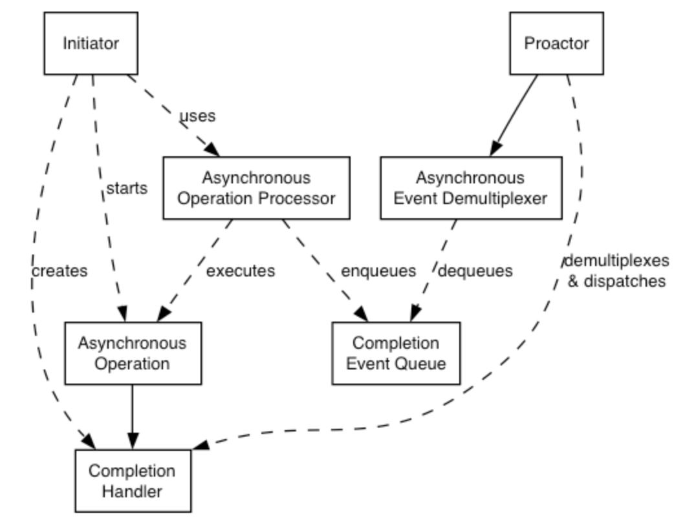

# [Core Concepts and Functionality](https://think-async.com/Asio/asio-1.28.0/doc/asio/overview/core.html)


## The Proactor Design Pattern: Concurrency Without Threads

- The Asio library offers side-by-side support for synchronous and asynchronous operations.
- The asynchronous support is based on the Proactor design pattern [POSA2].
- The advantages and disadvantages of this approach, when compared to a synchronous-only or Reactor approach, are outlined below.


### Proactor design pattern (adapted from [POSA2])




|Role|Functionality|
|--|--|
|**Initiator**|Application-specific code that starts asynchronous operations. The initiator interacts with an asynchronous operation processor via a high-level interface such as `basic_stream_socket`, which in turn delegates to a service like `reactive_socket_service`.|
|**Asynchronous Operation Processor**| Executes asynchronous operations and queues events on a completion event queue when operations complete. From a high-level point of view, internal services like `reactive_socket_service` are asynchronous operation processors.|
|**Asynchronous Operation**|Defines an operation that is executed asynchronously, such as an asynchronous read or write on a socket.|
|**Completion Event Queue**|Buffers completion events until they are dequeued by an asynchronous event de-multiplexer.|
|**Completion Handler** | Processes the result of an asynchronous operation. These are function objects, often created using `boost::bind`.|
|**Proactor** | Calls the asynchronous event demultiplexer to dequeue events, and dispatches the completion handler (i.e. invokes the function object) associated with the event. This abstraction is represented by the `io_context` class.|
|**Asynchronous Event Demultiplexer** | Blocks waiting for events to occur on the completion event queue, and returns a completed event to its caller.|


Implementation Using Reactor

- On many platforms, Asio implements the Proactor design pattern in terms of a **Reactor**, such as `select`, `epoll` or `kqueue`. This implementation approach corresponds to the Proactor design pattern as follows:

|Role|Implementation approach|
|--|--|
| Asynchronous Operation Processor | A reactor implemented using `select`, `epoll` or `kqueue`. When the reactor indicates that the resource is ready to perform the operation, the processor executes the asynchronous operation and enqueues the associated completion handler on the completion event queue.|
| Asynchronous Event Demultiplexer|This is implemented by waiting on an event or condition variable until a completion handler is available in the completion event queue.|
|Completion Event Queue|A linked list of completion handlers (i.e. function objects).|

Implementation Using Windows Overlapped I/O

(Skip)


## Advantages of implementation

Portability.

- Many operating systems offer a native asynchronous I/O API (such as overlapped I/O on Windows) as the preferred option for developing high performance network applications.
- The library may be implemented in terms of native asynchronous I/O. However, if native support is not available, the library may also be implemented using synchronous event demultiplexors that typify the Reactor pattern, such as POSIX `select()`.


Decoupling threading from concurrency.

- Long-duration operations are performed asynchronously by the implementation on behalf of the application. Consequently applications do not need to spawn many threads in order to increase concurrency.

Performance and scalability.

- Implementation strategies such as thread-per-connection (which a synchronous-only approach would require) can degrade system performance, due to increased context switching, synchronization and data movement among CPUs.
- With asynchronous operations it is possible to avoid the cost of context switching by minimizing the number of operating system threads — typically a limited resource — and only activating the logical threads of control that have events to process.

Simplified application synchronization.

- Asynchronous operation completion handlers can be written as though they exist in a single-threaded environment, and so application logic can be developed with little or no concern for synchronization issues.

Function composition.

- Function composition refers to the implementation of functions to provide a higher-level operation, such as sending a message in a particular format. Each function is implemented in terms of multiple calls to lower-level read or write operations.

- For example, consider a protocol where each message consists of a fixed-length header followed by a variable length body, where the length of the body is specified in the header. A hypothetical `read_message` operation could be implemented using two lower-level reads, the first to receive the header and, once the length is known, the second to receive the body.

- To compose functions in an asynchronous model, asynchronous operations can be chained together. That is, **a completion handler for one operation can initiate the next.**
  - Starting the first call in the chain can be encapsulated so that the caller need not be aware that the higher-level operation is implemented as a chain of asynchronous operations.
  - The ability to compose new operations in this way simplifies the development of higher levels of abstraction above a networking library, such as functions to support a specific protocol.

## Disadvantages

Program complexity.

- It is more difficult to develop applications using asynchronous mechanisms due to the separation in time and space between operation initiation and completion. Applications may also be harder to debug due to the inverted flow of control.

Memory usage.

- Buffer space must be committed for the duration of a read or write operation, which may continue indefinitely, and **a separate buffer is required for each concurrent operation**. The Reactor pattern, on the other hand, does not require buffer space until a socket is ready for reading or writing.


## [Threads and Asio](https://think-async.com/Asio/asio-1.28.0/doc/asio/overview/core/threads.html)

Thread Safety

- In general, it is safe to make concurrent use of distinct objects, but unsafe to make concurrent use of a single object.
- However, types such as `io_context` provide a stronger guarantee that it is safe to use a single object concurrently.

Thread Pools

- Multiple threads may call `io_context::run()` to set up a pool of threads from which completion handlers may be invoked.
- This approach may also be used with `post()` as a means to perform arbitrary computational tasks across a thread pool.
- Note that all threads that have joined an `io_context`'s pool are considered equivalent, and the `io_context` may distribute work across them in an arbitrary fashion.

Internal Threads

- The implementation of this library for a particular platform may make use of one or more internal threads to emulate asynchronicity. As far as possible, these threads must be invisible to the library user. In particular, the threads:
  - must not call the user's code directly; and
  - must block all signals.

- This approach is complemented by the following guarantee:
  - Asynchronous completion handlers will only be called from threads that are currently calling `io_context::run()`.

- Consequently, it is the library user's responsibility to create and manage all threads to which the notifications will be delivered.

The reasons for this approach include:

- By only calling `io_context::run()` from a single thread, the user's code can avoid the development complexity associated with synchronization. For example, a library user can implement scalable servers that are single-threaded (from the user's point of view).
- A library user may need to perform initialization in a thread shortly after the thread starts and before any other application code is executed. 
- The library interface is decoupled from interfaces for thread creation and management, and permits implementations on platforms where threads are not available.

## [Strands: Use Threads Without Explicit Locking](https://think-async.com/Asio/asio-1.28.0/doc/asio/overview/core/strands.html)

- `strand` is defined as a **strictly sequential invocation of event handlers** (i.e. no concurrent invocation).
- Use of `strand`s allows execution of code in a multithreaded program without the need for explicit locking (e.g. using mutexes).

- Strands may be either implicit or explicit, as illustrated by the following alternative approaches:
  - Calling `io_context::run()` from only one thread means all event handlers execute in an implicit strand, due to the `io_context`'s guarantee that handlers are only invoked from inside `run()`.
  - Where there is a single chain of asynchronous operations associated with a connection (e.g. in a half duplex protocol implementation like HTTP) there is no possibility of concurrent execution of the handlers. This is an implicit strand.
  - An explicit `strand` is an instance of `strand<>` or `io_context::strand`.
  - All event handler function objects need to be bound to the `strand` using `asio::bind_executor()` or otherwise posted/dispatched through the `strand` object.
  - In the case of composed asynchronous operations, such as `async_read()` or `async_read_until()`, if a completion handler goes through a `strand`, then all intermediate handlers should also go through the same `strand`.
  - This is needed to ensure thread safe access for any objects that are shared between the caller and the composed operation (in the case of `async_read()` it's the socket, which the caller can `close()` to cancel the operation).

- To achieve this, all asynchronous operations obtain the handler's associated executor by using the `get_associated_executor` function. For example:

```cpp
asio::associated_executor_t<Handler> a = asio::get_associated_executor(h);
```

- The associated executor must satisfy the Executor requirements. It will be used by the asynchronous operation to submit both intermediate and final handlers for execution.

- The executor may be customized for a particular handler type by specifying a nested type executor_type and member function `get_executor()`:

```cpp
class my_handler {
 public:
  // Custom implementation of Executor type requirements.
  typedef my_executor executor_type;

  // Return a custom executor implementation.
  executor_type get_executor() const noexcept { return my_executor(); }

  void operator()() { ... }
};
```

- In more complex cases, the `associated_executor` template may be partially specialized directly:

```cpp
struct my_handler {
  void operator()() { ... }
};

namespace asio {

template <class Executor>
struct associated_executor<my_handler, Executor> {
  // Custom implementation of Executor type requirements.
  typedef my_executor type;

  // Return a custom executor implementation.
  static type get(const my_handler&, const Executor& = Executor()) noexcept {
    return my_executor();
  }
};

}  // namespace asio
```

- The `asio::bind_executor()`` function is a helper to bind a specific executor object, such as a `strand`, to a completion handler.
- This binding automatically associates an executor as shown above.
- For example, to bind a `strand` to a completion handler we would simply write:

```cpp
my_socket.async_read_some(my_buffer,
                          asio::bind_executor(my_strand,
                                              [](error_code ec, size_t length) {
                                                // ...
                                              }));
```